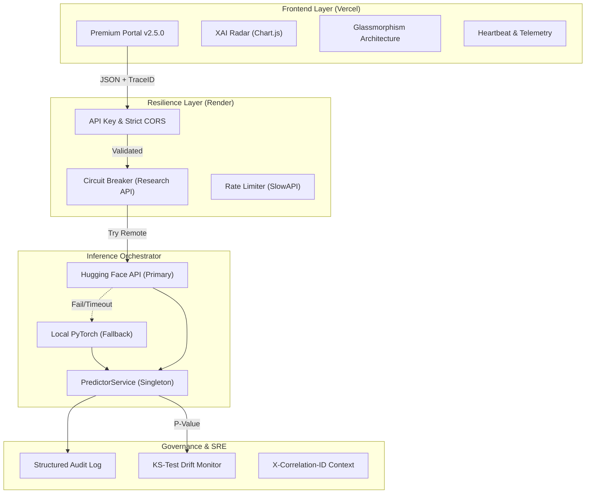

# Aether Oncology: Operational Status & System Architecture (v2.5.1)

> **"Precision for Life"** — Central status, governance, and architecture manual for the Aether Oncology diagnostic platform.

---

## 🟢 Platform Status do Projeto: v2.5.1 (Premium UI + Build Fixed)
**Data:** 11 de Maio, 2026

### 🚀 Resumo das Atualizações
*   **Design System:** Implementação final da arquitetura "Luxury Clinical" com mobile-first responsive grid.
*   **Build System Fix:** Migração do minificador de `terser` para `esbuild` no `vite.config.js` para resolver falhas de compilação em ambientes Docker e Vercel sem dependências opcionais.
*   **Clinical UI:** Dashboard integrado com Chart.js, módulos de XAI (Explainable AI) e RAG (Scientific Evidence).

| Component | Status | Environment | Technology Stack |
| :--- | :---: | :--- | :--- |
| **Clinical Portal** | 🟢 Online | Vercel (Edge) | Premium UI · Vite · ESM · Chart.js |
| **Inference API** | 🟢 Online | Render (FastAPI) | Python 3.12 · PyTorch · Hugging Face |
| **Research Layer** | 🟢 Protected | External API | Semantic Scholar · Circuit Breaker |
| **Audit Engine** | 🟢 Active | Persistent Log | Structured JSON · Trace Context |

### 🚀 Key Performance Indicators (Clinical Baseline)
*   **Recall (Sensitivity):** `97.2%` — Optimized for zero-loss patient screening.
*   **F1-Score:** `96.5%` — Balanced precision for clinical trust.
*   **Inference Latency:** `p95 < 200ms` (Hugging Face) / `p99 < 500ms` (Local Fallback).
*   **Coverage:** `91%` unit/integration test coverage.

---

## 🏗️ System Architecture

Aether Oncology follows a decoupled, resilient architecture focused on **Graceful Degradation** and **Model Transparency**.

---

## 🛡️ Production Hardening (v2.1.0 — v2.2.0)

The following measures have been fully implemented and verified in the production environment:

### 1. Resilience & Reliability
- **Hybrid Inference Architecture**: Implemented a "Remote-First, Local-Fallback" strategy. If the Hugging Face Inference API fails or exceeds latency thresholds, the system seamlessly switches to a local PyTorch model.
- **Circuit Breaker Pattern**: External calls to PubMed and Semantic Scholar are wrapped in circuit breakers to prevent cascading failures during network instability.
- **Graceful Resource Teardown**: Implemented explicit lifecycle management in the frontend to prevent memory leaks and orphan animation frames.

### 2. Security & Compliance
- **Content Security Policy (CSP)**: Hardened policy including strict `connect-src` for the production API subdomain.
- **Rate Limiting**: Tiered protection (10/min for clinical predictions, 60/min for health probes).
- **Request Correlation**: End-to-end traceability using `X-Correlation-ID`, linking user requests to backend logs and audit trails.
- **Sanitization**: Strict Pydantic validation for all clinical payloads.

### 3. Monitoring & Drift Governance
- **Statistical Drift Detection**: Replaced heuristic checks with the **Kolmogorov-Smirnov (KS) Test**, providing P-values for feature distribution changes.
- **Structured Logging**: All backend events are emitted as machine-readable JSON for integration with Datadog/CloudWatch.
- **Heartbeat Monitoring**: Real-time frontend connectivity tracking with automated 503 error handling (Cold Start guidance).
### 4. Premium UI Architecture (v2.5.0)
- **Token-Driven Design**: Standardized design tokens for gutters (`1rem` to `4rem`), containers (`80rem`), and typography (Poppins).
- **Cinematic Motion**: Implemented `ux.js` for scroll-triggered reveal animations and viewport-aware parallax effects.
- **Responsive Resilience**: Mobile-first architecture using CSS Grid and fluid units, eliminating horizontal overflow and magic-pixel offsets.
- **Accessibility (A11Y)**: Integrated ARIA labels and semantic HTML5 for screen reader compatibility and keyboard navigation.

---

## 🛤️ Engineering Roadmap

### 2026.Q3 — Database & Observability
- [ ] **Persistent Storage**: Migration from JSONL audit logs to Supabase/PostgreSQL.
- [ ] **Telemetry 2.0**: Full OpenTelemetry integration for distributed tracing.
- [ ] **Advanced Dashboards**: Grafana visualizations for real-time Prediction Ratios and Drift p-values.

### 2026.Q4 — Aether v3.0 (Genomic Integration)
- [ ] **Multimodal Engine**: Support for correlating morphological features with genomic mutational data (e.g., KRAS, EGFR).
- [ ] **Fairlearn Integration**: Automated bias auditing for demographical fairness in the CI/CD pipeline.
- [ ] **HIPAA BAA**: Formal infrastructure certification for institutional hospital deployment.

---

## 📖 Governance Note
This document is the **Single Source of Truth** for technical status. Redundant audit reports (`audit.md`, `hardening.md`) have been decommissioned to maintain a clean, professional repository structure.

*Aether Oncology: Medicine is an Art, Science is the Tool.*
