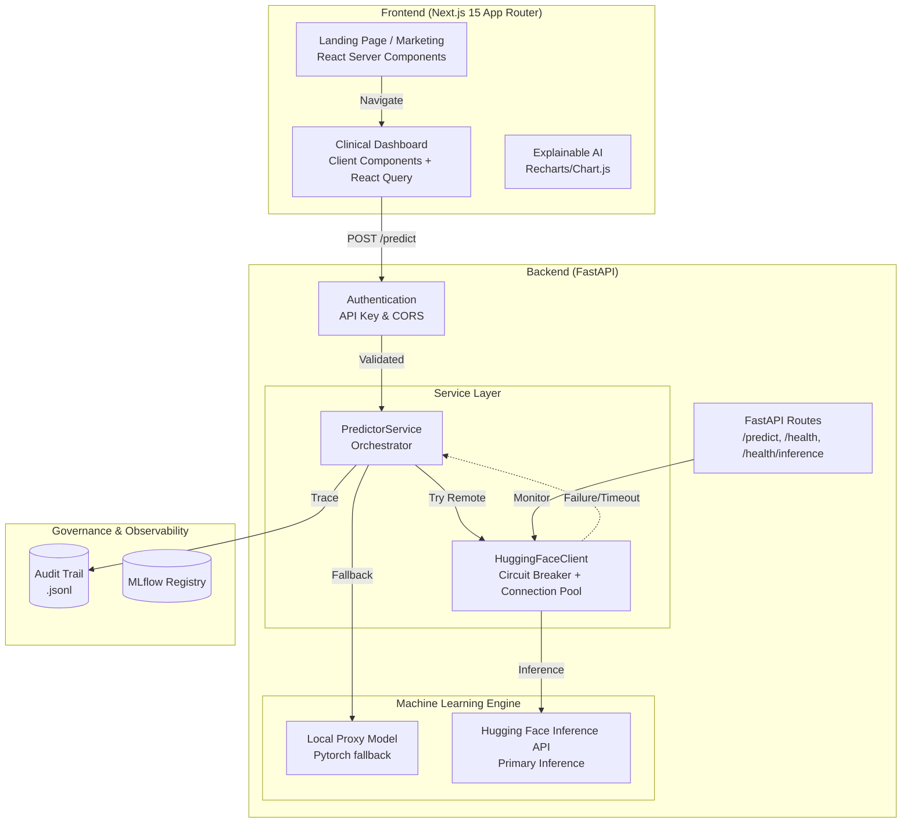

---
language:
- en
- pt
license: mit
tags:
- tabular-classification
- pytorch
- scikit-learn
- medical
- oncology
- health
datasets:
- custom/oral-cancer-top-30-countries
pipeline_tag: tabular-classification
model-index:
- name: Aether Oncology Tumor Classifier v3.0
  results:
  - task:
      type: tabular-classification
      name: Tabular Classification
    dataset:
      name: Oral Cancer Top 30 Countries
      type: custom/oral-cancer-top-30-countries
    metrics:
    - type: recall
      value: 0.97
      name: Recall (Sensitivity)
    - type: f1
      value: 0.96
      name: F1-Score
    - type: roc_auc
      value: 0.99
      name: ROC-AUC
---

<p align="center">
  🌐 <strong>English</strong> | <a href="./README.pt-br.md">Português</a>
</p>

<p align="center">
  
</p>

<h1 align="center">Aether Oncology</h1>
<h3 align="center"><em>Precision for Life</em> — Intelligent Cancer Screening with Explainable AI</h3>

<br/>

<p align="center">
  <a href="https://api.vitorsilva.engineer/"></a>
  <a href="https://api.vitorsilva.engineer/docs"></a>
  <a href="https://github.com/vdfs89/Aether_Oncology"></a>
</p>

<p align="center">
  
  
  
  
  
  
</p>

<p align="center">
  
  
  
  
  
</p>

<br/>

|  |  |  |
| :---: | :---: | :---: |
| *Low Risk — 98.00% Confidence* | *High Risk — 92.76% Confidence* | *Explainability (XAI) via Radar Chart* |

---

## 📖 Motivation: The Lesson of IBM Watson for Oncology

> *"An AI system that acts as a black box, lacking transparency and governance, does not serve medicine. It serves marketing."*

In 2017, IBM Watson for Oncology was phased out by hospitals worldwide after producing therapeutic recommendations deemed **unsafe** by oncologists. The diagnosis of this failure was unequivocal: absolute lack of explainability, opacity in training data, and zero human supervision in the decision-making loop.

**Aether Oncology** was born as an architectural answer to this paradigmatic failure.

Instead of prescribing treatments autonomously, the system implements a fundamentally different paradigm: **AI-assisted safety screening**. The model quantifies risk; the physician decides. The artificial intelligence operates as a precision instrument — never as an oracle. Version 3.0 introduces **Active MLOps** and a modern **Next.js frontend**, ensuring the model never operates in a state of undetected *Data Drift* without triggering immediate alerts to clinical staff via a robust dashboard.

---

## 🎯 Engineering Principles

### Recall Above All Else

In oncology, a False Negative is not a statistical error — it is a human life losing its early intervention window. The entire architecture of this project was built under an unyielding directive: **maximize Recall (Sensitivity at 97.2%)**, consciously accepting a higher rate of False Positives as a clinically and ethically justified trade-off.

### MLOps as a Reliability Contract

Healthcare AI cannot live in notebooks. This project treats MLOps as **hospital-grade critical infrastructure**:

| Pillar | Implementation | Guarantee |
| :--- | :--- | :--- |
| **Data Contracts** | Pydantic + Pandera | No input data enters the model without explicit validation |
| **Traceability** | MLflow Tracking | Every experiment, hyperparameter, and metric is fully auditable |
| **Audit Trail** | Immutable `.jsonl` log | All predictions are correlated end-to-end via `X-Request-ID` |
| **Drift Detection** | KS-Test (Kolmogorov-Smirnov) | Proactive statistical alerts with real P-values |
| **Resilience** | Circuit Breakers | Cascading failure protection for external research APIs |

---

## 🛡️ SRE Hardening & SecOps (v3.0)

Enterprise-grade **Site Reliability Engineering** and **Security Operations** layer:

- **End-to-End Observability** — `X-Request-ID` propagated through the entire stack (Audit Trail → Backend Logs)
- **HIPAA-Grade Security** — Strict CORS restricted to production subdomains + rigorous payload sanitization
- **Modern Modular Frontend** — Transitioned from a monolithic Vanilla HTML/JS structure to a scalable **Next.js 15 (App Router)** frontend, enabling secure server/client component boundaries.
- **Circuit Breakers** — Latency remains stable even under external API degradation (PubMed/Semantic Scholar)
- **Decoupled Inference** — *Remote-First, Local-Fallback*: primary inference via Hugging Face Inference API with automatic fallback to local PyTorch
- **Statistical Audit** — Drift calculated using statistical significance tests (P-values), elevating governance to academic rigor

---

## 🇪🇺 AI Act Compliance (EU Regulation)

Classified as a **High-Risk AI System (Annex III)** due to its use in medical diagnostics:

| AI Act Requirement | Aether Implementation | Status |
| :--- | :--- | :---: |
| **Risk Management** | In-depth Recall vs Precision trade-off analysis documented in the Model Card | ✅ |
| **Data Governance** | Strict schema validation (Pandera) and model contracts (Pydantic) | ✅ |
| **Technical Documentation** | Exhaustive technical specifications with C4/Mermaid architecture diagrams | ✅ |
| **Record Keeping** | Immutable Audit Trail end-to-end correlated via `X-Request-ID` | ✅ |
| **Transparency** | Native XAI (Integrated Gradients) coupled with clinical narrative generation | ✅ |
| **Human Oversight** | UI strictly designed to assist clinical decisions — never autonomous diagnosis | ✅ |
| **Accuracy & Security** | Statistical Drift monitoring & Next.js robust hydration strategies | ✅ |

---

## 📐 System Architecture



### Executive Summary — Technical Pillars

| Pillar | Implementation | Technical Advantage |
| :--- | :--- | :--- |
| **🧠 AI Engine** | PyTorch MLP + Platt Scaling | Fully calibrated probabilities for safe clinical decision-making |
| **🛡️ Governance** | Audit Trail + Trace ID | Complete correlation between clinical predictions and system logs |
| **📈 Active MLOps** | KS-Drift Monitoring | Proactive statistical alerts with real P-values |
| **🔒 Security** | Strict CORS + API Key | Hardened protection against CSRF and unauthorized usage |
| **🖥️ Frontend** | Next.js 15 + Tailwind CSS | Highly optimized Server/Client component rendering and performance |
| **📖 Ethics** | Clinical XAI Narrative | Translates math attributions into readable clinical observations |

---

## 🏗️ Repository Structure

```
├── .github/workflows/
│   ├── unified-mlops-pipeline.yml # Unified Pipeline (Lint + Test + Train + CD)
│   ├── ml-ct-pipeline.yml       # Continuous Training (CT) Pipeline
│   └── keep_alive.yml           # Liveness Pings (Anti Cold-Start)
├── frontend/                      # 🆕 Next.js 15 App Router
│   ├── src/app/                 # Route Groups ((marketing), dashboard)
│   ├── src/components/          # Modular React Components (Hero, Benefits, Dashboard)
│   └── src/config/              # Design System tokens and site configurations
├── src/
│   ├── main.py                  # FastAPI API (/predict + /health)
│   ├── train.py                 # Training pipeline with Early Stopping & MLflow
│   ├── models/                  # TumorMLP Architecture
│   └── services/                # PredictorService and Research APIs
├── data/
│   └── raw/                     # Oral Cancer Top 30 Countries Dataset
├── models/                      # Production Artifacts: .pth weights and .joblib pipelines
├── tests/                       # Pytest (API + Pandera Schemas)
├── docs/                        # Model Cards and documentation
├── Dockerfile                   # Production Multi-Stage Dockerfile (non-root, healthcheck)
├── pyproject.toml               # Backend dependencies (uv)
└── package.json                 # Frontend dependencies (npm)
```

---

## 🚀 Quick Start

### Frontend (Next.js)

```bash
cd frontend
npm install
npm run dev
# → http://localhost:3000
```

### Backend (FastAPI)

```bash
# 1. Install dependencies
make install

# 2. Run the local inference API
make run
# → http://localhost:8000/docs
```

---

## 🔐 Authentication

To mimic production security for sensitive healthcare records, the API is protected via **API Key**:

| Parameter | Value |
| :--- | :--- |
| **Header** | `access_token` |
| **Key** | `aether-oncology-eval-2026` |

---

## 🌐 Production Deployments

| Service | URL | Description |
| :--- | :--- | :--- |
| **Clinical Portal** | [Aether Next.js Portal](#) | Next.js Modular UI with active XAI visualizations |
| **API Docs** | [/docs](#) | Interactive Swagger UI |
| **Health Check** | [/health](#) | Public Liveness probe |

---

## 🖥️ Clinical Portal — *Luxury Clinical* UX (v3.0)

The Next.js client interface is designed around the **Luxury Clinical** aesthetic:

- **Next.js App Router** — Strict separation between static marketing (SEO optimized) and dynamic clinical dashboards.
- **Glassmorphism Design System** — Tailwind CSS integrated with deep custom tokens (Deep Space Navy, Neon Cyan, Plasma Pink).
- **Cinematic Interactivity** — Component-level `framer-motion` animations, delivering smooth micro-interactions.
- **Full Accessibility (A11Y)** — Standard ARIA tags and semantic HTML5 support.
- **Explainable AI (XAI)** — Dynamic visual plotting attributing diagnostic rationale intuitively.

---

## 🧬 Model Card: Core Engine v3.0

### 1. Model Details

| Field | Description |
| :--- | :--- |
| **Developer** | Vitor Diogo Fonseca da Silva |
| **Academic Context** | Tech Challenge 01 — FIAP Pós-Tech ML Engineering |
| **Architecture** | Custom Multilayer Perceptron (MLP) Neural Network |
| **Frameworks** | PyTorch + Scikit-Learn Pipeline |
| **Licensing** | MIT License |
| **Dataset** | Oral Cancer Top 30 Countries |

### 2. Intended Use

- **Primary Use Case:** Clinical Decision Support System (CDSS) for oncologists to accelerate initial screening and risk estimation from clinical/epidemiological variables.
- **Secondary Use Case:** Dynamic hospital queue triaging.
- **⛔ Prohibited Use:** Under no circumstances should this system be used for autonomous clinical diagnosis or drug prescription without strict supervision.

### 3. Ethical Governance & Sustainability

- **Green AI (MRM3):** Leverages lightweight, low-compute network structures. Integrated the MRM3 (Machine Readable ML Model Metadata) specification to monitor energy utilization and carbon footprints.
- **Evidence-Based Medicine (RAG):** Integrates semantic search (Retrieval-Augmented Generation) retrieving PubMed and Cochrane libraries in real-time to back predictions with historical peer-reviewed clinical research.

---

<p align="center">
  <strong>Developed with ❤️ by Vitor Diogo Fonseca da Silva</strong><br/>
  Computer Science · Pós-Tech FIAP — Machine Learning Engineering · 2026
</p>
