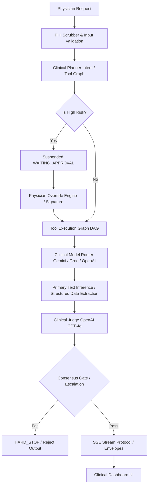
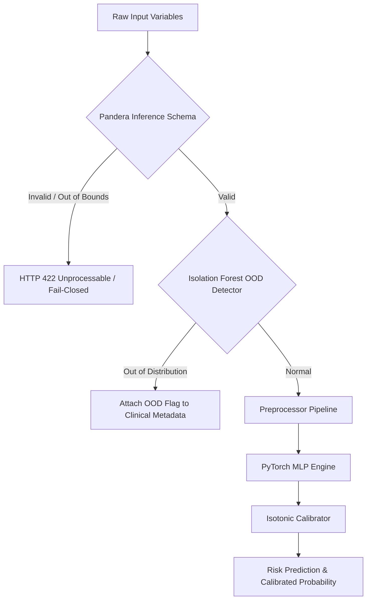
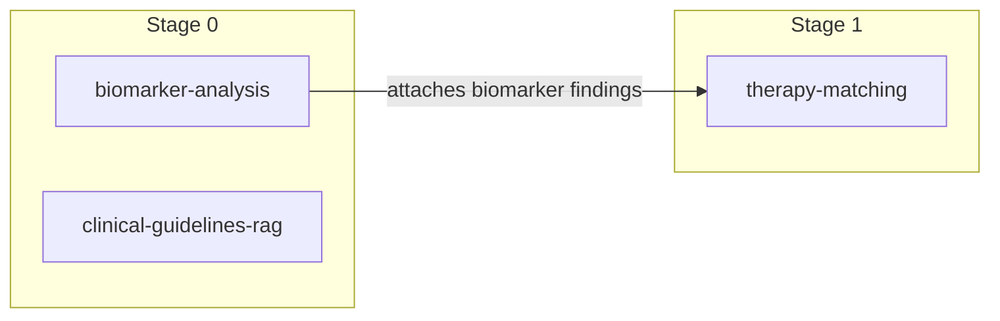

# Aether Oncology: Clinical-Grade AI Operating System

```text
    ___         __  __               ____                     _                 
   /   |  ___  / /_/ /_  ___  _____ / __ \____  _________  __/ /___  ____ ___  __
  / /| | / _ \/ __/ __ \/ _ \/ ___// / / / __ \/ ___/ __ \/ / / __ \/ __ `/ / / /
 / ___ |/  __/ /_/ / / /  __/ /   / /_/ / / / / /__/ /_/ / / / /_/ / /_/ / /_/ / 
/_/  |_|\___/\__/_/ /_/\___/_/    \____/_/ /_/\___/\____/_/_/\____/\__, /\__, /  
                                                                 /____//____/   
   C L I N I C A L  -  G R A D E    A I    O P E R A T I N G    S Y S T E M
```

[](https://www.python.org/)
[](https://fastapi.tiangolo.com/)
[](https://nextjs.org/)
[](https://www.typescriptlang.org/)
[](https://pytorch.org/)
[](https://scikit-learn.org/)
[](#)
[](#)
[](#)
[](#)

Aether Oncology is a **Clinical-Grade AI Operating System** designed for oncology decision support and auditable clinical inference. Built with a focus on AI Safety, regulatory compliance (FDA SaMD / ANVISA), and physician agency, Aether acts as a precision clinical assistant that preserves human oversight in high-stakes medical workflows.

---

## 🌐 Live Resources & Portals

* **Clinical Portal:** [https://api.vitorsilva.engineer/](https://api.vitorsilva.engineer/)
* **Interactive API Docs:** [https://api.vitorsilva.engineer/docs](https://api.vitorsilva.engineer/docs)
* **MLflow Tracking Dashboard:** [MLflow Registry Configuration](#)
* **Hugging Face Model Registry:** [Custom Tabular Classifier Hub](#)

---

## 📖 Executive Summary & Clinical Philosophy

### The Lesson of IBM Watson for Oncology
In 2017, IBM Watson for Oncology faced critical pushback and decommissioning by major hospital systems because it operated as a **black box**. It generated therapeutic recommendations without clinical evidence, citation audit trails, or checks against local medical realities.

**Aether Oncology** rejects the black-box paradigm. It treats AI as an instrument of clinical decision support rather than an autonomous medical authority:
1. **Physician-in-the-Loop Agency:** The system does not diagnose or prescribe autonomously. It presents structured execution plans, flags clinical warnings, and requests explicitly signed approvals for high-risk actions.
2. **Recall-First Sensitivity:** A False Negative in cancer screening can delay early intervention. Aether's underlying tumor classification MLP is tuned to prioritize **Recall (97.22%)**, consciously trading off precision to avoid missing high-risk tumor markers.
3. **Deterministic Replayability:** Every event, tool invocation, and routing decision is tracked in a cryptographic event bus, enabling clinical audits to reconstruct the system's exact cognitive state at the millisecond level.

---

## 🛠️ Key Architectural Features

### 1. Multi-Agent Execution Engine
* **Clinical Planner:** Parses prompts to detect intent, selects relevant tools based on capabilities, and builds a dependency-sorted Directed Acyclic Graph (DAG) for parallel execution.
* **Smart Routing Layer:** Interactively routes tasks to optimal LLM backends (OpenAI, Gemini, Groq) based on cost, latency profiles, and logical constraints.
* **Circuit Breaker System:** Ensures system reliability by isolating failing providers and falling back gracefully without degrading the clinical session.

### 2. Clinical Safety & Consensus Engine
* **Hallucination Guard:** Evaluates generated claims against established clinical guidelines.
* **Consensus Engine:** Combines multi-model evaluations, applying vetoes if consensus fails.
* **Escalation Policy:** Enforces warnings or hard-stops based on severity scoring.

### 3. Physician Governance & Override Layer
* **State Suspension:** Automatically pauses execution on high-risk intents, holding tasks in a `WAITING_APPROVAL` state.
* **Override Engine:** Enables physicians to dynamically mutate the execution graph by adding/removing tools, reordering stages, or attaching annotations.
* **Approval Persistence:** Saves pending requests in an encrypted local database (SQLite) with automatic timeouts (15 minutes default, 5 minutes for critical risk).

### 4. Machine Learning & Data Governance (MLOps)
* **Pandera Verification:** Separates validation into a permissive training schema and a strict inference schema (fail-closed on critical anomalies).
* **Isolation Forest OOD Detector:** Flags out-of-distribution inputs (e.g., clinically incoherent variable ranges).
* **Leakage & Fairness Audits:** Automatically checks training runs for data leakage (e.g., temporal or proxy predictors) and subgroup bias (Brier score, Equalized Odds).
* **Probability Calibration:** Fits Platt Scaling and Isotonic Regression models to ensure raw network logits correspond to real-world risk frequencies.
* **Data Lineage:** Tracks code, dataset, and schema SHA-256 hashes inside a JSON registry, linking every prediction to its exact dataset origin.

### 5. Regulatory SecOps & Streaming
* **Fernet Log Encryption:** Secures local `.jsonl` audit files with AES-128-CBC/HMAC-SHA256, protecting Patient Health Information (PHI) at rest.
* **Web Crypto Session Encryption:** Encrypts local browser state (IndexedDB) with AES-GCM-256 derived from the session token using PBKDF2 (100,000 iterations).
* **Brazilian PHI Scrubber:** Automatically detects and scrubs sensitive identifiers (CPF, SUS, CNS, CRM, and phone numbers) at the interface boundary.
* **SSE Event Protocol:** Streams structured JSON envelopes detailing routing decisions, token emission, and judge consensus metrics.

---

## 📐 System Architecture

### High-Level Cognitive Pipeline


### Safety and Validation Architecture


---

## 🧠 Multi-Agent Execution Engine

The client-side execution framework coordinates intent detection, tool selection, and execution planning:

1. **Layer 1 — Intent Detection (`intentDetector.ts`):** Uses deterministic, weighted keyword and regex pattern matching to identify clinical tasks without relying on external LLM calls. It also parses and extracts gene symbols (e.g., `BRCA1`, `EGFR`) to guide tool selection.
2. **Layer 2 — Tool Capability Registry (`toolCapabilities.ts`):** Declares tool parameters (risk level, PHI access, cost, and prerequisites) and registers core tools:
   * `biomarker-analysis` (Moderate Risk, requires PHI, executes biomarker lookup).
   * `therapy-matching` (High Risk, depends on `biomarker-analysis`, matches treatments to mutations).
   * `clinical-guidelines-rag` (Low Risk, references peer-reviewed literature).
3. **Layer 3 — Execution Graph Builder (`planner.ts`):** Builds a Directed Acyclic Graph (DAG) using a topological sort. Tools with satisfied dependencies run concurrently, while tools awaiting prerequisite inputs are queued for subsequent stages.



---

## 🛡️ Clinical Safety & Consensus Engine

Aether routes raw inference payloads through a multi-tiered validation pipeline:

```
[Inference Generated] ──> [Hallucination Guard] ──> [Consensus Gate] ──> [Escalation Policy]
```

### 1. Hallucination Guard
Verifies factual assertions against clinical guidelines. It queries the `JudgeProvider` (using GPT-4o) with a custom system prompt instruct-tuned to flag discrepancies, missing clinical evidence, and unsupported claims.

### 2. Consensus Engine
Applies strict rules to aggregate safety evaluations:
* **Hallucination Veto:** Any evaluation flagging `HIGH` hallucination risk immediately fails.
* **Confidence Gate:** Rejects predictions with an evaluation confidence score $< 50\%$.
* **Contradiction Threshold:** Rejects outputs with $\ge 2$ internal contradictions.
* **Evidence Check:** Rejects output if evidence strength is `LOW` and $\ge 2$ expected citations are missing.

### 3. Escalation Policy
Determines safety levels based on evaluation results:
* **`HARD_STOP`:** Triggered by high hallucination risk, low evidence, or contradictions. The output is discarded, and the API returns a safety violation error.
* **`WARNING`:** Triggered by medium hallucination risk or missing citations. The output is streamed with clinical warning annotations.

---

## 👥 Physician Governance & Override Layer

When the Planner identifies high-risk tools (e.g., `therapy-matching`), the runtime suspends task execution.

```
[Runtime Interrupted] ──> [Wait for Signature] ──> [Physician Override] ──> [DAG Re-Evaluation]
```

1. **State Suspension:** The execution transitions to the `WAITING_APPROVAL` state. The request metadata, plan, and safety rationales are persisted in the backend SQLite database via `SQLiteApprovalRepository` and mirrored in the physician's browser session.
2. **Override Engine (`overrideEngine.ts`):** Provides a clean, functional interface for the physician to inspect the plan and make adjustments. Modifications do not mutate the original plan:
   ```typescript
   // Functional override application signature
   export function applyOverride(
     originalPlan: ExecutionPlan,
     override: ExecutionPlanOverride | null
   ): ResolvedExecutionPlan
   ```
   * **Removing Tools:** The physician can strip tools from the execution stages.
   * **Forcing Tools:** Allows explicit inclusion of tools regardless of system-inferred dependencies.
   * **Stage Reordering:** Enables restructuring of execution sequence.
3. **Risk Difference Engine:** Compares the risk profile of the original plan with the modified plan, displaying the delta to the clinician before execution.

---

## 🔒 HIPAA, LGPD, and FDA Compliance

| Requirement | Regulatory Standard | Technical Control |
| :--- | :--- | :--- |
| **Audit Trails** | HIPAA § 164.312(b) / LGPD Art. 37 | All backend log lines are serialized as JSON metadata envelopes and encrypted at rest with Fernet (AES-128-CBC + HMAC-SHA256). |
| **Data at Rest** | HIPAA § 164.312(a)(2)(iv) | Browser-side IndexedDB databases are encrypted with AES-GCM-256. The session key is derived via PBKDF2 with 100,000 iterations using the physician's session token. |
| **Privacy Safeguards** | HIPAA § 164.502 / LGPD Art. 17 | An input scrubber intercepts physician queries, checking against regex patterns for Brazilian IDs (CPF, CNS/SUS, CRM) and phone numbers. The scrubber fails closed to block queries if an extraction error occurs. |
| **Traceability** | FDA SaMD / ANVISA Class II | Every inference output includes a lineage block containing the SHA-256 hashes of the active dataset, model code, Pandera schemas, and the feature registry. |

---

## 📊 Machine Learning Platform

The Aether Oncology machine learning engine trains and evaluates a custom tumor classifier on patient variables:

```
[Dataset Registry] ──> [Pandera Check] ──> [OOD Isolation Forest] ──> [Fairness & Leakage Check] ──> [Isotonic Calibration]
```

### 1. Robust Feature Extraction (`preprocessing.py`)
Encapsulates derived clinical feature extraction into a deterministic scikit-learn pipeline step:
* **Lifestyle Risk Index:** Combines categorical indicators to compute a continuous risk score.
* **Country Risk Indicator:** Maps incidence rates according to epidemiological studies.
* **Age Binning:** Discretizes age ranges to capture non-linear risk effects.

### 2. Validation Severity Engine
Separates checks into training and inference stages:
* **Training Validation (`training_schema.py`):** Uses Pandera to validate types and ranges, allowing imputations for historical drift.
* **Inference Validation (`inference_schema.py`):** Enforces a strict validation gate:
  * `WARNING` (e.g., Age $> 120$): Logs warning but permits inference.
  * `CRITICAL` (e.g., Survival Rate out of bounds or clinically incoherent configurations): Block inference immediately (`can_infer = False`).

### 3. Out-Of-Distribution (OOD) Detection (`ood.py`)
Trains an **Isolation Forest** on clinical features during model training. Inference inputs are checked against this model; if flagged as anomalous, the API attaches an `ood_detected` flag to prompt clinical review.

### 4. Automated Audits (`leakage.py` & `fairness.py`)
* **Leakage Audit:** Scans for temporal leakage (e.g., using post-diagnosis metrics like `Treatment_Type` as inputs) and flags proxy predictors with high Pearson or Mutual Information scores.
* **Fairness Audit:** Computes Equalized Odds, False Negative rate disparities, and subgroup Brier scores to detect bias across demographics (e.g., Gender, Socioeconomic Status).

### 5. Platt & Isotonic Calibration (`calibration_engine.py`)
Converts raw MLP outputs into calibrated probabilities:
* Evaluates both **Platt Scaling** and **Isotonic Regression** against test sets.
* Computes Brier Score, Expected Calibration Error (ECE), and Maximum Calibration Error (MCE).
* Generates and saves a reliability curve plot to `models/calibration/reliability_curve.png`.

---

## 📡 SSE Streaming Protocol

The backend streams inference results using Server-Sent Events (SSE) structured in JSON envelopes:

### Event Types
1. **`routing_decision`:** Indicates selected LLM, fallback configurations, and cost estimates.
2. **`status`:** Emits system states (e.g., `generating_internally`, `streaming`).
3. **`inference_envelope`:** Contains token stats, cost estimates, and latency metrics.
4. **`judgement_started` / `judgement_completed`:** Details the Clinical Judge's evaluation.
5. **`token`:** Streams individual text increments.
6. **`complete`:** Signals successful task completion.

```json
/* Example: routing_decision event */
event: routing_decision
data: {
  "traceId": "9b1deb4d-3b7d-4bad-9bdd-2b0d7b3dcb6d",
  "sessionId": "doctor-session-101",
  "patientId": "pt-882",
  "sequence": 1,
  "timestamp": 1779929960,
  "provider": "groq",
  "model": "llama3-70b-8192",
  "rationale": "High-throughput task with low-latency constraints",
  "estimated_latency_ms": 150,
  "estimated_cost": 0.00012,
  "fallback_chain": ["openai", "gemini"]
}
```

---

## 📂 Project Structure

```text
├── .github/workflows/
│   ├── unified-mlops-pipeline.yml  # Linting (Ruff), Testing, Model Training, Docker Scans
│   └── keep_alive.yml              # Prevent cold-starts on deployment platforms
├── frontend/                       # Next.js 15 App Router Frontend
│   ├── public/                     # Static client assets
│   └── src/
│       └── features/ai/
│           ├── orchestration/
│           │   ├── planner/        # Intent detector, tool capability registry, clinical planner
│           │   └── runtime/        # Approval manager, event bus, override engine
│           ├── telemetry/          # PHI scrubbing rules
│           └── services/           # Crypto helpers (AES-GCM Web Crypto)
├── src/                            # Python Backend Code
│   ├── api/
│   │   ├── routes/
│   │   │   └── clinical_chat.py    # SSE stream routing, approvals CRUD
│   │   └── schemas.py              # Pydantic models for request/response envelopes
│   ├── core/
│   │   └── logging.py              # Structured logging and request correlation
│   ├── ml/                         # Hospital-Grade ML Platform
│   │   └── pipelines/
│   │       ├── audit/              # Leakage and fairness audits
│   │       ├── calibration/        # Platt Scaling / Isotonic Calibration engines
│   │       ├── drift/              # PSI and KS test drift monitors
│   │       ├── preprocessing/      # Preprocessor, feature registry, Isolation Forest OOD
│   │       ├── validation/         # Training/Inference schemas (Pandera), clinical rules
│   │       └── lineage.py          # Hash-based data lineage trackers
│   ├── ml_platform/                # Historical ML abstractions and helper models
│   ├── models/                     # PyTorch MLP architectures
│   ├── safety/                     # Safety layer (Consensus, Escalation, Hallucination checks)
│   ├── services/
│   │   ├── approval_store.py       # SQLite approval persistence
│   │   └── audit.py                # Fernet log encryption and drift triggers
│   ├── train.py                    # Sequential training pipeline
│   └── main.py                     # FastAPI entrypoint, lifespan loaders
├── tests/                          # Pytest suite
│   ├── test_api.py                 # Endpoint verification tests
│   ├── test_audit.py               # Encrypted log verification
│   ├── test_model.py               # PyTorch MLP sanity checks
│   └── test_schema.py              # Pandera validation checks
├── pyproject.toml                  # Backend project configuration (Ruff, Pytest, Python dependencies)
└── package.json                    # Frontend package definition
```

---

## 🚀 Installation & Setup

### Prerequisites
* Python $\ge 3.10$
* Node.js $\ge 18.0$
* npm

### 1. Backend Setup
Clone the repository and set up a virtual environment:
```bash
# Set up virtual environment
python -m venv .venv
source .venv/bin/activate  # On Windows: .venv\Scripts\activate

# Install package dependencies
pip install -e ".[dev]"
```

Configure your environment variables in `.env`:
```env
OPENAI_API_KEY="your-openai-api-key"
GROQ_API_KEY="your-groq-api-key"
GEMINI_API_KEY="your-gemini-api-key"
AUDIT_ENCRYPTION_KEY="your-fernet-key-32-bytes"
API_KEY="aether-oncology-eval-2026"
```

### 2. Frontend Setup
Navigate to the frontend directory and install dependencies:
```bash
cd frontend
npm install
```

Configure the client environment in `frontend/.env.local`:
```env
NEXT_PUBLIC_API_URL="http://localhost:8000"
```

---

## ⚙️ Environment Variables Reference

| Variable | Type | Description | Required |
| :--- | :--- | :--- | :--- |
| `OPENAI_API_KEY` | String | API key for OpenAI GPT models (used by the Clinical Judge). | Yes |
| `GROQ_API_KEY` | String | API key for Groq (used for low-latency inference). | Yes |
| `GEMINI_API_KEY` | String | API key for Google Gemini (used for secondary inference). | Yes |
| `AUDIT_ENCRYPTION_KEY` | String | 32-byte Fernet key used to encrypt the local audit log. | Yes |
| `API_KEY` | String | Shared access token protecting backend routes. | Yes |
| `NEXT_PUBLIC_API_URL` | URL | URL pointing to the running backend service. | Yes |

---

## 🏃 Running the Platform

### Running Local Model Training
To train the PyTorch MLP, run audits, calibrate output probabilities, and export model cards/data lineage, execute:
```bash
python -m src.train
```

### Running the Backend Service
Start the FastAPI server:
```bash
uvicorn src.main:app --host 127.0.0.1 --port 8000 --reload
```

### Running the Next.js Frontend
Start the Next.js development server:
```bash
cd frontend
npm run dev
```
Open [http://localhost:3000](http://localhost:3000) to access the clinical dashboard.

---

## 🧪 Testing Suite

Ensure all tests pass before deploying changes:

### Backend Pytest Suite
Runs verification tests for API endpoints, schemas, audits, and calibration metrics:
```bash
pytest tests/ --cov=src -v
```

### Frontend Typecheck & Lints
Verify TypeScript interfaces and React code quality:
```bash
cd frontend
npm run lint
```

---

## 🛡️ Cryptographic Security Model

Aether implements layered cryptographic controls:
```
  [User Action] ──────> [PBKDF2 Key Derivation] ──────> [AES-GCM-256 IndexedDB]
  [System Event] ─────> [Fernet Envelope Encryption] ──> [Encrypted JSONL Audit Log]
```
1. **Key Derivation:** Browser session keys are derived from the user's session token using PBKDF2 with 100,000 iterations of SHA-256 and a random salt.
2. **IndexedDB Encryption:** Data is encrypted locally using AES-256-GCM. Unencrypted data is never written to browser storage.
3. **Audit Log Security:** Backend audit entries are encrypted with Fernet (AES-128-CBC + HMAC-SHA256). If the encryption key is missing or invalid at startup, the system fails closed and blocks execution.

---

## 📋 Clinical Disclaimer

> [!WARNING]
> **Aether Oncology is a Clinical Decision Support System (CDSS) designed to assist trained medical professionals.**
> It does not provide medical diagnoses, treatment recommendations, or prescriptions.
> All outputs and suggestions must be verified against current clinical standards, patient records, and professional medical judgment.
> Do not use this system as a substitute for professional clinical decision-making.

---

## 🗺️ Product Roadmap

* [ ] **Temporal Reasoning Engine:** Parse longitudinal patient records to evaluate disease progression over time.
* [ ] **Tumor Board Simulation:** Multi-agent panel simulating interactions between oncologists, radiologists, and pathologists.
* [ ] **Guideline RAG (NCCN & ESMO):** Direct vector search against latest oncology guidelines to verify treatment matches.
* [ ] **FHIR Interoperability:** Support direct ingestion and synchronization with hospital Electronic Health Records (EHR) via standard HL7 FHIR APIs.
* [ ] **Federated Learning Support:** Enable multi-institutional model training without centralizing sensitive patient data.

---

## 🤝 Contributing

Contributions are welcome! Please read our [Contributing Guidelines](CONTRIBUTING.md) and code of conduct before submitting a Pull Request.

### Development Process
1. Fork the repository.
2. Create a feature branch: `git checkout -b feat/my-feature`.
3. Format and lint your changes: `ruff check src/` and `ruff format src/`.
4. Run the test suite: `pytest`.
5. Submit a Pull Request targeting the `main` branch.

---

## 📄 License

Distributed under the MIT License. See [LICENSE](LICENSE) for more information.
