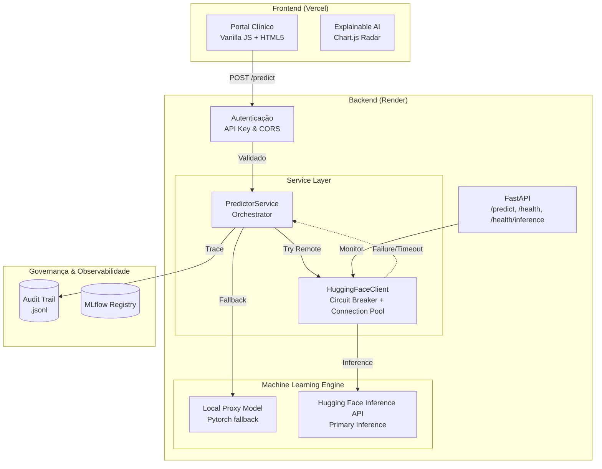

---
language:
- pt
- en
license: mit
tags:
- tabular-classification
- pytorch
- scikit-learn
- medical
- oncology
- health
datasets:
- scikit-learn/breast-cancer-wisconsin
pipeline_tag: tabular-classification
model-index:
- name: Aether Oncology Tumor Classifier v2.0
  results:
  - task:
      type: tabular-classification
      name: Classificação Tabular
    dataset:
      name: Breast Cancer Wisconsin Diagnostic
      type: scikit-learn/breast-cancer-wisconsin
    metrics:
    - type: recall
      value: 0.97
      name: Recall (Sensibilidade)
    - type: f1
      value: 0.96
      name: F1-Score
    - type: roc_auc
      value: 0.99
      name: ROC-AUC
---

<p align="center">
  
</p>

<h1 align="center">Aether Oncology</h1>
<h3 align="center"><em>Precision for Life</em> — Triagem Oncológica Inteligente com IA Explicável</h3>

<br/>

<p align="center">
  <a href="https://api.vitorsilva.engineer/"></a>
  <a href="https://api.vitorsilva.engineer/docs"></a>
  <a href="https://huggingface.co/datasets/scikit-learn/breast-cancer-wisconsin"></a>
</p>

<p align="center">
  
  
  
  
  
  
</p>

<p align="center">
  
  
  
  
  
</p>

<br/>

|  |  |  |
| :---: | :---: | :---: |
| *Benigno — 98.00% Confiança* | *Maligno — 92.76% Confiança* | *Explicabilidade (XAI) via Radar Chart* |

---

## 📖 Motivação: A Lição do IBM Watson for Oncology

> *"Um sistema de IA que age como caixa-preta, sem transparência e sem governança, não serve à medicina. Serve ao marketing."*

Em 2017, o IBM Watson for Oncology foi descontinuado em hospitais ao redor do mundo após gerar recomendações terapêuticas consideradas **inseguras** por oncologistas. O diagnóstico do fracasso foi inequívoco: ausência de explicabilidade, opacidade nos dados de treinamento e zero supervisão humana no loop decisório.

O **Aether Oncology** nasce como resposta arquitetural a esse erro paradigmático.

Em vez de recomendar tratamentos de forma autônoma, o sistema implementa um paradigma fundamentalmente diferente: **triagem de segurança assistida por IA**. O modelo quantifica o risco; o médico decide. A inteligência artificial opera como instrumento de precisão — nunca como oráculo. A versão 2.0 introduz o conceito de **MLOps Ativo**, garantindo que o modelo jamais opere em regime de *Data Decay* sem alerta imediato ao corpo clínico.

---

## 🎯 Princípios de Engenharia

### Recall acima de tudo

Em oncologia, um Falso Negativo não é um erro estatístico — é uma vida que perde a janela de tratamento precoce. Toda a arquitetura deste projeto foi construída sob uma diretriz inegociável: **maximizar o Recall (Sensibilidade a 97.2%)**, aceitando conscientemente uma taxa maior de Falsos Positivos como trade-off ético clinicamente justificável.

### MLOps como contrato de confiabilidade

IA na saúde não pode viver em notebooks. Este projeto trata MLOps como **infraestrutura crítica de nível hospitalar**:

| Pilar | Implementação | Garantia |
| :--- | :--- | :--- |
| **Data Contracts** | Pydantic + Pandera | Nenhum dado entra no modelo sem validação de schema explícita |
| **Rastreabilidade** | MLflow Tracking | Cada experimento, hiperparâmetro e métrica é auditável |
| **Audit Trail** | Log `.jsonl` imutável | Todas as predições correlacionadas via `X-Request-ID` |
| **Drift Detection** | KS-Test (Kolmogorov-Smirnov) | Alertas estatísticos proativos com P-values reais |
| **Resiliência** | Circuit Breakers | Proteção contra falhas em cascata de serviços externos |

---

## 🛡️ SRE Hardening & SecOps (v2.2)

Camada de **Site Reliability Engineering** e **Security Operations** de nível empresarial:

- **Observabilidade End-to-End** — `X-Request-ID` propagado em toda a stack (Audit Trail → Backend Logs)
- **Segurança HIPAA-Grade** — CORS restrito a domínios de produção + sanitização rigorosa de payloads
- **DevSecOps Pipeline** — Scanner **Grype** no CI/CD para detecção proativa de CVEs em containers
- **Build Otimizado** — Migração de Terser para **Esbuild**, eliminando conflitos de dependência
- **Circuit Breakers** — Latência estável mesmo sob degradação de APIs externas (PubMed/Semantic Scholar)
- **Decoupled Inference** — Arquitetura *Remote-First, Local-Fallback*: inferência primária via HF Inference API com fallback automático para modelo local PyTorch
- **Statistical Audit** — Cálculo de Drift via testes de significância estatística (P-values), elevando governança de heurística para rigor acadêmico
- **Hardened CI/CD** — Mitigação de falhas de I/O em runners via redirecionamento dinâmico de `TMPDIR`

---

## 🇪🇺 AI Act Compliance (EU Regulation)

Sistema classificado como **Alto Risco (Anexo III)** por atuar em diagnóstico de saúde:

| Requisito AI Act | Implementação Aether | Status |
| :--- | :--- | :---: |
| **Risk Management** | Análise de trade-off Recall vs Precision documentada no Model Card | ✅ |
| **Data Governance** | Validação de schema (Pandera) e contratos de dados (Pydantic) | ✅ |
| **Technical Documentation** | Documentação técnica exaustiva com Diagramas C4/Mermaid | ✅ |
| **Record Keeping** | Audit Trail imutável com correlação de `X-Request-ID` | ✅ |
| **Transparency** | XAI nativo (Integrated Gradients) com narrativa clínica | ✅ |
| **Human Oversight** | UI projetada para suporte à decisão — nunca diagnóstico autônomo | ✅ |
| **Accuracy & Security** | Pipeline DevSecOps (Grype) + monitoramento de Drift estatístico | ✅ |

---

## 📐 Arquitetura do Sistema



### Executive Summary — Pilares Técnicos

| Pilar | Implementação | Diferencial |
| :--- | :--- | :--- |
| **🧠 Engine de IA** | PyTorch MLP + Platt Scaling | Probabilidades calibradas para decisão médica segura |
| **🛡️ Governança** | Audit Trail + Trace ID | Rastreabilidade total entre predição e logs de sistema |
| **📈 MLOps Ativo** | Monitoramento KS-Drift | Alertas estatísticos proativos com P-values reais |
| **🔒 Segurança** | Strict CORS + API Key | Hardening contra CSRF e acessos não autorizados |
| **🚀 Resiliência** | Circuit Breakers | Proteção contra falhas em cascata de serviços externos |
| **📖 Ética** | Clinical XAI Narrative | Tradução de atribuições para linguagem médica natural |

---

## 🏗️ Estrutura do Repositório

```
├── .github/workflows/
│   ├── unified-mlops-pipeline.yml # Pipeline unificado (Lint + Test + Train + CD)
│   ├── ml-ct-pipeline.yml       # Retreino contínuo (Continuous Training)
│   └── keep_alive.yml           # Liveness Pings (Anti Cold-Start)
├── src/
│   ├── main.py                  # API FastAPI (/predict + /health)
│   ├── train.py                 # Pipeline de treino com Early Stopping e MLflow
│   ├── optimize.py              # Busca de hiperparâmetros via Optuna
│   ├── models/
│   │   └── mlp.py               # Arquitetura TumorMLP — Single Source of Truth
│   └── services/
│       ├── predictor.py         # PredictorService (Singleton Pattern)
│       └── research.py          # Integração com Semantic Scholar API
├── data/
│   └── raw/                     # Dataset WDBC (Wisconsin Diagnostic Breast Cancer)
├── models/                      # Artefatos de produção: pesos .pth e pipeline .joblib
├── notebooks/
│   └── eda_aether_oncology.ipynb  # EDA + Baseline + Treino MLP
├── tests/
│   ├── test_schema.py           # Validação de schema com Pandera
│   └── test_api.py              # Testes de integração da API
├── docs/
│   └── MODEL_CARD.md            # Documentação ética e limites operacionais
├── PROJECT_STATUS.md            # Single Source of Truth (Status & Roadmap)
├── Dockerfile                   # Imagem de produção (non-root, healthcheck)
├── Makefile                     # Automação completa do ciclo de vida
├── pyproject.toml               # Dependências e configuração do projeto
└── README.md
```

---

## 🚀 Quick Start

### Pipeline completo (um comando)

```bash
make setup-and-test   # install → train → test → lint
```

### Passo a passo

```bash
# 1. Instalar dependências
make install

# 2. Gerar o dataset WDBC via scikit-learn (sem download externo)
python -c "
from sklearn.datasets import load_breast_cancer
import pandas as pd
data = load_breast_cancer()
df = pd.DataFrame(data.data, columns=[c.lower().replace(' ','_') for c in data.feature_names])
df['target'] = 1 - data.target  # 1=Maligno, 0=Benigno
df.to_csv('data/raw/data.csv', index=False)
"

# 3. Otimizar hiperparâmetros (opcional)
python -m src.optimize

# 4. Treinar o modelo final (MLflow tracking automático)
make train

# 5. Rodar os testes com cobertura
make test

# 6. Subir a API de inferência
make run
# → http://localhost:8000/docs
```

---

## 🔬 Destaques de Implementação

### 🧠 Arquitetura Neural: TumorMLP

Definida **uma única vez** em `src/models/mlp.py` e importada tanto pelo `train.py` quanto pelo `predictor.py`. Essa decisão arquitetural elimina o risco de *mismatch* entre os pesos serializados e o grafo computacional carregado na API.

```
Topologia: Linear(30→64) → BatchNorm → ReLU → Dropout
         → Linear(64→32) → BatchNorm → ReLU → Dropout
         → Linear(32→1)
```

| Decisão de Engenharia | Justificativa Técnica |
| :--- | :--- |
| `BCEWithLogitsLoss` | Estabilidade numérica — evita overflow no sigmoid |
| **Early Stopping** | Monitora `val_loss` com paciência configurável contra overfitting |
| **`state_dict`** serialization | Segurança em produção — não executa pickle arbitrário |
| **Singleton** `PredictorService` | Modelo carregado uma vez no startup — latência < 200ms por predição |
| `StandardScaler` no `Pipeline` | Previne data leakage — escala do treino reproduzida na inferência |
| Validação Pandera | Medições fora dos limites biológicos rejeitadas antes do modelo |
| MLflow como backbone | Cada treino gera run rastreável com params, métricas e artefatos |

### 📡 Endpoints da API

| Método | Rota | Descrição | Auth |
| :---: | :--- | :--- | :---: |
| `GET` | `/health` | Liveness probe — status básico | 🔓 |
| `GET` | `/health/inference` | Health check da camada remota (Hugging Face) | 🔓 |
| `POST` | `/predict` | Classifica amostra e gera Audit Log | 🔐 |
| `GET` | `/analytics` | Report de Data Drift (Média Móvel) | 🔐 |
| `GET` | `/audit` | Extração do Audit Trail completo | 🔐 |

**Response de exemplo:**
```json
{
  "prediction": 1,
  "label": "Malignant",
  "probability": 0.9731,
  "confidence": "High",
  "status": "sucesso",
  "warning": null
}
```

> Quando `confidence == "Low"`, o campo `warning` é preenchido com alerta de **revisão manual dupla obrigatória**.

---

## 🔐 Autenticação

Para simular um ambiente produtivo de dados sensíveis (saúde), a API está protegida por **API Key**:

| Parâmetro | Valor |
| :--- | :--- |
| **Header** | `access_token` |
| **Chave** | `aether-oncology-eval-2026` |

```bash
curl -X POST https://api.vitorsilva.engineer/predict \
  -H "access_token: aether-oncology-eval-2026" \
  -H "Content-Type: application/json" \
  -d '{
    "radius_mean": 17.99, "texture_mean": 10.38, "perimeter_mean": 122.8,
    "area_mean": 1001.0, "smoothness_mean": 0.1184, "compactness_mean": 0.2776,
    "concavity_mean": 0.3001, "concave_points_mean": 0.1471,
    "symmetry_mean": 0.2419, "fractal_dimension_mean": 0.07871,
    "radius_se": 1.095, "texture_se": 0.9053, "perimeter_se": 8.589,
    "area_se": 153.4, "smoothness_se": 0.006399, "compactness_se": 0.04904,
    "concavity_se": 0.05373, "concave_points_se": 0.01587,
    "symmetry_se": 0.03003, "fractal_dimension_se": 0.006193,
    "radius_worst": 25.38, "texture_worst": 17.33, "perimeter_worst": 184.6,
    "area_worst": 2019.0, "smoothness_worst": 0.1622, "compactness_worst": 0.6656,
    "concavity_worst": 0.7119, "concave_points_worst": 0.2654,
    "symmetry_worst": 0.4601, "fractal_dimension_worst": 0.1189
  }'
```

> ⚠️ Requisições sem o header `access_token` correto recebem `403 Forbidden`.
> A rota `GET /health` permanece **pública**.

---

## 🌐 Deploy em Produção

| Serviço | URL | Descrição |
| :--- | :--- | :--- |
| **Portal Clínico** | [api.vitorsilva.engineer](https://api.vitorsilva.engineer/) | Interface com gráficos de explicabilidade (XAI) |
| **API Docs** | [/docs](https://api.vitorsilva.engineer/docs) | Swagger UI interativo |
| **Health Check** | [/health](https://api.vitorsilva.engineer/health) | Liveness probe público |
| **Predict API** | `POST /predict` | Endpoint de inferência (requer API Key) |

> **Cold Start:** A API roda no Render (Free Tier). A primeira requisição após inatividade pode levar ~30-40s. Mitigação ativa via GitHub Action (`keep_alive.yml`) com pings a cada 10 minutos.

---

## 🖥️ Portal Clínico — *Luxury Clinical* UX

Interface acessível em `https://api.vitorsilva.engineer/`, projetada sob a estética **Luxury Clinical**:

- **Starfield & Nebula Background** — Fundo dinâmico com profundidade e sofisticação aliada ao Glassmorphism
- **Lotus Pulsante** — Animação contínua (*breathing effect*) na navbar, transmitindo resiliência e estabilidade
- **Cinematic Inference Loader** — Simulação de latência arquitetural (2.5s) para reforçar a complexidade do cálculo
- **Clinical UI** — Painel duplo com input focado nas 5 features primárias e auto-preenchimento inteligente
- **Mobile-First** — CSS Grid e unidades relativas para perfeição em qualquer dispositivo
- **Acessibilidade (A11Y)** — ARIA labels e HTML5 semântico para leitores de tela
- **Explainable AI (XAI)** — Radar Charts em tempo real traduzindo a contribuição de cada feature morfológica
- **Error Handling** — Modais elegantes para erros 403 (Auth) e 503 (Cold Start)

---

## 🐳 Docker

```bash
make docker-build   # Build da imagem
make docker-run     # Container na porta 8000
```

> Imagem `python:3.11-slim`, usuário non-root (`appuser`), `HEALTHCHECK` nativo.

---

## 📊 MLflow — Rastreamento de Experimentos

```bash
make mlflow-ui   # → http://localhost:5000
```

| Experimento | Origem |
| :--- | :--- |
| `Aether_Oncology_Diagnostic` | Pipeline de treino (`make train`) |
| `Baseline_Models` | Regressão Logística (notebook EDA) |

---

## 🧪 Testes

```bash
make test   # pytest + cobertura
```

| Arquivo | Cobertura |
| :--- | :--- |
| `test_schema.py` | Schema Pandera: 30 colunas WDBC, sem NaN, classes presentes, rejeita inválidos |
| `test_api.py` | Health check, predição maligna/benigna, payload inválido (422) |
| `test_api.py` | **Segurança**: chave errada → 403, sem header → 403 |

> Testes de predição usam `pytest.mark.xfail` automático enquanto artefatos de treino não existem.

---

## 📓 Notebook EDA

| Seção | Conteúdo |
| :--- | :--- |
| 1. Introdução | Contexto clínico, justificativa do Recall |
| 2. Setup | Carga do dataset (mesma lógica do `train.py`) |
| 3. EDA | Distribuição de classes, heatmap, boxplots, pairplot |
| 4. Baseline | `Pipeline([scaler, LogisticRegression])` com MLflow |
| 5. MLP PyTorch | Loop de treino, Early Stopping, curvas de convergência |
| 6. Comparativa | Recall / F1 / AUC-ROC: Baseline vs Aether MLP |

---

## 🧬 Model Card: Core Engine v2.0

### 1. Detalhes do Modelo

| Campo | Valor |
| :--- | :--- |
| **Desenvolvedor** | Vitor Diogo Fonseca da Silva |
| **Programa** | Tech Challenge 01 — FIAP Pós-Tech ML Engineering |
| **Tipo** | Multilayer Perceptron (MLP) Neural Network |
| **Frameworks** | PyTorch + Scikit-Learn Pipeline |
| **Licença** | MIT |
| **Dataset** | [Breast Cancer Wisconsin Diagnostic (WDBC)](https://huggingface.co/datasets/scikit-learn/breast-cancer-wisconsin) |

### 2. Uso Pretendido

- **Primary Use:** Sistema de Suporte à Decisão Clínica (CDSS) para triagem inicial e estimativa de risco de malignidade em biópsias de mama
- **Secondary Use:** Priorização de filas hospitalares — casos de alto risco sobem no ranking de análise humana
- **⛔ Uso Proibido:** Este modelo **nunca** deve ser utilizado para diagnóstico autônomo ou prescrição sem supervisão médica

### 3. Dados e Pré-processamento

Dataset WDBC: 30 atributos numéricos de biópsias FNA (Fine Needle Aspirate). Padronização via `StandardScaler` serializado como Pipeline `.joblib` — prevenção total de data leakage entre treino e inferência.

### 4. Métricas de Avaliação

| Métrica | Valor | Contexto |
| :--- | :---: | :--- |
| **Recall (Sensibilidade)** | **0.97** | Métrica primária — minimizar Falsos Negativos |
| **F1-Score** | **0.96** | Harmonia entre Precision e Recall |
| **ROC-AUC** | **0.99** | Capacidade discriminativa global |
| **Acurácia** | **~97.3%** | Referência secundária |

### 5. Governança, Ética e Sustentabilidade

- **Fairness:** Features exclusivamente morfológicas mitigam viés demográfico. Roadmap v3.0 prevê **Fairlearn** como gatekeeper no CI/CD
- **Green AI (MRM3):** Framework MRM3 rastreando consumo de energia e pegada de carbono durante inferência
- **Medicina Baseada em Evidências (RAG):** Módulo RAG integrado a PubMed e Cochrane Library para embasar o score preditivo com literatura científica em tempo real

### 6. Limitações e Monitoramento

- **Fronteira Operacional:** Amostras assumem microscópios e equipamentos calibrados nos padrões do dataset de treinamento
- **Data Drift:** Protocolo Day-2 de MLOps com reavaliação estatística automática e retreino contínuo

---

## 🧬 Arquitetura Multimodal e Genômica (v2.0)

O sistema cruza dados de biópsia com evidências científicas em tempo real. Infraestrutura preparada para integração com **Prontuários Eletrônicos (EHR)** e **Painéis Genômicos**, permitindo correlacionar mutações *driver* (ex: KRAS G12C, EGFR L858R) com achados morfológicos.

---

## 🛠️ Referência de Comandos

| Comando | Descrição |
| :--- | :--- |
| `make install` | Instala dependências via pip |
| `make train` | Treino completo com MLflow |
| `make test` | Testes com cobertura |
| `make run` | API local em `localhost:8000` |
| `make lint` | Ruff check em `src/` e `tests/` |
| `make format` | Ruff format (auto-fix) |
| `make mlflow-ui` | Dashboard MLflow em `localhost:5000` |
| `make docker-build` | Build da imagem Docker |
| `make docker-run` | Container na porta 8000 |
| `make clean` | Remove artefatos de build e cache |
| `make setup-and-test` | Pipeline completo para o avaliador |

---

## 🛠️ Stack Tecnológica

| Camada | Tecnologias |
| :--- | :--- |
| **Core ML** | Python 3.11 · PyTorch · Scikit-Learn |
| **API** | FastAPI · Pydantic · Uvicorn · aiofiles |
| **Frontend** | HTML5 · CSS3 · JavaScript (Vanilla) |
| **Segurança** | API Key Header · CORS Middleware · Grype Scanner |
| **MLOps** | MLflow · Pandera · Optuna |
| **Visualização** | Chart.js · Seaborn · Matplotlib |
| **Qualidade** | Pytest · Ruff · Coverage |
| **Infra** | Docker · Makefile · uv · GitHub Actions |

---

## 📚 Bibliografia Técnica

| # | Referência |
| :---: | :--- |
| 1 | Street, W. N., Wolberg, W. H., & Mangasarian, O. L. (1993). *Nuclear feature extraction for breast tumor diagnosis*. IS&T/SPIE International Symposium on Electronic Imaging. |
| 2 | Wolberg, W. H., Street, W. N., & Mangasarian, O. L. (1995). *Image analysis in cancer diagnosis*. UW-Madison CS Technical Report #1280. |
| 3 | UCI ML Repository. *Breast Cancer Wisconsin (Diagnostic) Data Set*. [Link](https://archive.ics.uci.edu/ml/datasets/Breast+Cancer+Wisconsin+(Diagnostic)). |
| 4 | Sundararajan, M., Taly, A., & Yan, Q. (2017). *Axiomatic attribution for deep networks*. ICML 2017. (Integrated Gradients) |

---

<p align="center">
  <strong>Desenvolvido com ❤️ por Vitor Diogo Fonseca da Silva</strong><br/>
  Ciência da Computação · Pós-Tech FIAP — Engenharia de Machine Learning · 2026
</p>
