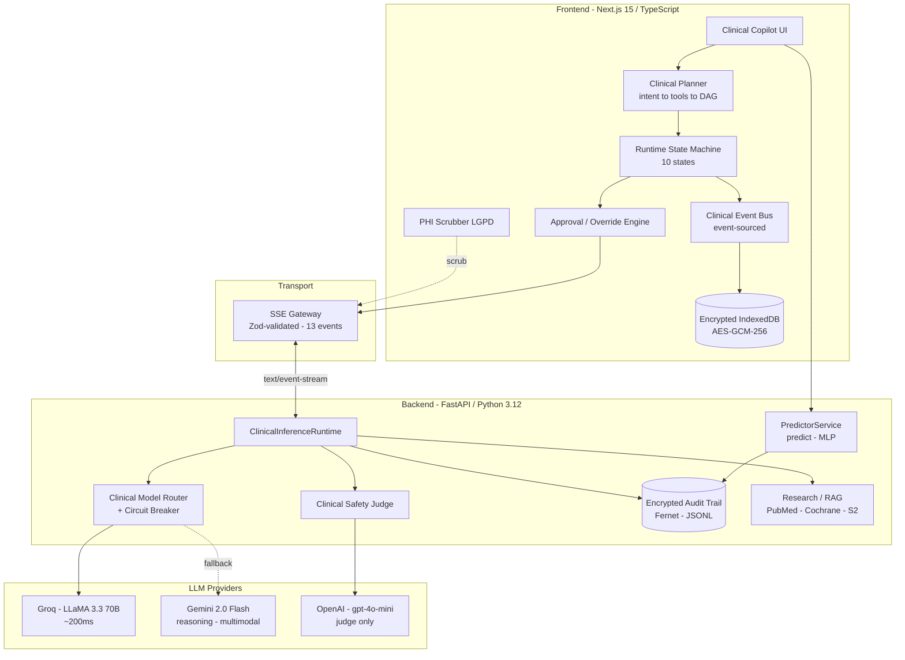
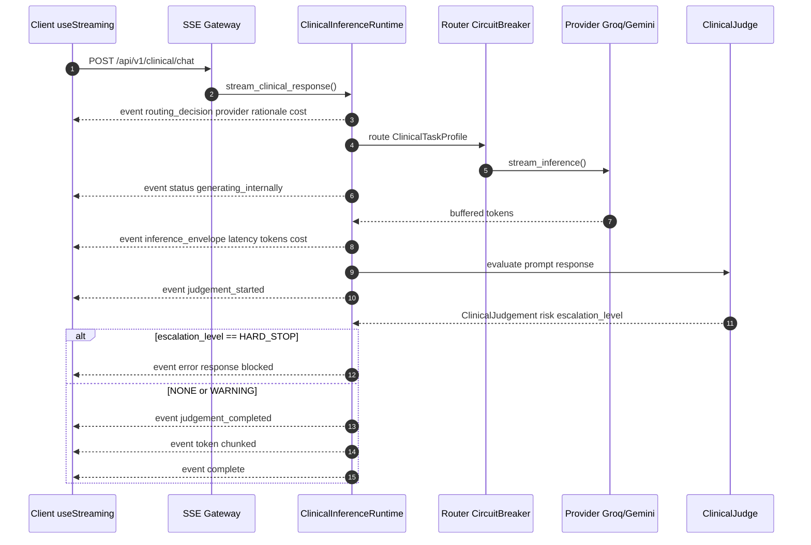
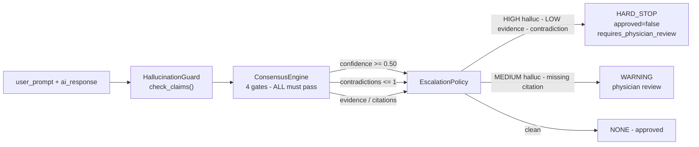
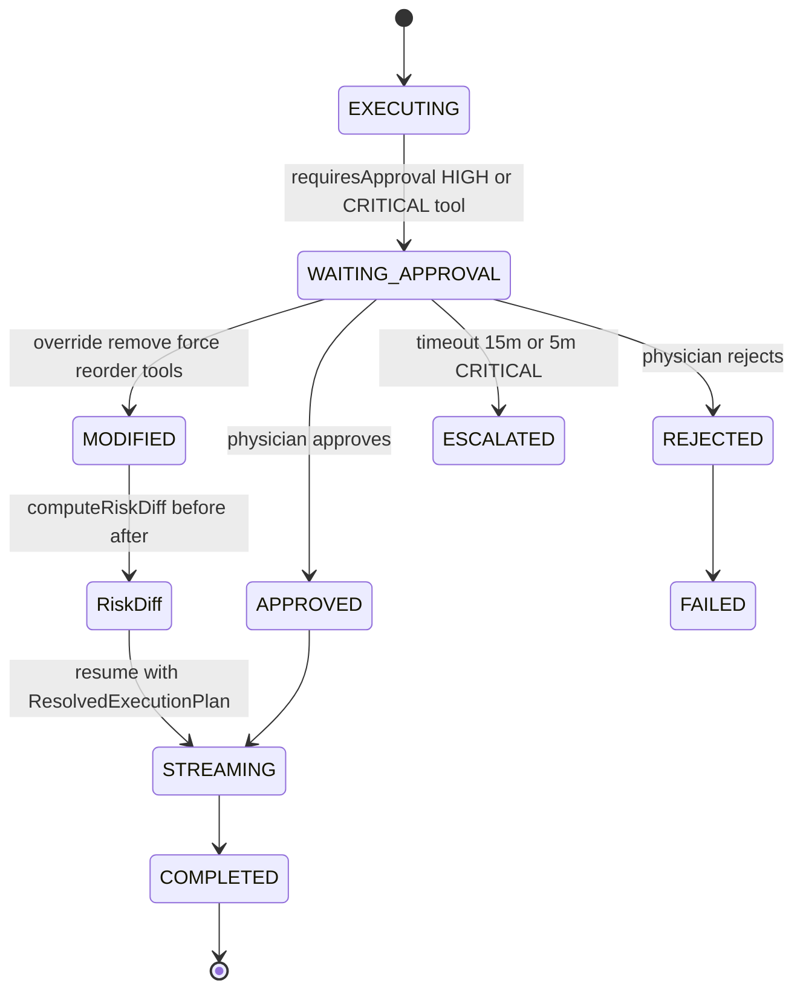

---
language:
- en
- pt
license: mit
tags:
- tabular-classification
- pytorch
- scikit-learn
- medical
- oncology
- health
datasets:
- custom/oral-cancer-top-30-countries
pipeline_tag: tabular-classification
model-index:
- name: Aether Oncology Tumor Classifier v3.0
  results:
  - task:
      type: tabular-classification
      name: Tabular Classification
    dataset:
      name: Oral Cancer Top 30 Countries
      type: custom/oral-cancer-top-30-countries
    metrics:
    - type: recall
      value: 0.97
      name: Recall (Sensitivity)
    - type: f1
      value: 0.96
      name: F1-Score
    - type: roc_auc
      value: 0.99
      name: ROC-AUC
---

<p align="center">
  🌐 <strong>English</strong> | <a href="./README.pt-br.md">Português</a>
</p>

<p align="center">
  
</p>

<h1 align="center">🪷 Aether Oncology</h1>

<h3 align="center"><em>A Clinical AI Operating System for Auditable Oncology Intelligence</em></h3>

<p align="center">
  <strong>Multi-agent orchestration · Cryptographic governance · Physician-in-the-loop · Hallucination-resistant inference</strong>
</p>

<br/>

<!-- ── Stack ── -->
<p align="center">
  
  
  
  
  
</p>

<!-- ── AI Providers ── -->
<p align="center">
  
  
  
</p>

<!-- ── Governance ── -->
<p align="center">
  
  
  
  
  
</p>

<!-- ── Quality ── -->
<p align="center">
  
  
  
  
</p>

<p align="center">
  <a href="https://api.vitorsilva.engineer/"></a>
  <a href="https://api.vitorsilva.engineer/docs"></a>
</p>

<br/>

|  |  |  |
| :---: | :---: | :---: |
| *Low Risk — 98.00% Confidence* | *High Risk — 92.76% Confidence* | *Explainability (XAI) via Radar Chart* |

---

> [!IMPORTANT]
> **Aether Oncology is a clinical *decision-support* and *research* platform — not a diagnostic device.**
> The model quantifies risk; the **physician decides**. See [Clinical Disclaimer](#-clinical-disclaimer).

---

## 📑 Table of Contents

1. [Overview](#-overview)
2. [Capability Maturity Matrix](#-capability-maturity-matrix)
3. [Key Features](#-key-features)
4. [System Architecture](#-system-architecture)
5. [Multi-Agent Execution Engine](#-multi-agent-execution-engine)
6. [Clinical Safety Engine](#-clinical-safety-engine)
7. [Physician Governance](#-physician-governance)
8. [Compliance: HIPAA · LGPD · FDA SaMD](#-compliance-hipaa--lgpd--fda-samd)
9. [Machine Learning Platform](#-machine-learning-platform)
10. [Data Governance](#-data-governance)
11. [SSE Streaming Protocol](#-sse-streaming-protocol)
12. [API Reference](#-api-reference)
13. [Project Structure](#-project-structure)
14. [Installation](#-installation)
15. [Environment Variables](#-environment-variables)
16. [Running the System](#-running-the-system)
17. [Testing](#-testing)
18. [Security Model](#-security-model)
19. [Clinical Disclaimer](#-clinical-disclaimer)
20. [Roadmap](#-roadmap)
21. [Contributing](#-contributing)
22. [License](#-license)

---

## 🌌 Overview

In 2017, **IBM Watson for Oncology** was withdrawn from hospitals after producing recommendations oncologists deemed unsafe. The post-mortem was unambiguous: a black box with no explainability, opaque training data, and **zero human supervision in the decision loop**.

**Aether Oncology is the architectural answer to that failure.**

It is not "another medical chatbot." It is a **Clinical AI Operating System** built around three non-negotiable principles:

- **🩺 Physician-in-the-loop, by design.** AI proposes; a clinician approves, modifies, or overrides — and every decision is recorded.
- **🔍 Auditable, not opaque.** Every inference emits structured, traceable events (`X-Request-ID` correlation), and every prediction is written to a **cryptographically encrypted, immutable audit trail**.
- **🛡️ Safety as a first-class layer.** A dedicated `ClinicalJudge` (hallucination guard → consensus engine → escalation policy) sits between the model and the user, with explicit `HARD_STOP` semantics.

The platform spans two complementary surfaces:

| Surface | What it is | Production maturity |
| :--- | :--- | :---: |
| **Diagnostic ML Core** (`/predict`) | A hospital-grade PyTorch MLP for **oral-cancer risk stratification**, governed by a full MLOps pipeline (Pandera contracts, calibration, fairness, leakage & drift audits, lineage, model cards). | ✅ **Production** |
| **Clinical AI Copilot** (`/api/v1/clinical/chat`) | A **multi-agent, SSE-streaming clinical reasoning runtime** — planner → execution DAG → provider router → safety judge → physician approval/override → event-sourced audit. | 🧪 **Experimental** |

> Aether is **engineered for Recall above all else.** In oncology, a false negative is not a statistical error — it is a lost early-intervention window. The model is tuned to maximize sensitivity (≈97% recall) and consciously accepts more false positives as a clinically justified trade-off.

---

## 🧭 Capability Maturity Matrix

> [!NOTE]
> Aether is an ambitious platform under active development. To stay honest, every major capability below is labelled by **maturity**, derived directly from the source tree — not from marketing.
>
> **✅ Current** = wired and exercised · **🧪 Experimental** = implemented but not fully integrated/validated · **🟡 Mock** = stubbed for demo/dev · **🗓️ Planned** = on the roadmap.

| Capability | Maturity | Evidence |
| :--- | :---: | :--- |
| Oral-cancer risk classification (MLP + confidence tiering) | ✅ Current | `src/main.py` · `src/services/predictor.py` |
| Encrypted, immutable audit trail (Fernet) | ✅ Current | `src/services/audit.py` |
| MLOps governance: Pandera schemas, calibration, leakage/fairness audits, OOD, lineage, model cards | ✅ Current | `src/train.py` · `src/ml/pipelines/**` |
| KS-Test data-drift detection | ✅ Current | `src/ml_platform/drift.py` · `src/services/audit.py` |
| Multi-provider LLM router (Groq → Gemini) + circuit breaker | ✅ Current | `src/providers/router.py` · `circuit_breaker.py` |
| SSE clinical-chat streaming runtime | ✅ Current (transport) | `src/orchestration/clinical_runtime.py` · `src/streaming/protocol.py` |
| Frontend multi-agent runtime (planner, state machine, override engine, event bus) | ✅ Current | `frontend/src/features/ai/orchestration/**` |
| Encrypted IndexedDB (AES-GCM-256 / PBKDF2) + LGPD PHI scrubber | ✅ Current | `frontend/.../persistence/crypto.ts` · `telemetry/scrubbers/phi.ts` |
| Clinical Safety Judge (hallucination → consensus → escalation) | 🧪 Experimental | `src/safety/**` — runs on `/chat`, **not** on `/predict` |
| Physician approval + override + risk-diff workflow | 🧪 Experimental | `frontend/.../runtime/approvalManager.ts` · `overrideEngine.ts` |
| Clinical tools (biomarker / therapy-match / guidelines-RAG) | 🟡 Mock | `frontend/src/features/ai/tools/registry.ts` (hardcoded data) |
| Frontend LLM provider (`NEXT_PUBLIC_LLM_PROVIDER`) | 🟡 Mock (default) | `frontend/src/features/ai/api/factory.ts` — defaults to `mock` |
| OpenAI as an **inference** provider | 🟡 Judge-only | used only inside the safety judge, not for chat inference |
| Genomic integration (KRAS/EGFR), Tumor-board simulation, FHIR/PACS | 🗓️ Planned | see [Roadmap](#-roadmap) |

---

## ✨ Key Features

### 🧠 Clinical Runtime
- **Deterministic clinical planner** — LLM-free intent detection (weighted keywords + 47 oncology gene symbols), tool selection from a capability registry, and topological **execution-DAG** building.
- **Strict runtime state machine** — 10 enforced states with validated transitions (`IDLE → HYDRATING → PLANNING → RETRIEVING → EXECUTING → STREAMING → WAITING_APPROVAL → COMPLETED | FAILED | INTERRUPTED`).
- **Tool runtime engine** — sequential stages with intra-stage parallelism, per-tool timeouts, exponential-backoff retries, and `AbortSignal` cancellation.

### 🛡️ Safety & Governance
- **ClinicalJudge pipeline** — `HallucinationGuard` → `ConsensusEngine` → `EscalationPolicy`, emitting a structured `ClinicalJudgement` (hallucination risk, evidence strength, contradictions, missing citations).
- **Three-tier escalation** — `NONE` / `WARNING` / `HARD_STOP` (a `HARD_STOP` blocks the response and short-circuits the stream).
- **Confidence-tiered safety loop** on `/predict` — `High ≥ 0.30`, `Medium ≥ 0.15`, `Low < 0.15` margin from the 0.5 threshold; `Low` raises a mandatory-review `warning`.

### 🔬 ML Platform
- **Pandera data contracts** for training **and** inference (distinct schemas).
- **Probability calibration** — Platt vs. Isotonic auto-selected by Brier score, with ECE/MCE and reliability curves.
- **Leakage, fairness, OOD & drift auditing** built into the training pipeline.
- **SHA-256 data lineage** + **FDA-style model cards** + **MLflow** tracking.

### 🔐 Security & Compliance
- **Fernet-encrypted** audit logs with versioned crypto envelopes.
- **Client-side AES-GCM-256** encryption of conversation data in IndexedDB (PBKDF2-SHA256, 100k iterations).
- **LGPD PHI scrubber** with Brazilian-format regexes (CPF, CNS/SUS, CRM, CEP, BR phone) — 42-case test suite.

### 📡 Streaming Architecture
- **Server-Sent Events (SSE)** with a strictly-typed, **Zod-validated 13-event protocol** and forward-compatible event forwarding.

### 📜 Replay & Auditability
- **Event-sourced clinical event bus** — all state transitions, approvals, overrides, and risk changes are emitted with `BaseEventMetadata` (`traceId`, `sessionId`, `patientId`, `sequence`) for replay and audit.

### 👨‍⚕️ Physician Workflow
- **Approval modal**, **DAG override editor**, **before/after risk diff**, and **timeout governance** (15 min default, 5 min for `CRITICAL`).

---

## 🏗️ System Architecture

### High-Level Architecture



### Clinical Chat — Runtime Sequence (SSE)



### Clinical Safety Pipeline



### Physician Approval & Override Workflow



---

## 🧩 Multi-Agent Execution Engine

The frontend runtime (`frontend/src/features/ai/orchestration/`) is a **deterministic, LLM-free planning pipeline** followed by an **approval-gated execution engine**.

| Layer | Module | Responsibility |
| :--- | :--- | :--- |
| **1 · Intent Detection** | `planner/intentDetector.ts` | Weighted keyword + regex + gene-symbol matching → `ClinicalIntent` (no LLM call). |
| **2 · Tool Selection** | `planner/toolCapabilities.ts` | Metadata registry (risk level, approval requirement, dependencies, latency, cost). |
| **3 · Execution Graph** | `planner/planner.ts` | Topological sort of tool dependencies → `ExecutionPlan` DAG (cycle-safe). |
| **4 · Risk Escalation** | `planner/planner.ts` | `getMaxRisk()` over selected tools → `requiresApproval` flag. |
| **Runtime** | `runtime/stateMachine.ts` | 10-state machine with validated transitions. |
| **Tool Engine** | `tools/runtime.ts` | Parallel-within-stage execution, timeouts, retries, abort. |

**Enumerations (source of truth):**

```ts
ClinicalIntent  = biomarker_analysis | therapy_matching | prognosis | trial_search
                | evidence_review | imaging_analysis | risk_assessment | general_inquiry | unknown
ClinicalRiskLevel = LOW | MODERATE | HIGH | CRITICAL
ClinicalRuntimeState = IDLE | HYDRATING | PLANNING | RETRIEVING | EXECUTING
                     | STREAMING | WAITING_APPROVAL | INTERRUPTED | FAILED | COMPLETED
```

**Backend routing** (`src/providers/router.py`): a `ClinicalModelRouter` selects a provider from a `ClinicalTaskProfile` (intent, risk level, latency/reasoning/multimodal needs). Default chain: **Groq (≈200 ms)** primary → **Gemini 2.0 Flash** fallback, each wrapped by `clinical_circuit_breaker` (opens after **3** failures, **60 s** recovery, then `HALF-OPEN` probing).

> 🟡 **Honest note:** the three registered tools (`biomarker-analysis`, `therapy-matching`, `clinical-guidelines-rag`) currently return **mock clinical data**. The orchestration, DAG, and governance around them are real; the tool *backends* are Phase-3 work.

---

## 🛡️ Clinical Safety Engine

The safety layer (`src/safety/`) wraps every **clinical-chat** response. It is the conceptual heir to the lesson of Watson: *no model output reaches a clinician without a verdict.*

```
ClinicalJudge.evaluate(prompt, response)
        │
        ├── HallucinationGuard.check_claims()   → delegates to JudgeProvider (OpenAI gpt-4o-mini)
        ├── ConsensusEngine.evaluate_consensus()  → 4 gates, ALL must pass
        └── EscalationPolicy.evaluate()           → NONE | WARNING | HARD_STOP
```

**`ClinicalJudgement`** (`src/safety/types.py`):

| Field | Type | Meaning |
| :--- | :--- | :--- |
| `approved` | `bool` | Whether the response may be delivered |
| `confidence` | `float [0–1]` | Judge confidence |
| `hallucination_risk` | `LOW · MEDIUM · HIGH` | Likelihood of fabricated claims |
| `evidence_strength` | `LOW · MODERATE · HIGH` | Quality of cited evidence |
| `contradictions` | `List[str]` | Detected clinical contradictions |
| `missing_citations` | `List[str]` | Claims lacking citation |
| `requires_physician_review` | `bool` | Mandatory escalation flag |
| `escalation_level` | `NONE · WARNING · HARD_STOP` | Final gate decision |

**Consensus gates** (`consensus_engine.py`): confidence floor **0.50**, max **1** contradiction, citation scrutiny when evidence is `LOW`.

**Escalation rules** (`escalation_policy.py`):
- **`HARD_STOP`** → `HIGH` hallucination **OR** `LOW` evidence **OR** any contradiction → response **blocked**, `approved=false`.
- **`WARNING`** → `MEDIUM` hallucination **OR** missing citations → response delivered but flagged for review.

> 🧪 **Experimental & scope:** the judge runs on `POST /api/v1/clinical/chat`. The diagnostic `/predict` endpoint uses the simpler, fully-production **confidence-tiering safety loop** (not the LLM judge). Hallucination guarding currently delegates to the OpenAI judge; specialized PMID/guideline cross-referencing is planned.

---

## 👨‍⚕️ Physician Governance

Governance is event-sourced end-to-end (`frontend/src/features/ai/orchestration/runtime/`).

- **`WAITING_APPROVAL`** — when the plan contains a tool with `requiresApproval`, execution suspends and a `ClinicalApprovalRequested` event is emitted.
- **`ClinicalApprovalManager`** — creates a `PendingApproval` (nanoid), persists to the backend approval store, and schedules a timeout: **`DEFAULT_TIMEOUT_MS = 15 min`**, **`CRITICAL_TIMEOUT_MS = 5 min`**, with an **80%** warning threshold.
- **Override Engine** (`overrideEngine.ts`) — a *pure functional* transform: physicians can **remove**, **force**, or **reorder** tools. The original plan is **never mutated**; a new `ResolvedExecutionPlan` is returned with a full audit trail.
- **`RiskDiffViewer`** — renders the before/after `RiskProfile` (`hallucinationRisk`, `evidenceStrength 0–100`, `consensusScore VERIFIED/PARTIAL/FAILED`, `fdaCompliance PASS/WARNING/FAIL`).
- **Immutable audit** — every decision emits `ClinicalApprovalResolved` (`APPROVED · REJECTED · ESCALATED · MODIFIED`), `ExecutionPlanOverridden`, and `RiskProfileChanged` to the event bus, persisted to encrypted IndexedDB.

> 🧪 Physician identity (`physicianSession.ts`) currently uses a demo/fallback profile; production requires hospital SSO/SAML integration. Approval-timeout auto-rejection is partially wired.

---

## 🔐 Compliance: HIPAA · LGPD · FDA SaMD

> [!WARNING]
> These describe **engineering controls and readiness**, not certifications. Aether is HIPAA/LGPD/FDA-SaMD *aligned and ready*; no formal Business Associate Agreement or regulatory clearance has been obtained.

### HIPAA (PHI confidentiality)
- **Encrypted audit logs** — `src/services/audit.py` wraps every prediction in a Fernet-encrypted JSON envelope (`key_version`, `algorithm`, `encrypted`, `payload`).
- **Fail-closed auth** — in production (`AETHER_ENV != dev`), protected endpoints return **503** when `API_KEY` is unset (no open access) and the app never injects default/ephemeral keys. A missing `AUDIT_ENCRYPTION_KEY` disables audit writes (fail-safe) and is logged **critical** instead of silently using a throwaway key.
- **Encrypted client storage** — conversation data is AES-GCM-256 encrypted in IndexedDB before persistence.
- **Migration tooling** — `src/scripts/migrate_logs.py` upgrades legacy plaintext logs into encrypted envelopes.

### LGPD (Brazilian data protection)
- **PHI scrubber** (`telemetry/scrubbers/phi.ts`) redacts Brazilian identifiers before any telemetry: **CPF, CNS/SUS, CRM, CEP, BR phone, email, DOB** — recursive over objects/arrays, with a 42-case test suite.
- **Fail-closed PHI gate** — `scrubPHI()` runs *before* inference; a failure halts execution and emits `InferenceFailed`.

### FDA SaMD / ANVISA readiness
- **Model cards** (`src/ml/pipelines/model_card_generator.py`, `models/model_card.md`) document intended use (CDSS, oral-cancer screening), clinical limitations (pediatric exclusion, immunocompromised contraindication, geographic variance), calibration, and fairness.
- **Deterministic lineage** — `src/ml/pipelines/lineage.py` records SHA-256 checksums of dataset, schemas, clinical rules, feature registry, and preprocessing logic + git commit (`models/data_lineage.json`).
- **Immutable snapshots** — training persists `raw.parquet` / `validated.parquet` keyed by dataset hash.
- **Event-sourced replay** — every clinical event carries a `sequence` within a `traceId` for deterministic reconstruction.

---

## 🔬 Machine Learning Platform

The diagnostic core is governed by a **hospital-grade MLOps pipeline** (`src/train.py` orchestrating `src/ml/pipelines/**`).

| Stage | Module | What it does |
| :--- | :--- | :--- |
| **Validation** | `validation/{training,inference}_schema.py`, `clinical_rules.py` | Pandera DataFrame schemas + clinical-coherence rules with severity `OK/WARNING/HIGH/CRITICAL` (pediatric <18 exclusion, survival bounds, stage/survival inconsistency). |
| **Feature Eng.** | `preprocessing/preprocessing.py` | `ClinicalFeatureExtractor` derives `risk_index` (tobacco+alcohol+HPV), `age_bucket`, `high_incidence_country`; then `StandardScaler` + `OneHotEncoder`. |
| **Leakage Audit** | `audit/leakage.py` | Blocks posterior features (`Diagnosis_Stage`); flags Pearson \|r\|>0.95, MI>0.95, permutation importance>0.45. |
| **OOD** | `preprocessing/ood.py` | Isolation Forest (`contamination=0.01`) flags rare demographic combinations. |
| **Calibration** | `calibration/calibration_engine.py` | Platt vs. Isotonic auto-selected by Brier; ECE/MCE over 10 bins; reliability curve. |
| **Fairness** | `audit/fairness.py` | Equalized-Odds FNR/FPR/recall disparity (15% threshold) across Gender / age-bucket / Country. |
| **Drift** | `drift/drift_rules.py`, `ml_platform/drift.py` | KS-test (p<0.05), PSI ≥0.25, JS-divergence ≥0.20; global flag when >33% features drift. |
| **Lineage & Cards** | `lineage.py`, `model_card_generator.py` | SHA-256 lineage + FDA-style model card. |
| **Tracking** | `train.py` | MLflow logging + model registry (`AetherOncologyOralCancerHighRisk`). |

**Model** — `src/models/mlp.py`: a configurable MLP `Input → [128, 64, 32] → 1 logit` with BatchNorm, ReLU, Dropout(0.3), trained with `BCEWithLogitsLoss(pos_weight)` and early stopping. Hyperparameter search via **Optuna (TPE)** in `src/optimize.py`.

**Dataset** — *Oral Cancer Top 30 Countries* (MIT License); binary target `high_risk = Diagnosis_Stage ∈ {Moderate, Late}`.

> 🧐 **Integrity note:** the committed `models/fairness_audit.json` reports near-perfect parity across all subgroups, which is unusual for a real holdout and likely reflects a synthetic/regenerated evaluation set. Treat the fairness *infrastructure* as production-grade and the *reported numbers* as provisional pending validation on real clinical data.

---

## 🗂️ Data Governance

- **Two schemas, by intent** — training (`strict`, full enums) vs. inference (looser, includes `Unknown` variants) prevent train/serve skew.
- **Severity engine** — `ClinicalValidationResult` tags each record `OK / WARNING / HIGH / CRITICAL`; `HIGH/CRITICAL` blocks inference (e.g. pediatric age, stage/survival contradiction).
- **Temporal & proxy leakage** — posterior features are hard-blocked; correlation/MI/permutation thresholds raise `ValueError` during training.
- **OOD detection** — Isolation Forest guards against demographic combinations unseen in training.
- **Calibration monitoring** — ECE/MCE + reliability curves persisted to `models/calibration/`.
- **Drift governance** — KS / PSI / JS divergence with a >33% global-drift trigger feeding the Continuous-Training workflow.

---

## 📡 SSE Streaming Protocol

Clinical chat streams over **Server-Sent Events** (`text/event-stream`). Every event is a JSON object carrying `BaseEventMetadata` (`sessionId`, `patientId`, `traceId`, optional `retrievalId` / `sequence`) and is validated against a **Zod union of 13 event types** on the client (`transport/protocol/protocol.ts`).

| Event | Emitted by | Payload highlights |
| :--- | :--- | :--- |
| `routing_decision` | backend | `provider`, `model`, `rationale`, `estimated_latency_ms`, `estimated_cost`, `fallback_chain`, `was_fallback` |
| `status` | backend | inference phase (`thinking`, `retrieving`, `generating_internally`, `judging`, `streaming`, …) |
| `inference_envelope` | backend | `prompt_tokens`, `completion_tokens`, `latency_ms`, `cost_estimate` |
| `judgement_started` | backend | safety evaluation begins |
| `judgement_completed` | backend | full `ClinicalJudgement` record |
| `hallucination_detected` | backend | flagged claims |
| `escalation_triggered` | backend | `WARNING` / `HARD_STOP` |
| `token` | backend | streamed text chunk |
| `citation` | backend | evidence / source metadata |
| `attachment` | backend | chart / artifact metadata |
| `trace` | backend | trace anchor |
| `error` | backend | stream failure / `HARD_STOP` block |
| `complete` | backend | stream finished |

**Example stream:**

```text
data: {"type":"routing_decision","provider":"groq","model":"llama-3.3-70b-versatile","rationale":"live_streaming → low-latency"}

data: {"type":"status","status":"generating_internally"}

data: {"type":"inference_envelope","latency_ms":345,"prompt_tokens":512,"completion_tokens":188}

data: {"type":"judgement_completed","hallucination_risk":"LOW","evidence_strength":"HIGH","escalation_level":"NONE"}

data: {"type":"token","chunk":"Given the BRCA1 status, "}

data: {"type":"complete"}
```

**Deterministic replay** — the client gateway retries with exponential backoff (3 attempts: 500 ms · 1 s · 2 s), supports `AbortSignal` cancellation, recognizes the `[DONE]` marker, and forwards unknown-but-typed events for forward compatibility. Because every event carries a `sequence` within its `traceId`, a session can be replayed event-by-event from the event bus.

> 🧪 Several backend telemetry events (`judgement_*`, `routing_decision`, `inference_envelope`, `hallucination_detected`, `escalation_triggered`) are defined and emitted, but not all are consumed by the current frontend hooks.

---

## 🌐 API Reference

Base URL (prod): `https://api.vitorsilva.engineer` · Interactive docs: `/docs`. **✅** routes require the `access_token` header; **🌐** are open. Auth is **fail-closed** (503 if `API_KEY` is unset in production).

> **Tech Challenge note:** `/predict` is intentionally **open (🌐, no key)** for academic evaluation — it stays rate-limited and audited (fail-closed). All **governance** routes remain protected. In production every route would be key-gated and, later, per-user **OAuth2/OIDC**.

| Method | Route | Auth | Description |
| :--- | :--- | :---: | :--- |
| `POST` | `/predict` | 🌐 | Oral-cancer risk prediction (`OralCancerRequest` → `PredictionResponse`). Public (eval), rate-limited 10/min, audited fail-closed. |
| `POST` | `/api/v1/clinical/chat` | — | **SSE** clinical-copilot stream. |
| `GET` | `/api/v1/clinical/approvals` | — | List pending physician approvals. |
| `GET` | `/api/v1/clinical/approvals/{id}` | — | Fetch an approval. |
| `POST` | `/api/v1/clinical/approvals` | — | Create an approval request. |
| `DELETE` | `/api/v1/clinical/approvals/{id}` | — | Resolve / delete an approval. |
| `POST` | `/feedback` | ✅ | Submit ground truth for a prediction (drift/fairness loop). |
| `GET` | `/analytics` | ✅ | Drift metrics (KS-test p-values). |
| `GET` | `/audit` | ✅ | Decrypted audit-trail view. |
| `GET` | `/monitor/drift` | ✅ | KS-test drift report. |
| `GET` | `/monitor/fairness` | ✅ | Fairness audit vs. ground-truth feedback. |
| `GET` | `/monitor/sustainability` | ✅ | Green-AI carbon report. |
| `GET` | `/health`, `/health/live`, `/health/ready`, `/health/inference` | — | Liveness / readiness / model status. |
| `GET` | `/version`, `/heartbeat` | — | Build SHA & ops heartbeat. |

**`OralCancerRequest`** (8 fields): `age`, `survival_rate`, `tobacco_use`, `alcohol_use`, `country`, `gender`, `socioeconomic_status`, `treatment_type`.

---

## 📁 Project Structure

```text
Aether Oncology/
├── src/                              # ⚙️ FastAPI backend (Python 3.12)
│   ├── main.py                       # App wiring, lifespan, /predict, monitoring, SRE middleware
│   ├── api/
│   │   ├── routes/clinical_chat.py   # SSE chat + approval endpoints
│   │   └── schemas.py                # Pydantic contracts (OralCancerRequest, PredictionResponse)
│   ├── orchestration/
│   │   └── clinical_runtime.py       # ClinicalInferenceRuntime (routing→stream→judge→escalate)
│   ├── providers/                    # 🤖 LLM provider plugins
│   │   ├── base.py  router.py  circuit_breaker.py
│   │   ├── groq_provider.py  gemini_provider.py
│   │   └── openai_provider.py  judge_provider.py
│   ├── safety/                       # 🛡️ Clinical safety engine
│   │   ├── clinical_judge.py  consensus_engine.py
│   │   ├── hallucination_guard.py  escalation_policy.py  types.py
│   ├── streaming/protocol.py         # 📡 SSE event models + format_sse()
│   ├── ml/pipelines/                 # 🔬 ML governance
│   │   ├── validation/  calibration/  audit/  drift/  preprocessing/
│   │   ├── lineage.py  model_card_generator.py
│   ├── ml_platform/                  # Orchestrator, drift, fairness, green_ai, training
│   ├── models/mlp.py                 # PyTorch MLP
│   ├── services/                     # audit · predictor · research(RAG) · approval_store · inference_client
│   ├── train.py  optimize.py         # Training + Optuna HPO
│   └── core/logging.py               # Structured JSON logging + request context
│
├── frontend/                         # 🖥️ Next.js 15 / React 19 / TypeScript
│   └── src/features/ai/
│       ├── orchestration/
│       │   ├── planner/              # intentDetector · toolCapabilities · planner
│       │   └── runtime/              # stateMachine · eventBus · overrideEngine
│       │                             #   approvalManager · physicianSession · executionContext
│       ├── transport/                # aiGateway · protocol(Zod) · sse(stream-reader)
│       ├── tools/                    # registry · runtime (DAG executor)  ⟶ 🟡 mock tools
│       ├── services/persistence/     # crypto(AES-GCM) · db(IndexedDB)
│       ├── telemetry/scrubbers/phi.ts# 🔐 LGPD PHI scrubber (+ tests)
│       └── components/               # approval/ override/ safety/ intelligence/ rag/ chat/
│
├── models/                           # Trained artifacts + governance outputs
│   ├── aether_mlp_v2.pth  preprocessor.joblib  calibrator.joblib  ood_detector.joblib
│   ├── model_card.md  data_lineage.json  fairness_audit.json
│   └── calibration/                  # ECE/MCE, Brier, reliability_curve.png
│
├── infrastructure/                   # ☸️ Kubernetes + Terraform (AWS EKS/Aurora)
├── .github/workflows/                # 🔁 unified-mlops · ml-ct · keep_alive
├── tests/                            # pytest: api · model · schema · audit · research
├── docs/                             # MODEL_CARD · INFRASTRUCTURE · screenshots
├── Dockerfile  Makefile  pyproject.toml  requirements.txt
└── README.md
```

---

## ⚙️ Installation

### Prerequisites
- **Python 3.12+**, **Node.js 22+**, `git`.

### Backend

```bash
# 1. Clone
git clone https://github.com/vdfs89/Aether_Oncology.git
cd Aether_Oncology

# 2. Virtual environment
python -m venv .venv
source .venv/bin/activate          # Windows: .venv\Scripts\Activate.ps1

# 3. Dependencies
pip install -r requirements.txt

# 4. Configure environment (see table below)
cp .env.example .env               # then add the required keys
```

### Frontend

```bash
cd frontend
npm install
cp .env.local.example .env.local   # or create .env.local manually
```

---

## 🔑 Environment Variables

> [!IMPORTANT]
> The backend **validates configuration at startup** and logs **critical** when a required variable (`API_KEY`, `AUDIT_ENCRYPTION_KEY`) is missing in production. Rather than crash-looping a PaaS, it **fails closed at the request layer** (protected endpoints → 503) and **fails safe** for audit (writes disabled) — never using insecure defaults (`src/main.py` lifespan + `get_api_key`).

### Backend

| Variable | Required | Default | Purpose |
| :--- | :---: | :--- | :--- |
| `API_KEY` | ✅ (prod) | — | `access_token` header for protected routes. **No default**: if unset in production, protected routes return 503 (fail-closed). `/predict` is public. |
| `OPENAI_API_KEY` | ✅ | — | Powers the safety **judge** (`gpt-4o-mini`). |
| `GROQ_API_KEY` | ✅ | — | Primary low-latency LLM provider (LLaMA 3.3 70B). |
| `GEMINI_API_KEY` | ✅ | — | Reasoning / multimodal fallback provider (Gemini 2.0 Flash). |
| `AUDIT_ENCRYPTION_KEY` | ✅ | — | **Fernet** symmetric key for the encrypted audit trail (validated at boot). |
| `OPENAI_JUDGE_MODEL` | ⬜ | `gpt-4o-mini` | Override the judge model. |
| `MLFLOW_TRACKING_URI` | ⬜ | `./mlruns` | MLflow experiment tracking store. |
| `ENTREZ_EMAIL` | ⬜ | placeholder | NCBI/PubMed RAG identification. |
| `HF_TOKEN` | ⬜ | — | Optional Hugging Face remote-inference fallback. |

Generate a Fernet key:

```bash
python -c "from cryptography.fernet import Fernet; print(Fernet.generate_key().decode())"
```

### Frontend

| Variable | Default | Purpose |
| :--- | :--- | :--- |
| `NEXT_PUBLIC_API_URL` | `http://localhost:8000` | Backend base URL for SSE & prediction calls. |
| `NEXT_PUBLIC_LLM_PROVIDER` | `mock` | Frontend provider selection: `mock` · `groq` · `gemini`. |

---

## ▶️ Running the System

```bash
# Backend (FastAPI + Uvicorn)
uvicorn src.main:app --reload --port 8000
#  → API at http://localhost:8000 · docs at /docs

# Frontend (Next.js)
cd frontend && npm run dev
#  → Portal at http://localhost:3000

# Train / retrain the diagnostic model (writes to models/ + MLflow)
python -m src.train

# Hyperparameter optimization (Optuna)
python -m src.optimize
```

> ℹ️ Before the model is trained, prediction routes return `503` and the corresponding tests are marked `xfail` — the API still boots.

---

## 🧪 Testing

```bash
# Backend — full suite (~91% coverage)
pytest                              # or: pytest -v --cov=src

# Targeted suites
pytest tests/test_api.py            # endpoint + auth + schema-validation integration
pytest tests/test_model.py          # MLP forward shape, gradients, sigmoid bounds
pytest tests/test_schema.py         # Pandera data contracts
pytest tests/test_audit.py          # Fernet encryption + KS-test drift statuses
pytest tests/test_research.py       # RAG / circuit-breaker behavior

# Frontend
cd frontend
npm run lint                        # ESLint
npx tsc --noEmit                    # TypeScript type-check
npx tsx src/features/ai/telemetry/scrubbers/__tests__/phi.test.ts   # PHI scrubber (42 cases)
```

| Suite | Covers |
| :--- | :--- |
| **PHI scrubber** | CPF, CNS/SUS, CRM, CEP, BR phone, email, DOB redaction (42 cases) |
| **Safety** | `overrideEngine` unit tests, tool-runtime DAG execution |
| **Replay/audit** | encrypted JSONL round-trip + drift statuses (`insufficient`, `collecting`, `stable`, `alert`) |

---

## 🔐 Security Model

| Layer | Primitive | Where |
| :--- | :--- | :--- |
| **Audit at rest** | **Fernet** (AES-128-CBC + HMAC-SHA256) symmetric encryption with versioned envelopes | `src/services/audit.py` |
| **Client storage** | **AES-GCM-256** with a random 12-byte IV per record | `frontend/.../persistence/crypto.ts` |
| **Key derivation** | **PBKDF2-SHA256**, 100,000 iterations | `crypto.ts` |
| **Lineage integrity** | **SHA-256** checksums of dataset/schemas/preprocessing | `src/ml/pipelines/lineage.py` |
| **Transport / API** | API-key (`access_token`), strict CORS, SlowAPI rate limiting, `X-Request-ID` correlation | `src/main.py` |
| **PHI** | Regex redaction (LGPD) **before** any logging/telemetry | `telemetry/scrubbers/phi.ts` |
| **Container** | Non-root user, `readOnlyRootFilesystem`, `allowPrivilegeEscalation=false` | `Dockerfile`, K8s manifests |

> [!NOTE]
> Hardening backlog (intentionally surfaced): the IndexedDB PBKDF2 salt is a fixed constant (acceptable for high-entropy session tokens but documented), a demo fallback session token exists for dev, and the audit `.jsonl` has no retention cap yet. See [Roadmap](#-roadmap).

---

## ⚕️ Clinical Disclaimer

> [!CAUTION]
> **Aether Oncology is NOT a diagnostic device and must not be used to make autonomous clinical decisions.**
>
> - It is a **Clinical Decision Support System (CDSS)** for **risk screening** and **research assistance** only.
> - **Physician oversight is mandatory.** The model quantifies risk; a licensed clinician interprets, validates, and decides.
> - It has **not** received FDA clearance, ANVISA registration, CE marking, or any regulatory approval.
> - The model is **not validated for pediatric patients (<18)**, immunocompromised individuals, or populations outside its training distribution (Top-30 oral-cancer-burden countries).
> - Outputs may contain errors or hallucinations; the safety engine **reduces** but does not **eliminate** this risk.

---

## 🛤️ Roadmap

### Near term — Hardening & Observability
- [ ] Migrate audit trail from JSONL → **PostgreSQL/Supabase** (Aurora is already provisioned in Terraform).
- [ ] **OpenTelemetry** distributed tracing (replace manual `X-Request-ID`).
- [ ] Wire backend `judgement_*` / `escalation_triggered` events into frontend safety HUD consumption.
- [ ] Hospital **SSO/SAML** for real physician identity; enforce approval-timeout auto-rejection.
- [ ] Audit-log retention policy + size caps.

### Mid term — Clinical Depth
- [ ] Replace **mock clinical tools** with real backends (biomarker, therapy-match, guidelines).
- [ ] **RAG over NCCN** guidelines with a real vector store (`VectorDBService` is currently stubbed).
- [ ] Automated **Fairlearn** bias auditing in CI.
- [ ] **Temporal reasoning** over longitudinal biomarker trajectories.

### Long term — Platform Vision
- [ ] **Tumor-board simulation** (multi-agent deliberation).
- [ ] **Genomic integration** (KRAS, EGFR, HER2) — multimodal correlation.
- [ ] **Real-time FHIR** + **PACS** integration.
- [ ] **Federated learning** + **differential privacy** for cross-institution training.

---

## 🤝 Contributing

Contributions are welcome — this is an open-source clinical-AI engineering project.

1. **Fork** and create a feature branch: `git checkout -b feat/your-feature`.
2. Keep the maturity contract honest — new capabilities must be labelled `Current / Experimental / Mock / Planned`.
3. Run the gates before opening a PR:
   ```bash
   ruff check . && ruff format --check .
   pytest
   cd frontend && npm run lint && npx tsc --noEmit
   ```
4. For clinical/safety-relevant changes, include tests and update the relevant **model card** / **safety docs**.
5. Open a PR against `main` with a clear description and the maturity impact.

Please follow the existing module conventions (`src/` for backend, `frontend/src/features/ai/` for the runtime) and never weaken PHI/audit/safety controls without explicit discussion.

---

## 👤 Author

**Vitor Diogo Fonseca da Silva** — RM375157
FIAP · Pós-Tech — Tech Challenge (Fase 1). [github.com/vdfs89](https://github.com/vdfs89)

---

## 📄 License

Distributed under the **MIT License**. See [`LICENSE`](./LICENSE) for details.

---

<p align="center">
  <em>Aether Oncology — Medicine is an Art, Science is the Tool.</em><br/>
  <strong>Precision for Life.</strong> 🪷
</p>
