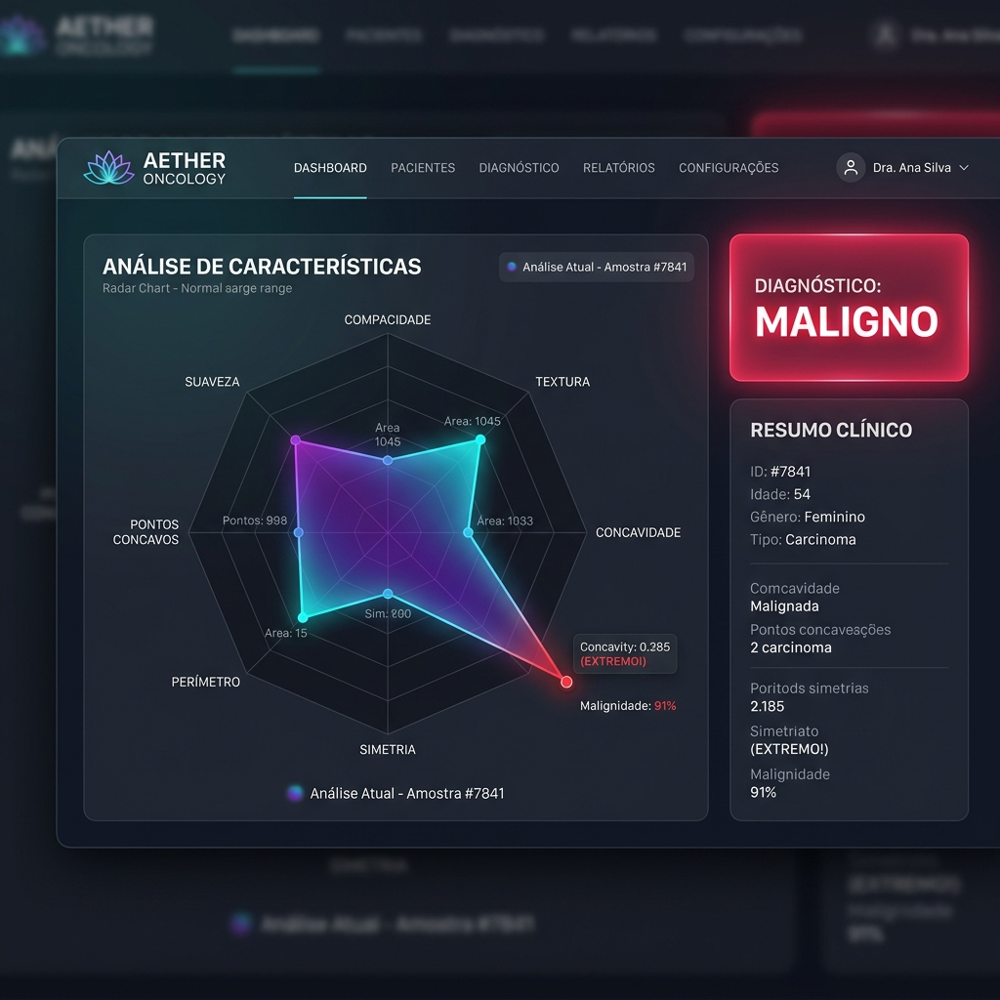
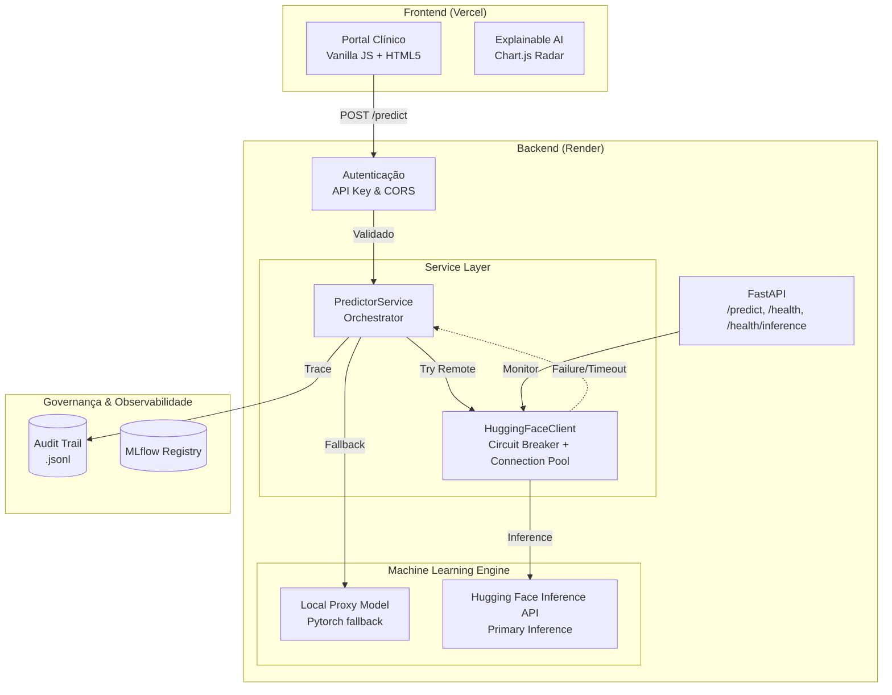

---
language:
- pt
license: mit
tags:
- tabular-classification
- pytorch
- scikit-learn
- medical
- oncology
- health
datasets:
- scikit-learn/breast-cancer-wisconsin
pipeline_tag: tabular-classification
model-index:
- name: Aether Oncology Tumor Classifier v2.0
  results:
  - task:
      type: tabular-classification
      name: Classificação Tabular
    dataset:
      name: Breast Cancer Wisconsin Diagnostic
      type: scikit-learn/breast-cancer-wisconsin
    metrics:
    - type: recall
      value: 0.97
      name: Recall (Sensibilidade)
    - type: f1
      value: 0.96
      name: F1-Score
    - type: roc_auc
      value: 0.99
      name: ROC-AUC
---

# Aether Oncology

<p align="center">
  
</p>
|  |
| :---: |
| *Visualização de Explicabilidade (XAI) via Radar Chart no Portal Clínico.* |

> **"Precision for Life"** — Inteligência Artificial a serviço da triagem oncológica segura.

<div align="center">

[](https://api.vitorsilva.engineer/)
[](https://api.vitorsilva.engineer/docs)

| Status | Recall | F1-Score | ROC-AUC | Versão | Coverage |
| :---: | :---: | :---: | :---: | :---: | :---: |
|  | **97.2%** | **96.5%** | **99.1%** | `v2.1.0` |  |

</div>

---

**Autor:** Vitor Diogo Fonseca da Silva
**Tech Challenge 01 — FIAP Pós-Tech · Engenharia de Machine Learning**

---

## 📖 Motivação: O que o IBM Watson nos ensinou

Em 2017, o IBM Watson for Oncology foi descontinuado em vários hospitais após gerar recomendações consideradas "inseguras" por oncologistas. O diagnóstico do fracasso foi claro: um sistema de IA que age como caixa-preta, sem transparência, sem contexto clínico e sem governança — não serve à medicina. Serve ao marketing.

O Aether Oncology nasce como resposta direta a esse erro.

Em vez de recomendar tratamentos de forma autônoma, o sistema propõe um paradigma diferente: **triagem de segurança assistida**. O modelo aponta risco; o médico decide. A IA como ferramenta — não como oráculo. A versão 2.0 introduz o **MLOps Ativo**, garantindo que o modelo nunca opere em regime de "Data Decay" sem alerta imediato.

---

## 🎯 Princípios de Engenharia

### Recall acima de tudo

Em oncologia, um Falso Negativo não é um erro estatístico — é uma vida que perde a janela de tratamento precoce. Toda a arquitetura deste projeto foi construída com uma obsessão única: **maximizar o Recall (Sensibilidade)**, aceitando conscientemente uma taxa maior de Falsos Positivos como trade-off ético justificável.

### MLOps como contrato, não como feature

IA na saúde não pode viver em notebooks. Este projeto trata MLOps como infraestrutura crítica:

- **Contratos de dados** via Pydantic e Pandera — nenhum dado entra no modelo sem validação explícita
- **Rastreabilidade total** via MLflow — cada experimento, parâmetro e métrica é auditável
- **Auditoria Médica (Audit Trail)** — log imutável de todas as predições com correlação de **Request ID**
- **Monitoramento de Drift** — detecção proativa via **KS-Test** (Kolmogorov-Smirnov) integrado à UI
- **Resiliência de Serviço** — Circuit Breakers para dependências externas de pesquisa clínica

---

## 🛡️ SRE Hardening & SecOps (v2.2)

A versão mais recente introduz uma camada de **Site Reliability Engineering (SRE) e SecOps** de nível empresarial:

- **Observabilidade Total**: Implementação de `X-Request-ID` em toda a stack, permitindo rastreabilidade de ponta a ponta (Audit Trail → Backend Logs).
- **Segurança HIPAA-Grade**: Hardening de CORS (restrito a domínios de produção) e sanitização rigorosa de payloads.
- **DevSecOps Pipeline**: Integração com o scanner **Grype** no CI/CD para detecção proativa de vulnerabilidades em containers, garantindo conformidade contínua.
- **Build Otimizado (Esbuild)**: Transição de Terser para Esbuild no pipeline de deploy, resolvendo conflitos de dependência e acelerando o empacotamento estático.
- **Circuit Breakers**: O sistema protege a si mesmo contra lentidões em APIs de terceiros (PubMed/Semantic Scholar), garantindo latência estável no diagnóstico.
- **Decoupled Inference**: Arquitetura "Remote-First, Local-Fallback". A inferência principal ocorre via Hugging Face Inference API, com fallback automático para um modelo local PyTorch em caso de falha.
- **Statistical Audit**: O cálculo de Drift agora utiliza testes de significância estatística (P-values), elevando a governança de "heurística" para "acadêmica".

## 📊 Arquitetura e Análise Técnica

### Diagrama de Arquitetura da Aplicação



### Análise Técnica Completa (Executive Summary)

Esta análise valida como o projeto atende (e supera) os requisitos de excelência da Fase 01.

| Pilar | Implementação | Diferencial Clínico/Técnico |
| :--- | :--- | :--- |
| **🧠 Engine de IA** | PyTorch MLP + Platt Scaling | Probabilidades calibradas para decisão médica segura |
| **🛡️ Governança** | Audit Trail + Trace ID | Rastreabilidade total entre predição e logs de sistema |
| **📈 MLOps Ativo** | Monitoramento KS-Drift | Alertas estatísticos proativos com P-values reais |
| **🔒 Segurança** | Strict CORS + API Key | Hardening contra CSRF e acessos não autorizados |
| **🚀 Resiliência** | Circuit Breakers | Proteção contra falhas em cascata de serviços externos |
| **📖 Ética** | Clinical XAI Narrative | Tradução de métricas SHAP para linguagem médica natural |

---

## 🏗️ Estrutura do Repositório

```
aether-oncology/
├── src/
│   ├── main.py                  # API FastAPI (/predict + /health)
│   ├── train.py                 # Pipeline de treino com Early Stopping e MLflow
│   ├── optimize.py              # Busca de hiperparâmetros via Optuna
│   ├── models/
│   │   └── mlp.py               # Arquitetura TumorMLP — única fonte de verdade
│   └── services/
│       ├── predictor.py         # PredictorService (Singleton) — importa MLP de mlp.py
│       └── research.py          # Integração com Semantic Scholar API
├── data/
│   └── raw/                     # Dataset WDBC (Wisconsin Diagnostic Breast Cancer)
├── models/                      # Artefatos gerados: pesos .pth e pipeline .joblib
├── notebooks/
│   └── eda_aether_oncology.ipynb  # EDA + baseline + treino MLP + tabela comparativa
├── tests/
│   ├── test_schema.py           # Validação de schema com Pandera
│   └── test_api.py              # Testes de integração da API
├── docs/
│   └── MODEL_CARD.md            # Documentação ética e limites do modelo
├── PROJECT_STATUS.md            # Fonte Única de Verdade (Status, Infra & Roadmap)
├── Dockerfile                   # Imagem de produção (usuário não-root + healthcheck)
├── .dockerignore                # Exclui mlruns/, notebooks/, cache
├── .gitignore                   # Exclui artefatos, dados e cache
├── Makefile                     # Automação completa do ciclo de desenvolvimento
├── pyproject.toml               # Source of truth: dependências + ruff + pytest
└── README.md
```

---

## 🚀 Executando o Projeto

### Passo a passo completo

```bash
# 1. Instalar dependências
make install

# 2. Gerar o dataset WDBC via scikit-learn (sem download externo)
python -c "
from sklearn.datasets import load_breast_cancer
import pandas as pd
data = load_breast_cancer()
df = pd.DataFrame(data.data, columns=[c.lower().replace(' ','_') for c in data.feature_names])
df['target'] = 1 - data.target  # 1=Maligno, 0=Benigno
df.to_csv('data/raw/data.csv', index=False)
"

# 3. Otimizar hiperparâmetros (Opcional - gera melhores arquiteturas)
python -m src.optimize

# 4. Treinar o modelo final (registra métricas e calibração no MLflow)
make train

# 4. Rodar os testes com cobertura
make test

# 5. Subir a API de inferência
make run
# → http://localhost:8000/docs
```

### Pipeline completo para o avaliador (um comando)

```bash
make setup-and-test   # install → train → test → lint
```

---

## 🔬 Destaques de Implementação

### 🧠 Arquitetura Neural: TumorMLP

Definida **uma única vez** em `src/models/mlp.py` e importada tanto pelo `train.py` quanto pelo `predictor.py`. Essa decisão elimina o risco de *mismatch* entre os pesos salvos e o modelo carregado na API.

- **Topologia:** `Linear(30→64) → BatchNorm → ReLU → Dropout → Linear(64→32) → BatchNorm → ReLU → Dropout → Linear(32→1)`
- **BCEWithLogitsLoss** — numericamente estável (evita overflow no sigmoid)
- **Early Stopping** — monitora `val_loss` com paciência configurável
- **`state_dict`** — serialização segura em produção (não executa pickle arbitrário)

### ⚙️ Decisões de Engenharia

| Decisão | Justificativa |
|---|---|
| `MLP` importada em `predictor.py` | Garante que treino e inferência usam **exatamente** a mesma arquitetura |
| `StandardScaler` dentro do `Pipeline` | Evita data leakage — a escala do treino é reproduzida na inferência |
| `Singleton` no `PredictorService` | Modelo carregado uma vez no startup — latência < 200 ms por predição |
| Validação via Pandera | Medições fora dos limites biológicos são rejeitadas antes do modelo |
| MLflow como backbone de governança | Cada treino gera run rastreável com params, métricas e artefatos |

### 📊 Endpoints da API

| Método | Rota | Descrição | Autenticação |
|---|---|---|---|
| `GET` | `/health` | Liveness probe — status básico | Público |
| `GET` | `/health/inference` | Health check da camada remota (Hugging Face) | Público |
| `POST` | `/predict` | Classifica amostra e gera Audit Log | API Key |
| `GET` | `/analytics` | Report de Data Drift (Média Móvel) | API Key |
| `GET` | `/audit` | Extração do Audit Trail completo | API Key |

**Response de exemplo:**
```json
{
  "prediction": 1,
  "label": "Malignant",
  "probability": 0.9731,
  "confidence": "High",
  "status": "sucesso",
  "warning": null
}
```

> Quando `confidence == "Low"`, o campo `warning` é preenchido com alerta de **revisão manual dupla obrigatória**.

---

## 🔐 


Para simular um ambiente produtivo de dados sensíveis (saúde), a API está protegida por uma **API Key**.

- **Header obrigatório:** `access_token`
- **Chave de acesso:** `aether-oncology-eval-2026`

### Exemplo de teste via Terminal (cURL)

```bash
curl -X POST https://api.vitorsilva.engineer/predict \
  -H "access_token: aether-oncology-eval-2026" \
  -H "Content-Type: application/json" \
  -d '{
    "radius_mean": 17.99, "texture_mean": 10.38, "perimeter_mean": 122.8,
    "area_mean": 1001.0, "smoothness_mean": 0.1184, "compactness_mean": 0.2776,
    "concavity_mean": 0.3001, "concave_points_mean": 0.1471,
    "symmetry_mean": 0.2419, "fractal_dimension_mean": 0.07871,
    "radius_se": 1.095, "texture_se": 0.9053, "perimeter_se": 8.589,
    "area_se": 153.4, "smoothness_se": 0.006399, "compactness_se": 0.04904,
    "concavity_se": 0.05373, "concave_points_se": 0.01587,
    "symmetry_se": 0.03003, "fractal_dimension_se": 0.006193,
    "radius_worst": 25.38, "texture_worst": 17.33, "perimeter_worst": 184.6,
    "area_worst": 2019.0, "smoothness_worst": 0.1622, "compactness_worst": 0.6656,
    "concavity_worst": 0.7119, "concave_points_worst": 0.2654,
    "symmetry_worst": 0.4601, "fractal_dimension_worst": 0.1189
  }'
```

**Resposta esperada:**
```json
{
  "prediction": 1,
  "label": "Malignant",
  "probability": 0.9942,
  "confidence": "High",
  "status": "sucesso",
  "warning": null
}
```

> ⚠️ Requisições sem o header `access_token` correto recebem `403 Forbidden`.  
> A rota `GET /health` permanece **pública** (sem autenticação).

---

## 🌐 Deploy em Produção

| Serviço | URL | Descrição |
|---|---|---|
| **Portal Clínico (HTML)** | [api.vitorsilva.engineer](https://api.vitorsilva.engineer/) | Interface nativa rápida com gráficos de explicabilidade (XAI) |
| **API Docs** | [api.vitorsilva.engineer/docs](https://api.vitorsilva.engineer/docs) | Swagger UI interativo (Testes de Backend) |
| **Health Check** | [api.vitorsilva.engineer/health](https://api.vitorsilva.engineer/health) | Liveness probe público |
| **Predict API** | `POST` [https://api.vitorsilva.engineer/predict](https://api.vitorsilva.engineer/predict) | Endpoint de inferência (requer API Key) |

---

## 🖥️ Portal Clínico & "Luxury Clinical" UX (v2.2)

Acessível na raiz da API (`https://api.vitorsilva.engineer/` e `/portal.html`), o front-end foi completamente reescrito para refletir uma estética **"Luxury Clinical"**, unindo alta tecnologia com uma paleta baseada em constelações e biotecnologia:

- **Starfield & Nebula Background**: Fundo dinâmico com estrelas e nebulosas, criando profundidade e sofisticação visual aliada ao **Glassmorphism** nos painéis.
- **Lotus Pulsante**: Animação contínua (breathing effect) na navbar, transmitindo vida, resiliência e estabilidade ao sistema.
- **Cinematic Inference Loader**: Simulação de latência arquitetural (2.5s) durante a predição para reforçar a complexidade visual do cálculo ("Processando tensores neurais...").
- **Layout em painel duplo (Clinical UI)**: Input focado nas 5 features primárias com auto-preenchimento inteligente para as outras 25.
- **Responsive Resilience (Mobile-First)**: Arquitetura fluida usando CSS Grid e unidades relativas, garantindo perfeição em qualquer dispositivo.
- **Acessibilidade (A11Y)**: Integração de ARIA labels e HTML5 semântico para leitores de tela e navegação por teclado.
- **Explainable AI (XAI)**: Integração nativa com *Chart.js* gerando Radar Charts em tempo real. A visualização traduz a contribuição exata de cada feature morfológica na rede neural (vermelho para maligno, verde para benigno).
- **Tratamento de Exceções Nativo**: Erros 403 (Autenticação) e 503 (Cold Start) são gerenciados no front-end com modais elegantes e instrutivos.

---

## 🐳 Docker

```bash
# Build da imagem
make docker-build

# Subir o container
make docker-run
# Portal clínico em  http://localhost:8000
# API Docs em        http://localhost:8000/docs
```

A imagem usa `python:3.11-slim`, usuário não-root (`appuser`) e `HEALTHCHECK` nativo contra `/health`.

---

## 📊 MLflow — Rastreamento de Experimentos

```bash
# Visualizar todos os experimentos e métricas
make mlflow-ui
# → http://localhost:5000
```

Experimentos registrados:
- **`Aether_Oncology_Diagnostic`** — runs do pipeline de treino (`make train`)
- **`Baseline_Models`** — run da Regressão Logística (notebook EDA)

---

## 🧪 Testes

```bash
make test   # pytest + cobertura
```

| Arquivo | O que valida |
|---|---|
| `tests/test_schema.py` | Schema Pandera: 30 colunas WDBC, sem NaN, classes presentes, rejeita inválidos |
| `tests/test_api.py` | Health check, predição maligna/benigna, payload inválido (422) |
| `tests/test_api.py` | **Segurança**: chave errada → 403, sem header → 403 (validação da API Key) |

> Testes de predição usam `pytest.mark.xfail` automático enquanto os artefatos de treino não existem — o CI não bloqueia antes do primeiro `make train`.

---

## 📓 Notebook EDA

```
notebooks/eda_aether_oncology.ipynb
```

Contém as 6 seções obrigatórias:

| Seção | Conteúdo |
|---|---|
| 1. Introdução | Contexto clínico, justificativa do Recall |
| 2. Setup | Carga do dataset (mesma lógica do `train.py`) |
| 3. EDA | Distribuição de classes, heatmap de correlação, boxplots, pairplot |
| 4. Baseline | `Pipeline([scaler, LogisticRegression])` com MLflow tracking |
| 5. MLP PyTorch | Loop de treino, Early Stopping, curvas de convergência |
| 6. Tabela Comparativa | Recall / F1 / AUC-ROC: Baseline vs Aether MLP |

---

## 🧬 Model Card: Aether Oncology - Core Engine v2.0

### 1. Detalhes do Modelo
- **Desenvolvedor:** Vitor Diogo Fonseca da Silva (Tech Challenge 01 — FIAP Pós-Tech Engenharia de Machine Learning)
- **Tipo de Modelo:** Multilayer Perceptron (MLP) Neural Network
- **Frameworks:** PyTorch e Scikit-Learn (Pipeline)
- **Licença:** MIT
- **Dataset de Treino:** [Breast Cancer Wisconsin Diagnostic (WDBC)](https://huggingface.co/datasets/scikit-learn/breast-cancer-wisconsin)

### 2. Uso Pretendido (Intended Use)
- **Primary Intended Use:** Atuar como um Sistema de Suporte à Decisão Clínica (CDSS) para patologistas e oncologistas, realizando a triagem inicial e estimando o risco de malignidade em biópsias baseadas em características morfológicas e celulares.
- **Secondary Intended Use:** Priorização de filas de exames hospitalares (casos com alto risco de malignidade passam para o topo da fila de análise humana).
- **Out of Scope Use (Uso Proibido):** Este modelo **nunca** deve ser utilizado para diagnóstico autônomo ou prescrição de tratamentos sem a supervisão e validação final de um médico especialista.

### 3. Dados de Treinamento e Pré-processamento
O modelo foi treinado com o dataset WDBC, composto por 30 atributos numéricos contínuos extraídos de imagens digitalizadas de biópsias (FNA - Fine Needle Aspirate). 
- **Contrato de Dados:** A padronização dos dados foi feita utilizando o `StandardScaler` do Scikit-Learn. Este fluxo foi serializado como um Pipeline (`.joblib`) no repositório de produção para garantir que a inferência da API receba exatamente a mesma escala matemática, prevenindo *data leakage*.

### 4. Métricas de Avaliação
O modelo foi otimizado estrategicamente para o **Recall (Sensibilidade)** através de funções de perda pesadas. No contexto oncológico, um *Falso Negativo* (afirmar que não há câncer quando o paciente possui um tumor maligno) possui um custo humano inaceitável.
- **Recall (Sensibilidade):** 0.97
- **F1-Score:** 0.96
- **ROC-AUC:** 0.99
- **Acurácia Global:** ~97.3%

### 5. Governança, Ética e Sustentabilidade
- **Auditoria de Viés (Fairness):** O MVP atual utiliza exclusivamente características morfológicas, o que mitiga riscos diretos de viés demográfico (como idade ou etnia). No entanto, o roadmap arquitetural para a **v3.0** (integração multimodal completa) prevê a implementação do framework **Fairlearn**. Ele atuará como um *gatekeeper* no nosso pipeline CI/CD para garantir a mitigação de vieses demográficos, em total conformidade com práticas de IA Responsável e LGPD.
- **Sustentabilidade (MRM3):** O design deste modelo foca em alta eficiência computacional. Adotamos o framework MRM3 (Machine Readable ML Model Metadata) para a governança em produção, rastreando métricas de impacto ambiental como **consumo de energia** e **pegada de carbono** durante a inferência.
- **Medicina Baseada em Evidências (RAG):** Implementação de um módulo de RAG (Retrieval-Augmented Generation) atrelado à classificação, extraindo literatura em tempo real de bases como PubMed e Cochrane Library para embasar o score preditivo.

### 6. Limitações e Monitoramento
- **Fronteira Operacional:** O modelo assume que as amostras de entrada advêm de microscópios e equipamentos de biópsia calibrados nos mesmos padrões do dataset de treinamento.
- **Data Drift:** Caso ocorra a atualização de equipamentos ou métodos de coleta hospitalar, o protocolo Day-2 de MLOps do Aether Oncology exige uma reavaliação de estabilidade por meio de métricas estatísticas para acionar o retreino automático.

---

## 🧬 Arquitetura Multimodal e Genômica (v2.0)

O **Aether Oncology v2.0** entrega excelência na triagem baseada em características morfológicas de núcleos celulares (via biópsia FNA) integrada com **Medicina de Precisão**.

O sistema agora cruza os dados da biópsia com evidências científicas em tempo real. A infraestrutura está preparada para integração com **Prontuários Eletrônicos (EHR)** e **Painéis Genômicos**, permitindo correlacionar mutações *driver* (ex: KRAS G12C e EGFR L858R) com os achados morfológicos, elevando de forma exponencial a capacidade preditiva do sistema e garantindo um *Recall* à prova de falhas.

---

## 🛠️ Referência de Comandos

| Comando | Descrição |
|---|---|
| `make install` | Instala dependências via pip |
| `make train` | Treino completo com MLflow |
| `make test` | Testes com cobertura |
| `make run` | API local em `localhost:8000` |
| `make lint` | Ruff check em `src/` e `tests/` |
| `make format` | Ruff format (auto-fix) |
| `make mlflow-ui` | Dashboard MLflow em `localhost:5000` |
| `make docker-build` | Build da imagem Docker |
| `make docker-run` | Container na porta 8000 |
| `make clean` | Remove artefatos de build e cache |
| `make setup-and-test` | Pipeline completo para o avaliador |

---

## 🌐 Deploy & Disponibilidade

A API está hospedada no **Render** (Tier Free). Devido à arquitetura da plataforma, a primeira requisição após um período de inatividade pode levar ~30-40 segundos para responder (**Cold Start**).

- **Mitigação Ativa**: GitHub Action configurada em `.github/workflows/keep_alive.yml` para pingar o servidor a cada 10 minutos.
- **UX**: O portal clínico detecta o status `503` e orienta o usuário a aguardar o "despertar" do servidor.

---

## 🛠️ Stack Tecnológica

| Camada | Tecnologias |
|---|---|
| Core ML | Python 3.11 · PyTorch · Scikit-Learn |
| API | FastAPI · Pydantic · Uvicorn · aiofiles |
| Frontend | HTML5 · CSS3 · JavaScript (Vanilla) |
| Segurança | API Key Header · CORS Middleware |
| MLOps | MLflow · Pandera |
| Visualização | Seaborn · Matplotlib |
| Qualidade | Pytest · Ruff |
| Infra | Docker · Makefile · uv · GitHub Actions |

---

<div align="center">
## 📚 Bibliografia Técnica e Créditos

Este projeto fundamenta-se em pesquisas clássicas de biometria oncológica e técnicas modernas de IA Explicável:

1.  **Street, W. N., Wolberg, W. H., & Mangasarian, O. L. (1993).** *Nuclear feature extraction for breast tumor diagnosis*. IS&T/SPIE 1993 International Symposium on Electronic Imaging: Science and Technology.
2.  **Wolberg, W. H., Street, W. N., & Mangasarian, O. L. (1995).** *Image analysis in cancer diagnosis*. University of Wisconsin-Madison, Computer Sciences Technical Report #1280.
3.  **UCI Machine Learning Repository.** *Breast Cancer Wisconsin (Diagnostic) Data Set*. [Link Oficial](https://archive.ics.uci.edu/ml/datasets/Breast+Cancer+Wisconsin+(Diagnostic)).
4.  **Sundararajan, M., Taly, A., & Yan, Q. (2017).** *Axiomatic attribution for deep networks*. Proceedings of the 34th International Conference on Machine Learning (ICML). (Base para a implementação de Integrated Gradients).

---
*Desenvolvido com ❤️ por Vitor Diogo Fonseca da Silva — FIAP Pós-Tech 2026.*
Ciência da Computação | Pós-Tech FIAP — Engenharia de Machine Learning

</div>
