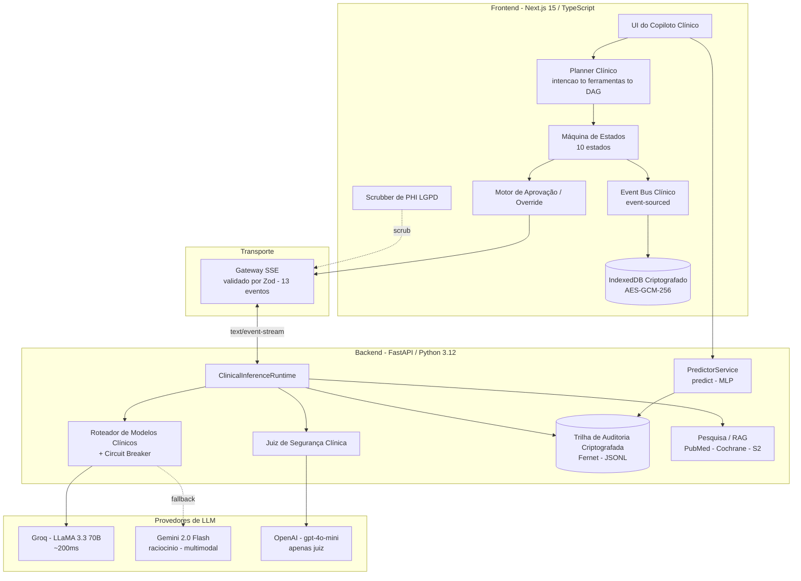
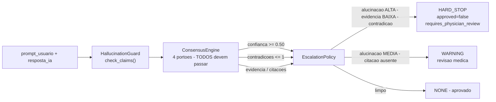
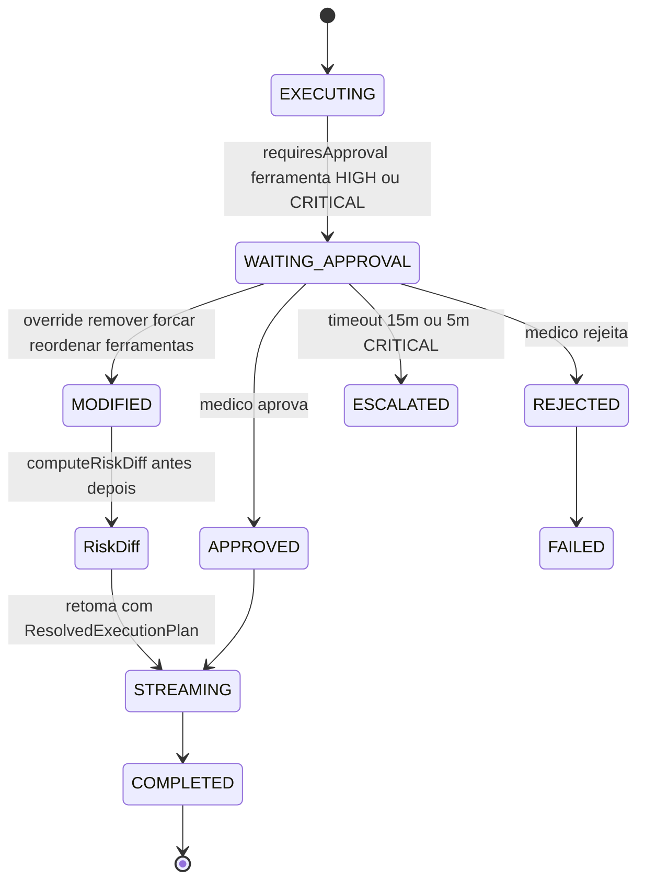

---
language:
- pt
- en
license: mit
tags:
- tabular-classification
- pytorch
- scikit-learn
- medical
- oncology
- health
datasets:
- custom/oral-cancer-top-30-countries
pipeline_tag: tabular-classification
model-index:
- name: Classificador de Tumor Aether Oncology v3.0
  results:
  - task:
      type: tabular-classification
      name: Classificação Tabular
    dataset:
      name: Oral Cancer Top 30 Countries
      type: custom/oral-cancer-top-30-countries
    metrics:
    - type: roc_auc
      value: 0.50
      name: ROC-AUC (CV 5-fold — sem sinal aprendível)
    - type: recall
      value: 0.45
      name: Recall @0.5 (CV 5-fold)
    - type: f1
      value: 0.54
      name: F1-Score (CV 5-fold)
---

<p align="center">
  🌐 <a href="./README.md">English</a> | <strong>Português</strong>
</p>

<p align="center">
  
</p>

<h1 align="center">🪷 Aether Oncology</h1>

<h3 align="center"><em>Um Sistema Operacional de IA Clínica para Inteligência Oncológica Auditável</em></h3>

<p align="center">
  <strong>Orquestração multi-agente · Governança criptográfica · Médico no loop · Inferência resistente a alucinações</strong>
</p>

<br/>

<!-- ── Stack ── -->
<p align="center">
  
  
  
  
  
</p>

<!-- ── Provedores de IA ── -->
<p align="center">
  
  
  
</p>

<!-- ── Enquadramento honesto ── -->
<p align="center">
  
  
  
</p>

<!-- ── Qualidade ── -->
<p align="center">
  
  
  
  
  
</p>

<p align="center">
  <a href="https://api.vitorsilva.engineer/"></a>
  <a href="https://api.vitorsilva.engineer/docs"></a>
</p>

<br/>

> 📸 **Capturas do portal — recaptura pendente.** As capturas anteriores referiam-se a um
> modelo anterior e foram removidas para não induzir a erro. Novas capturas do portal atual de
> **estratificação de risco** de câncer oral (`/portal.html`) serão adicionadas aqui, rotuladas
> como *exemplos de saída de baixo/alto risco* — **sem percentuais de confiança**, já que o
> benchmark mostra ROC-AUC ≈ 0,50 (sem sinal preditivo real).

---

> [!IMPORTANT]
> **Aether Oncology é uma plataforma de *apoio à decisão clínica* e *pesquisa* — não é um dispositivo de diagnóstico.**
> O modelo quantifica o risco; o **médico decide**. Veja o [Aviso Clínico](#-aviso-clínico).

---

## 📑 Sumário

1. [Visão Geral](#-visão-geral)
2. [Matriz de Maturidade](#-matriz-de-maturidade)
3. [Principais Funcionalidades](#-principais-funcionalidades)
4. [Arquitetura do Sistema](#-arquitetura-do-sistema)
5. [Motor de Execução Multi-Agente](#-motor-de-execução-multi-agente)
6. [Motor de Segurança Clínica](#-motor-de-segurança-clínica)
7. [Governança Médica](#-governança-médica)
8. [Engenharia de Segurança & Privacidade](#-engenharia-de-segurança--privacidade-lgpd-aware)
9. [Plataforma de Machine Learning](#-plataforma-de-machine-learning)
10. [Governança de Dados](#-governança-de-dados)
11. [Protocolo de Streaming SSE](#-protocolo-de-streaming-sse)
12. [Referência da API](#-referência-da-api)
13. [Estrutura do Projeto](#-estrutura-do-projeto)
14. [Instalação](#-instalação)
15. [Variáveis de Ambiente](#-variáveis-de-ambiente)
16. [Executando o Sistema](#-executando-o-sistema)
17. [Testes](#-testes)
18. [Modelo de Segurança](#-modelo-de-segurança)
19. [Aviso Clínico](#-aviso-clínico)
20. [Roadmap](#-roadmap)
21. [Contribuindo](#-contribuindo)
22. [Licença](#-licença)

---

## 🌌 Visão Geral

O **Aether Oncology** é um **Sistema Operacional de IA Clínica** (Clinical AI Operating System) experimental concebido para demonstrar infraestrutura de engenharia e governança de MLOps na área da saúde. Em vez de atuar como uma caixa-preta de recomendação clínica, o projeto serve como referência arquitetural para a orquestração e auditoria de inteligência artificial aplicada, estruturado sob três princípios inegociáveis:

- **🩺 Médico no loop, por design.** A IA propõe; um clínico aprova, modifica ou faz override — e cada decisão é registrada.
- **🔍 Auditável, não opaco.** Cada inferência emite eventos estruturados e rastreáveis (correlação por `X-Request-ID`), e cada predição é gravada em uma **trilha de auditoria imutável e criptografada**.
- **🛡️ Segurança como camada de primeira classe.** Um `ClinicalJudge` dedicado (guarda de alucinação → motor de consenso → política de escalonamento) fica entre o modelo e o usuário, com semântica explícita de `HARD_STOP`.

A plataforma abrange duas superfícies complementares:

| Superfície | O que é | Maturidade |
| :--- | :--- | :---: |
| **Núcleo Diagnóstico de ML** (`/predict`) | Uma MLP em PyTorch para **estratificação de risco de câncer oral**, governada por um pipeline completo de MLOps (contratos Pandera, calibração, fairness, auditorias de vazamento e drift, lineage, model cards). | ✅ **Funcional (protótipo)** |
| **Copiloto Clínico de IA** (`/api/v1/clinical/chat`) | Um **runtime de raciocínio clínico multi-agente com streaming SSE** — planner → DAG de execução → roteador de provedores → juiz de segurança → aprovação/override médico → auditoria event-sourced. | 🧪 **Experimental** |

> Aether foi **projetado para Recall acima de tudo.** Em oncologia, um falso negativo não é um erro estatístico — é uma janela de intervenção precoce perdida, então o *design* prioriza sensibilidade. **Achado honesto:** o benchmark reprodutível ([`docs/benchmark.md`](./docs/benchmark.md), CV estratificada 5-fold, MLP vs DummyClassifier/LogReg/RandomForest) mostra que o dataset sintético **não tem sinal aprendível** — ROC-AUC ≈ 0,50, o MLP **não** supera a taxa-base (teste t pareado p=0,79) e remover as features de vazamento quase não altera as métricas. O pipeline é apresentado como **demonstração de engenharia/MLOps**, não como evidência de desempenho preditivo.

---

## 🧭 Matriz de Maturidade

> [!NOTE]
> Aether é uma plataforma ambiciosa em desenvolvimento ativo. Para manter a honestidade, cada capacidade abaixo é rotulada por **maturidade**, derivada diretamente do código-fonte — não de marketing.
>
> **✅ Atual** = ligado e exercitado · **🧪 Experimental** = implementado mas não totalmente integrado/validado · **🟡 Mock** = stub para demo/dev · **🗓️ Planejado** = no roadmap.

| Capacidade | Maturidade | Evidência |
| :--- | :---: | :--- |
| Classificação de risco de câncer oral (MLP + confidence tiering) | ✅ Atual | `src/main.py` · `src/services/predictor.py` |
| Trilha de auditoria imutável e criptografada (Fernet) | ✅ Atual | `src/services/audit.py` |
| Governança MLOps: schemas Pandera, calibração, auditorias de leakage/fairness, OOD, lineage, model cards | ✅ Atual | `src/train.py` · `src/ml/pipelines/**` |
| Detecção de drift de dados (Teste KS) | ✅ Atual | `src/ml_platform/drift.py` · `src/services/audit.py` |
| Roteador multi-provedor de LLM (Groq → Gemini) + circuit breaker | ✅ Atual | `src/providers/router.py` · `circuit_breaker.py` |
| Runtime de streaming SSE para chat clínico | ✅ Atual (transporte) | `src/orchestration/clinical_runtime.py` · `src/streaming/protocol.py` |
| Runtime multi-agente no frontend (planner, máquina de estados, override engine, event bus) | ✅ Atual | `frontend/src/features/ai/orchestration/**` |
| IndexedDB criptografado (AES-GCM-256 / PBKDF2) + scrubber de PHI (LGPD) | ✅ Atual | `frontend/.../persistence/crypto.ts` · `telemetry/scrubbers/phi.ts` |
| Juiz de Segurança Clínica (alucinação → consenso → escalonamento) | 🧪 Experimental | `src/safety/**` — roda no `/chat`, **não** no `/predict` |
| Workflow de aprovação + override + risk-diff médico | 🧪 Experimental | `frontend/.../runtime/approvalManager.ts` · `overrideEngine.ts` |
| Ferramentas clínicas (biomarker / therapy-match / guidelines-RAG) | 🟡 Mock | `frontend/src/features/ai/tools/registry.ts` (dados fixos) |
| Provedor de LLM no frontend (`NEXT_PUBLIC_LLM_PROVIDER`) | 🟡 Mock (padrão) | `frontend/src/features/ai/api/factory.ts` — padrão `mock` |
| OpenAI como provedor de **inferência** | 🟡 Apenas juiz | usado só dentro do juiz de segurança, não para inferência de chat |
| Integração genômica (KRAS/EGFR), simulação de Tumor Board, FHIR/PACS | 🗓️ Planejado | veja o [Roadmap](#-roadmap) |

---

## ✨ Principais Funcionalidades

### 🧠 Runtime Clínico
- **Planner clínico determinístico** — detecção de intenção sem LLM (palavras-chave ponderadas + 47 símbolos de genes oncológicos), seleção de ferramentas a partir de um registro de capacidades e construção de um **DAG de execução** topológico.
- **Máquina de estados rígida** — 10 estados com transições validadas (`IDLE → HYDRATING → PLANNING → RETRIEVING → EXECUTING → STREAMING → WAITING_APPROVAL → COMPLETED | FAILED | INTERRUPTED`).
- **Motor de execução de ferramentas** — estágios sequenciais com paralelismo intra-estágio, timeouts por ferramenta, retries com backoff exponencial e cancelamento via `AbortSignal`.

### 🛡️ Segurança & Governança
- **Pipeline do ClinicalJudge** — `HallucinationGuard` → `ConsensusEngine` → `EscalationPolicy`, emitindo um `ClinicalJudgement` estruturado (risco de alucinação, força da evidência, contradições, citações ausentes).
- **Escalonamento em três níveis** — `NONE` / `WARNING` / `HARD_STOP` (um `HARD_STOP` bloqueia a resposta e interrompe o stream).
- **Safety loop por confidence tiering** no `/predict` — `Alto ≥ 0,30`, `Médio ≥ 0,15`, `Baixo < 0,15` de margem do threshold 0,5; `Baixo` levanta um `warning` de revisão obrigatória.

### 🔬 Plataforma de ML
- **Contratos de dados Pandera** para treino **e** inferência (schemas distintos).
- **Calibração de probabilidade** — Platt vs. Isotônica auto-selecionada por Brier score, com ECE/MCE e curvas de confiabilidade.
- **Auditorias de vazamento, fairness, OOD e drift** integradas ao pipeline de treino.
- **Lineage SHA-256** + **model cards** + tracking via **MLflow**.

### 🔐 Segurança & Compliance
- **Logs de auditoria criptografados com Fernet**, com envelopes criptográficos versionados.
- **Criptografia AES-GCM-256 client-side** dos dados de conversa no IndexedDB (PBKDF2-SHA256, 100k iterações).
- **Scrubber de PHI (LGPD)** com regexes de formatos brasileiros (CPF, CNS/SUS, CRM, CEP, telefone BR) — suíte de 42 casos de teste.

### 📡 Arquitetura de Streaming
- **Server-Sent Events (SSE)** com um **protocolo de 13 eventos validado por Zod**, fortemente tipado e com forward-compatibility.

### 📜 Replay & Auditabilidade
- **Event bus clínico event-sourced** — todas as transições de estado, aprovações, overrides e mudanças de risco são emitidas com `BaseEventMetadata` (`traceId`, `sessionId`, `patientId`, `sequence`) para replay e auditoria.

### 👨‍⚕️ Fluxo do Médico
- **Modal de aprovação**, **editor de override do DAG**, **risk-diff antes/depois** e **governança de timeout** (15 min padrão, 5 min para `CRITICAL`).

---

## 🏗️ Arquitetura do Sistema

### Arquitetura de Alto Nível



### Chat Clínico — Sequência do Runtime (SSE)

```mermaid
sequenceDiagram
    autonumber
    participant C as Cliente useStreaming
    participant G as Gateway SSE
    participant R as ClinicalInferenceRuntime
    participant RT as Roteador CircuitBreaker
    participant P as Provedor Groq/Gemini
    participant J as ClinicalJudge

    C->>G: POST /api/v1/clinical/chat
    G->>R: stream_clinical_response()
    R-->>C: event routing_decision provedor justificativa custo
    R->>RT: route ClinicalTaskProfile
    RT->>P: stream_inference()
    R-->>C: event status generating_internally
    P-->>R: tokens em buffer
    R-->>C: event inference_envelope latencia tokens custo
    R->>J: evaluate prompt resposta
    R-->>C: event judgement_started
    J-->>R: ClinicalJudgement risco escalation_level
    alt escalation_level == HARD_STOP
        R-->>C: event error resposta bloqueada
    else NONE or WARNING
        R-->>C: event judgement_completed
        R-->>C: event token em chunks
        R-->>C: event complete
    end
```



### Pipeline de Segurança Clínica



### Fluxo de Aprovação & Override Médico



---

## 🧩 Motor de Execução Multi-Agente

O runtime do frontend (`frontend/src/features/ai/orchestration/`) é um **pipeline de planejamento determinístico e sem LLM** seguido de um **motor de execução com portão de aprovação**.

| Camada | Módulo | Responsabilidade |
| :--- | :--- | :--- |
| **1 · Detecção de Intenção** | `planner/intentDetector.ts` | Match ponderado de palavras-chave + regex + símbolos de genes → `ClinicalIntent` (sem chamada de LLM). |
| **2 · Seleção de Ferramentas** | `planner/toolCapabilities.ts` | Registro de metadados (nível de risco, exigência de aprovação, dependências, latência, custo). |
| **3 · Grafo de Execução** | `planner/planner.ts` | Ordenação topológica das dependências → DAG `ExecutionPlan` (à prova de ciclos). |
| **4 · Escalonamento de Risco** | `planner/planner.ts` | `getMaxRisk()` sobre as ferramentas selecionadas → flag `requiresApproval`. |
| **Runtime** | `runtime/stateMachine.ts` | Máquina de 10 estados com transições validadas. |
| **Motor de Ferramentas** | `tools/runtime.ts` | Execução paralela dentro do estágio, timeouts, retries, abort. |

**Enumerações (fonte da verdade):**

```ts
ClinicalIntent  = biomarker_analysis | therapy_matching | prognosis | trial_search
                | evidence_review | imaging_analysis | risk_assessment | general_inquiry | unknown
ClinicalRiskLevel = LOW | MODERATE | HIGH | CRITICAL
ClinicalRuntimeState = IDLE | HYDRATING | PLANNING | RETRIEVING | EXECUTING
                     | STREAMING | WAITING_APPROVAL | INTERRUPTED | FAILED | COMPLETED
```

**Roteamento no backend** (`src/providers/router.py`): um `ClinicalModelRouter` seleciona um provedor a partir de um `ClinicalTaskProfile` (intenção, nível de risco, necessidades de latência/raciocínio/multimodal). Cadeia padrão: **Groq (≈200 ms)** primário → **Gemini 2.0 Flash** fallback, cada um envolvido pelo `clinical_circuit_breaker` (abre após **3** falhas, recuperação em **60 s**, depois sondagem `HALF-OPEN`).

> 🟡 **Nota honesta:** as três ferramentas registradas (`biomarker-analysis`, `therapy-matching`, `clinical-guidelines-rag`) atualmente retornam **dados clínicos mock**. A orquestração, o DAG e a governança ao redor delas são reais; os *backends* das ferramentas são trabalho da Fase 3.

---

## 🛡️ Motor de Segurança Clínica

A camada de segurança (`src/safety/`) envolve cada resposta de **chat clínico**. Ela atua como uma barreira de governança explícita: *nenhuma saída de IA chega ao clínico sem passar por uma validação de conformidade e veredito clínico.*

```
ClinicalJudge.evaluate(prompt, resposta)
        │
        ├── HallucinationGuard.check_claims()   → delega ao JudgeProvider (OpenAI gpt-4o-mini)
        ├── ConsensusEngine.evaluate_consensus()  → 4 portões, TODOS devem passar
        └── EscalationPolicy.evaluate()           → NONE | WARNING | HARD_STOP
```

**`ClinicalJudgement`** (`src/safety/types.py`):

| Campo | Tipo | Significado |
| :--- | :--- | :--- |
| `approved` | `bool` | Se a resposta pode ser entregue |
| `confidence` | `float [0–1]` | Confiança do juiz |
| `hallucination_risk` | `LOW · MEDIUM · HIGH` | Probabilidade de afirmações fabricadas |
| `evidence_strength` | `LOW · MODERATE · HIGH` | Qualidade da evidência citada |
| `contradictions` | `List[str]` | Contradições clínicas detectadas |
| `missing_citations` | `List[str]` | Afirmações sem citação |
| `requires_physician_review` | `bool` | Flag de escalonamento obrigatório |
| `escalation_level` | `NONE · WARNING · HARD_STOP` | Decisão final do portão |

**Portões de consenso** (`consensus_engine.py`): piso de confiança **0,50**, máximo de **1** contradição, escrutínio de citação quando a evidência é `LOW`.

**Regras de escalonamento** (`escalation_policy.py`):
- **`HARD_STOP`** → alucinação `HIGH` **OU** evidência `LOW` **OU** qualquer contradição → resposta **bloqueada**, `approved=false`.
- **`WARNING`** → alucinação `MEDIUM` **OU** citações ausentes → resposta entregue, mas sinalizada para revisão.

> 🧪 **Experimental & escopo:** o juiz roda no `POST /api/v1/clinical/chat`. O endpoint diagnóstico `/predict` usa o **safety loop de confidence tiering** mais simples e totalmente em produção (não o juiz LLM). A guarda de alucinação atualmente delega ao juiz OpenAI; o cruzamento especializado de PMID/diretrizes está planejado.

---

## 👨‍⚕️ Governança Médica

A governança é event-sourced de ponta a ponta (`frontend/src/features/ai/orchestration/runtime/`).

- **`WAITING_APPROVAL`** — quando o plano contém uma ferramenta com `requiresApproval`, a execução é suspensa e um evento `ClinicalApprovalRequested` é emitido.
- **`ClinicalApprovalManager`** — cria um `PendingApproval` (nanoid), persiste no backend store de aprovação e agenda um timeout: **`DEFAULT_TIMEOUT_MS = 15 min`**, **`CRITICAL_TIMEOUT_MS = 5 min`**, com um threshold de aviso de **80%**.
- **Motor de Override** (`overrideEngine.ts`) — uma transformação *funcional pura*: o médico pode **remover**, **forçar** ou **reordenar** ferramentas. O plano original **nunca é mutado**; um novo `ResolvedExecutionPlan` é retornado com trilha de auditoria completa.
- **`RiskDiffViewer`** — renderiza o `RiskProfile` antes/depois (`hallucinationRisk`, `evidenceStrength 0–100`, `consensusScore VERIFIED/PARTIAL/FAILED`, `fdaCompliance PASS/WARNING/FAIL`).
- **Auditoria imutável** — cada decisão emite `ClinicalApprovalResolved` (`APPROVED · REJECTED · ESCALATED · MODIFIED`), `ExecutionPlanOverridden` e `RiskProfileChanged` ao event bus, persistidos no IndexedDB criptografado.

> 🧪 A identidade do médico (`physicianSession.ts`) atualmente usa um perfil demo/fallback; produção exige integração com SSO/SAML hospitalar. A auto-rejeição por timeout de aprovação está parcialmente ligada.

---

## 🔐 Engenharia de Segurança & Privacidade (LGPD-aware)

> [!NOTE]
> Estes são **controles de engenharia**, não certificações nem status regulatório. **Nenhum** Business Associate Agreement (HIPAA), aprovação do FDA, registro na ANVISA, SOC 2 ou auditoria foi obtido ou buscado. Frameworks como HIPAA, LGPD e FDA SaMD são citados apenas como **conceitos que informaram o design** dos controles abaixo — nunca como alegação de conformidade ou "prontidão".

### Trilha de auditoria cifrada e à prova de adulteração
- **Logs de auditoria cifrados (Fernet)** — `src/services/audit.py` envolve cada predição em um envelope JSON cifrado com Fernet (`key_version`, `algorithm`, `encrypted`, `payload`), **encadeado por hash** (tamper-evidence, `compute_entry_hash`).
- **Fail-closed** — em produção (`AETHER_ENV != dev`), endpoints protegidos retornam **503** quando `API_KEY` não está definida; `AUDIT_ENCRYPTION_KEY` ausente desabilita a escrita de auditoria (fail-safe) e é logado como **crítico** — nunca uma chave descartável. Se a escrita da auditoria falha, a predição **não** é emitida (HTTP 500).
- **Armazenamento client-side criptografado** — dados de conversa são criptografados com AES-GCM-256 no IndexedDB antes da persistência.
- **Ferramenta de migração** — `src/scripts/migrate_logs.py` migra logs legados em texto plano para envelopes criptografados.

### Scrubbing de PHI/PII (LGPD-aware)
- **Scrubber de PHI** (`frontend …/telemetry/scrubbers/phi.ts` + `src/safety/phi_scrubber.py`) redige identificadores brasileiros antes da telemetria/auditoria: **CPF, CNS/SUS, CRM, CEP, telefone BR, e-mail, data de nascimento** — recursivo sobre objetos/arrays, com suíte de testes.
- **Portão de PHI fail-closed** — `scrubPHI()` roda *antes* da inferência; uma falha interrompe a execução e emite `InferenceFailed`.

### Reprodutibilidade & lineage
- **Lineage determinístico** — `src/ml/pipelines/lineage.py` registra checksums SHA-256 do dataset, schemas, regras clínicas, registro de features e lógica de pré-processamento + commit git (`models/data_lineage.json`).
- **Snapshots imutáveis** — o treino persiste `raw.parquet` / `validated.parquet` indexados pelo hash do dataset.
- **Replay event-sourced** — cada evento clínico carrega um `sequence` dentro de um `traceId` para reconstrução determinística.

---

## 🔬 Plataforma de Machine Learning

O núcleo diagnóstico do **Aether Oncology** é governado por um **pipeline de MLOps abrangente** (`src/train.py` orquestrando `src/ml/pipelines/**`). 

### 📊 1. Diagnóstico do Sinal & Limitações dos Dados Sintéticos
*   **Independência Sintética:** O dataset principal [oral_cancer_top30.csv](file:///f:/FIAP/Tech%20Challenge%20-%2001/Aether%20Oncology/data/raw/oral_cancer_top30.csv) (160.292 registros, 11 colunas) foi gerado sinteticamente com **independência estatística quase perfeita** entre todas as features preditivas (fatores de risco e dados demográficos) e o estágio clínico de diagnóstico (`Diagnosis_Stage`). A informação mútua de todos os preditores em relação ao target é inferior a `0,008 nats`, o que impõe um limite rígido de desempenho: qualquer classificador operará sob a hipótese nula (**ROC-AUC ≈ 0,50**).
*   **A Ilusão do F1-score:** O dataset apresenta distribuição uniforme de estágios: **Moderate** (~39,89%), **Early** (~30,12%) e **Late** (~29,99%). A definição padrão de `high_risk = {Moderate, Late}` gera um desbalanceamento natural com **Classe 1 (69,88%)** vs. **Classe 0 (30,12%)**. Isso permite que classificadores triviais obtenham um F1-score enganoso de `~0,82` simplesmente prevendo a classe majoritária ("1") para todas as amostras. **Mesmo com F1 ≈ 0,82 sob colapso de classes, a PR-AUC permanece baixa**, reforçando que não há utilidade clínica real nesse cenário de independência sintética. A PR-AUC é a métrica mais honesta para triagem em cenários de desbalanceamento de classes, preparando o leitor para o benchmark detalhado no arquivo [benchmark.md](file:///f:/FIAP/Tech%20Challenge%20-%2001/Aether%20Oncology/docs/benchmark.md).

### 🚿 2. Categorização de Features & Auditoria de Vazamento
Para manter uma modelagem clínica conceitualmente robusta, as colunas disponíveis são categorizadas da seguinte forma:
*   **Fatores de Risco (Pré-Diagnóstico):** `Tobacco_Use`, `Alcohol_Use`, `HPV_Related`, `Age`.
*   **Variáveis Contextuais:** `Country`, `Gender`, `Socioeconomic_Status`.
*   **Variáveis de Consequência (Pós-Diagnóstico):** `Treatment_Type`, `Survival_Rate`.

Em um cenário real, `Treatment_Type` (como quimioterapia ou cirurgia) e `Survival_Rate` (taxa de sobrevida) são definidos após o diagnóstico e, portanto, constituem **vazamento temporal** (data leakage) quando usados como preditores do estágio. Embora a independência na síntese de dados faça com que sua remoção não altere a ROC-AUC atual, **elas são banidas por completo no pipeline de inferência honesto** para evitar vícios metodológicos graves em dados de produção reais.

### 🎯 3. Redesign Metodológico do Target
Propomos duas alternativas de enquadramento do target de rastreio para aplicação em datasets de validação clínica reais:
*   **Alternativa A: Triagem Urgente (Advanced vs. Early):** Mapeia `high_risk = Diagnosis_Stage ∈ {Moderate, Late}` (**Classe 1 = casos Moderate/Late**, Classe 0 = casos Early). O foco métrico é garantir um **Recall (sensibilidade) alto na classe avançada** para evitar falsos negativos catastróficos no direcionamento de leitos e tratamento especializado.
*   **Alternativa B: Screening Preventivo (Late vs. Early/Moderate):** Mapeia `target_late = Diagnosis_Stage == "Late"` (**Classe 1 = casos Late**, Classe 0 = casos Early/Moderate). O objetivo é isolar casos de alta complexidade e pior prognóstico, priorizando o **Recall na classe Late** no diagnóstico de fronteira epidemiológica.

### 🧪 4. Engenharia de Features Clínicas
Novas features de plausibilidade epidemiológica são calculadas pelo pipeline:
*   **`risk_index`:** Pontuação combinada de hábitos nocivos e predisposição (`Tobacco_Use + Alcohol_Use + HPV_Related`).
*   **`age_bucket`:** Estruturação em faixas etárias de risco acumulado (e.g. `Age_61_plus` como maior fator de incidência).
*   **Interações de Acesso:** Interação geográfica e socioeconômica (`Socioeconomic_Status` × `Country`), servindo como proxy de vulnerabilidade e atraso no rastreio.

Essas features devem ser implementadas na classe `ClinicalFeatureExtractor` em [preprocessing.py](file:///f:/FIAP/Tech%20Challenge%20-%2001/Aether%20Oncology/src/ml/pipelines/preprocessing/preprocessing.py), garantindo que tanto o MLP quanto os modelos baseados em árvores recebam o mesmo espaço de features enriquecido de forma determinística e auditável.

### 🏁 5. Execução do Benchmark e Modelagem Tabular
No arquivo [benchmark.py](file:///f:/FIAP/Tech%20Challenge%20-%2001/Aether%20Oncology/src/benchmark.py), implementamos uma validação estruturada com as seguintes garantias de rigor estatístico:
*   **Validação Cruzada Estratificada (k=5)** aplicada de forma idêntica a todos os modelos preditivos.
*   **Métricas de Rastreio:** Promoção da **PR-AUC (Average Precision)** a métrica principal de comparação, complementada por sensibilidade, especificidade, acurácia e o custo esperado com base na matriz de custo FP/FN ($\text{FN} = 10 \times \text{FP}$).
*   **Matriz de Confusão por Split:** Impressão explícita da matriz de confusão para analisar o comportamento de colapso de classe em cada partição de treino.
*   **Concorrência de Modelos:** Comparação direta entre o MLP em PyTorch (`src/models/mlp.py`) e baselines tabulares como **Random Forest** e algoritmos baseados em boosting (**XGBoost / LightGBM**), com tracking estruturado de experimentos no **MLflow** para identificação do "modelo campeão" (aquele com maior PR-AUC sob recall mínimo aceitável de 85%).

### 📝 6. Enquadramento e Nota de Integridade
O relatório gerado automaticamente em [model_card.md](file:///f:/FIAP/Tech%20Challenge%20-%2001/Aether%20Oncology/docs/MODEL_CARD.md) e a auditoria estatística detalhada em [dataset_audit_report.md](file:///f:/FIAP/Tech%20Challenge%20-%2001/Aether%20Oncology/docs/dataset_audit_report.md) refletem o compromisso do Aether Oncology com o rigor científico:
> ⚠️ **Resultados Nulos como Integridade:** A obtenção de ROC-AUC ≈ 0,50 é a única resposta matematicamente íntegra diante de dados sintéticos sem sinal. O Aether Oncology se posiciona estritamente como uma **arquitetura de referência de engenharia de MLOps clínicos e operações auditáveis**, e não como um classificador diagnóstico validado (SaMD). Qualquer uso clínico em ambiente de produção real exige substituição prévia por dados clínicos reais, auditoria externa de bias (Fairlearn) e re-calibração populacional.

| Estágio do Pipeline | Módulo | O que faz |
| :--- | :--- | :--- |
| **Validação** | `validation/{training,inference}_schema.py`, `clinical_rules.py` | Schemas Pandera + regras de coerência clínica com severidade `OK/WARNING/HIGH/CRITICAL` (exclusão pediátrica <18, limites de sobrevida, inconsistência estágio/sobrevida). |
| **Eng. de Features** | `preprocessing/preprocessing.py` | `ClinicalFeatureExtractor` deriva `risk_index` (tabaco+álcool+HPV), `age_bucket`, `high_incidence_country`; depois `StandardScaler` + `OneHotEncoder`. |
| **Auditoria de Vazamento** | `audit/leakage.py` | Bloqueia features posteriores (`Diagnosis_Stage`); sinaliza Pearson \|r\|>0,95, MI>0,95, importância por permutação>0,45. |
| **OOD** | `preprocessing/ood.py` | Isolation Forest (`contamination=0.01`) sinaliza combinações demográficas raras. |
| **Calibração** | `calibration/calibration_engine.py` | Platt vs. Isotônica auto-selecionada por Brier; ECE/MCE em 10 bins; curva de confiabilidade. |
| **Fairness** | `audit/fairness.py` | Disparidade FNR/FPR/recall por Equalized-Odds (threshold de 15%) entre Gênero / faixa-etária / País. |
| **Drift** | `drift/drift_rules.py`, `ml_platform/drift.py` | Teste KS (p<0,05), PSI ≥0,25, divergência JS ≥0,20; flag global quando >33% das features sofrem drift. |
| **Lineage & Cards** | `lineage.py`, `model_card_generator.py` | Lineage SHA-256 + model card. |
| **Tracking** | `train.py` | Logging MLflow + registro do modelo (`AetherOncologyOralCancerHighRisk`). |

---

## 🗂️ Governança de Dados

- **Dois schemas, por intenção** — treino (`strict`, enums completos) vs. inferência (mais frouxo, inclui variantes `Unknown`) previnem skew treino/produção.
- **Motor de severidade** — `ClinicalValidationResult` rotula cada registro `OK / WARNING / HIGH / CRITICAL`; `HIGH/CRITICAL` bloqueia a inferência (ex.: idade pediátrica, contradição estágio/sobrevida).
- **Vazamento temporal & proxy** — features posteriores são bloqueadas; thresholds de correlação/MI/permutação levantam `ValueError` durante o treino.
- **Detecção OOD** — Isolation Forest protege contra combinações demográficas não vistas no treino.
- **Monitoramento de calibração** — ECE/MCE + curvas de confiabilidade persistidas em `models/calibration/`.
- **Governança de drift** — divergência KS / PSI / JS com gatilho global de >33% alimentando o workflow de Treino Contínuo.

---

## 📡 Protocolo de Streaming SSE

O chat clínico transmite via **Server-Sent Events** (`text/event-stream`). Cada evento é um objeto JSON carregando `BaseEventMetadata` (`sessionId`, `patientId`, `traceId`, `retrievalId` / `sequence` opcionais) e é validado contra uma **união Zod de 13 tipos de evento** no cliente (`transport/protocol/protocol.ts`).

| Evento | Emitido por | Destaques do payload |
| :--- | :--- | :--- |
| `routing_decision` | backend | `provider`, `model`, `rationale`, `estimated_latency_ms`, `estimated_cost`, `fallback_chain`, `was_fallback` |
| `status` | backend | fase da inferência (`thinking`, `retrieving`, `generating_internally`, `judging`, `streaming`, …) |
| `inference_envelope` | backend | `prompt_tokens`, `completion_tokens`, `latency_ms`, `cost_estimate` |
| `judgement_started` | backend | avaliação de segurança inicia |
| `judgement_completed` | backend | registro `ClinicalJudgement` completo |
| `hallucination_detected` | backend | afirmações sinalizadas |
| `escalation_triggered` | backend | `WARNING` / `HARD_STOP` |
| `token` | backend | chunk de texto transmitido |
| `citation` | backend | metadados de evidência / fonte |
| `attachment` | backend | metadados de gráfico / artefato |
| `trace` | backend | âncora de trace |
| `error` | backend | falha de stream / bloqueio por `HARD_STOP` |
| `complete` | backend | stream finalizado |

**Exemplo de stream:**

```text
data: {"type":"routing_decision","provider":"groq","model":"llama-3.3-70b-versatile","rationale":"live_streaming → baixa latência"}

data: {"type":"status","status":"generating_internally"}

data: {"type":"inference_envelope","latency_ms":345,"prompt_tokens":512,"completion_tokens":188}

data: {"type":"judgement_completed","hallucination_risk":"LOW","evidence_strength":"HIGH","escalation_level":"NONE"}

data: {"type":"token","chunk":"Dado o status de BRCA1, "}

data: {"type":"complete"}
```

**Replay determinístico** — o gateway do cliente faz retry com backoff exponencial (3 tentativas: 500 ms · 1 s · 2 s), suporta cancelamento por `AbortSignal`, reconhece o marcador `[DONE]` e encaminha eventos desconhecidos-mas-tipados para forward-compatibility. Como cada evento carrega um `sequence` dentro de seu `traceId`, uma sessão pode ser reproduzida evento a evento a partir do event bus.

> 🧪 Vários eventos de telemetria do backend (`judgement_*`, `routing_decision`, `inference_envelope`, `hallucination_detected`, `escalation_triggered`) são definidos e emitidos, mas nem todos são consumidos pelos hooks atuais do frontend.

---

## 🌐 Referência da API

URL base (prod): `https://api.vitorsilva.engineer` · Docs interativas: `/docs`. Rotas **✅** exigem o header `access_token`; **🌐** são abertas. Auth é **fail-closed** (503 se `API_KEY` ausente em produção).

> **Nota Tech Challenge:** `/predict` está **aberto (🌐, sem key)** para avaliação acadêmica — segue rate-limited e auditado (fail-closed). As rotas de **governança** permanecem protegidas. Em produção toda rota seria key-gated e, depois, **OAuth2/OIDC** por usuário.

| Método | Rota | Auth | Descrição |
| :--- | :--- | :---: | :--- |
| `POST` | `/predict` | 🌐 | Predição de risco de câncer oral (`OralCancerRequest` → `PredictionResponse`). Pública (avaliação), rate-limit 10/min, auditada fail-closed. |
| `POST` | `/api/v1/clinical/chat` | — | Stream **SSE** do copiloto clínico. |
| `GET` | `/api/v1/clinical/approvals` | — | Lista aprovações médicas pendentes. |
| `GET` | `/api/v1/clinical/approvals/{id}` | — | Busca uma aprovação. |
| `POST` | `/api/v1/clinical/approvals` | — | Cria uma solicitação de aprovação. |
| `DELETE` | `/api/v1/clinical/approvals/{id}` | — | Resolve / deleta uma aprovação. |
| `POST` | `/feedback` | ✅ | Envia ground truth de uma predição (loop de drift/fairness). |
| `GET` | `/analytics` | ✅ | Métricas de drift (p-values do teste KS). |
| `GET` | `/audit` | ✅ | Visão descriptografada da trilha de auditoria. |
| `GET` | `/monitor/drift` | ✅ | Relatório de drift por teste KS. |
| `GET` | `/monitor/fairness` | ✅ | Auditoria de fairness vs. feedback de ground-truth. |
| `GET` | `/monitor/sustainability` | ✅ | Relatório de carbono Green-AI. |
| `GET` | `/health`, `/health/live`, `/health/ready`, `/health/inference` | — | Liveness / readiness / status do modelo. |
| `GET` | `/version`, `/heartbeat` | — | SHA do build & heartbeat de ops. |

**`OralCancerRequest`** (8 campos): `age`, `survival_rate`, `tobacco_use`, `alcohol_use`, `country`, `gender`, `socioeconomic_status`, `treatment_type`.

---

## 📁 Estrutura do Projeto

```text
Aether Oncology/
├── src/                              # ⚙️ Backend FastAPI (Python 3.12)
│   ├── main.py                       # Wiring do app, lifespan, /predict, monitoramento, middleware SRE
│   ├── api/
│   │   ├── routes/clinical_chat.py   # Endpoints SSE de chat + aprovação
│   │   └── schemas.py                # Contratos Pydantic (OralCancerRequest, PredictionResponse)
│   ├── orchestration/
│   │   └── clinical_runtime.py       # ClinicalInferenceRuntime (roteamento→stream→juiz→escalonamento)
│   ├── providers/                    # 🤖 Plugins de provedores de LLM
│   │   ├── base.py  router.py  circuit_breaker.py
│   │   ├── groq_provider.py  gemini_provider.py
│   │   └── openai_provider.py  judge_provider.py
│   ├── safety/                       # 🛡️ Motor de segurança clínica
│   │   ├── clinical_judge.py  consensus_engine.py
│   │   ├── hallucination_guard.py  escalation_policy.py  types.py
│   ├── streaming/protocol.py         # 📡 Modelos de evento SSE + format_sse()
│   ├── ml/pipelines/                 # 🔬 Governança de ML
│   │   ├── validation/  calibration/  audit/  drift/  preprocessing/
│   │   ├── lineage.py  model_card_generator.py
│   ├── ml_platform/                  # Orchestrator, drift, fairness, green_ai, treino
│   ├── models/mlp.py                 # MLP PyTorch
│   ├── services/                     # audit · predictor · research(RAG) · approval_store · inference_client
│   ├── train.py  optimize.py         # Treino + HPO Optuna
│   └── core/logging.py               # Logging JSON estruturado + contexto de request
│
├── frontend/                         # 🖥️ Next.js 15 / React 19 / TypeScript
│   └── src/features/ai/
│       ├── orchestration/
│       │   ├── planner/              # intentDetector · toolCapabilities · planner
│       │   └── runtime/              # stateMachine · eventBus · overrideEngine
│       │                             #   approvalManager · physicianSession · executionContext
│       ├── transport/                # aiGateway · protocol(Zod) · sse(stream-reader)
│       ├── tools/                    # registry · runtime (executor de DAG)  ⟶ 🟡 ferramentas mock
│       ├── services/persistence/     # crypto(AES-GCM) · db(IndexedDB)
│       ├── telemetry/scrubbers/phi.ts# 🔐 Scrubber de PHI (LGPD) (+ testes)
│       └── components/               # approval/ override/ safety/ intelligence/ rag/ chat/
│
├── models/                           # Artefatos treinados + saídas de governança
│   ├── aether_mlp_v2.pth  preprocessor.joblib  calibrator.joblib  ood_detector.joblib
│   ├── model_card.md  data_lineage.json  fairness_audit.json
│   └── calibration/                  # ECE/MCE, Brier, reliability_curve.png
│
├── infrastructure/                   # ☸️ Kubernetes + Terraform (AWS EKS/Aurora)
├── .github/workflows/                # 🔁 unified-mlops · ml-ct · keep_alive
├── tests/                            # pytest: api · model · schema · audit · research
├── docs/                             # MODEL_CARD · INFRASTRUCTURE · screenshots
├── Dockerfile  Makefile  pyproject.toml  requirements.txt
└── README.md
```

---

## ⚙️ Instalação

### Pré-requisitos
- **Python 3.12+**, **Node.js 22+**, `git`.

### Backend

```bash
# 1. Clonar
git clone https://github.com/vdfs89/Aether_Oncology.git
cd Aether_Oncology

# 2. Ambiente virtual
python -m venv .venv
source .venv/bin/activate          # Windows: .venv\Scripts\Activate.ps1

# 3. Dependências
pip install -r requirements.txt

# 4. Configurar ambiente (veja a tabela abaixo)
cp .env.example .env               # depois adicione as chaves obrigatórias
```

### Frontend

```bash
cd frontend
npm install
cp .env.local.example .env.local   # ou crie .env.local manualmente
```

---

## 🔑 Variáveis de Ambiente

> [!IMPORTANT]
> O backend **valida a configuração no startup** e loga **crítico** quando uma variável obrigatória (`API_KEY`, `AUDIT_ENCRYPTION_KEY`) está ausente em produção. Em vez de crash-loop num PaaS, ele **falha fechado na camada de request** (rotas protegidas → 503) e **falha seguro** na auditoria (escrita desabilitada) — nunca usa defaults inseguros (`src/main.py` lifespan + `get_api_key`).

### Backend

| Variável | Obrigatória | Padrão | Propósito |
| :--- | :---: | :--- | :--- |
| `API_KEY` | ✅ (prod) | — | Header `access_token` das rotas protegidas. **Sem default**: ausente em produção → rotas protegidas retornam 503 (fail-closed). `/predict` é público. |
| `OPENAI_API_KEY` | ✅ | — | Alimenta o **juiz** de segurança (`gpt-4o-mini`). |
| `GROQ_API_KEY` | ✅ | — | Provedor de LLM primário de baixa latência (LLaMA 3.3 70B). |
| `GEMINI_API_KEY` | ✅ | — | Provedor de fallback de raciocínio/multimodal (Gemini 2.0 Flash). |
| `AUDIT_ENCRYPTION_KEY` | ✅ | — | Chave simétrica **Fernet** para a trilha de auditoria criptografada (validada no boot). |
| `OPENAI_JUDGE_MODEL` | ⬜ | `gpt-4o-mini` | Sobrescreve o modelo do juiz. |
| `MLFLOW_TRACKING_URI` | ⬜ | `./mlruns` | Store de tracking de experimentos MLflow. |
| `ENTREZ_EMAIL` | ⬜ | placeholder | Identificação NCBI/PubMed para o RAG. |
| `HF_TOKEN` | ⬜ | — | Fallback opcional de inferência remota no Hugging Face. |

Gerar uma chave Fernet:

```bash
python -c "from cryptography.fernet import Fernet; print(Fernet.generate_key().decode())"
```

### Frontend

| Variável | Padrão | Propósito |
| :--- | :--- | :--- |
| `NEXT_PUBLIC_API_URL` | `http://localhost:8000` | URL base do backend para chamadas SSE & de predição. |
| `NEXT_PUBLIC_LLM_PROVIDER` | `mock` | Seleção de provedor no frontend: `mock` · `groq` · `gemini`. |

---

## ▶️ Executando o Sistema

```bash
# Backend (FastAPI + Uvicorn)
uvicorn src.main:app --reload --port 8000
#  → API em http://localhost:8000 · docs em /docs

# Frontend (Next.js)
cd frontend && npm run dev
#  → Portal em http://localhost:3000

# Treinar / retreinar o modelo diagnóstico (escreve em models/ + MLflow)
python -m src.train

# Otimização de hiperparâmetros (Optuna)
python -m src.optimize
```

> ℹ️ Antes do modelo ser treinado, as rotas de predição retornam `503` e os testes correspondentes são marcados como `xfail` — a API mesmo assim inicia.

---

## 🧪 Testes

```bash
# Backend — suíte completa (~91% de cobertura)
pytest                              # ou: pytest -v --cov=src

# Suítes específicas
pytest tests/test_api.py            # integração de endpoint + auth + validação de schema
pytest tests/test_model.py          # forward da MLP, gradientes, limites do sigmoid
pytest tests/test_schema.py         # contratos de dados Pandera
pytest tests/test_audit.py          # criptografia Fernet + status de drift do teste KS
pytest tests/test_research.py       # comportamento de RAG / circuit-breaker

# Frontend
cd frontend
npm run lint                        # ESLint
npx tsc --noEmit                    # checagem de tipos TypeScript
npx tsx src/features/ai/telemetry/scrubbers/__tests__/phi.test.ts   # scrubber de PHI (42 casos)
```

| Suíte | Cobre |
| :--- | :--- |
| **Scrubber de PHI** | Redação de CPF, CNS/SUS, CRM, CEP, telefone BR, e-mail, data de nascimento (42 casos) |
| **Segurança** | Testes unitários do `overrideEngine`, execução do DAG do tool-runtime |
| **Replay/auditoria** | Round-trip de JSONL criptografado + status de drift (`insufficient`, `collecting`, `stable`, `alert`) |

---

## 🔐 Modelo de Segurança

| Camada | Primitiva | Onde |
| :--- | :--- | :--- |
| **Auditoria em repouso** | Criptografia simétrica **Fernet** (AES-128-CBC + HMAC-SHA256) com envelopes versionados | `src/services/audit.py` |
| **Armazenamento no cliente** | **AES-GCM-256** com IV aleatório de 12 bytes por registro | `frontend/.../persistence/crypto.ts` |
| **Derivação de chave** | **PBKDF2-SHA256**, 100.000 iterações | `crypto.ts` |
| **Integridade de lineage** | Checksums **SHA-256** de dataset/schemas/pré-processamento | `src/ml/pipelines/lineage.py` |
| **Transporte / API** | API-key (`access_token`), CORS estrito, rate limiting SlowAPI, correlação `X-Request-ID` | `src/main.py` |
| **PHI** | Redação por regex (LGPD) **antes** de qualquer log/telemetria | `telemetry/scrubbers/phi.ts` |
| **Container** | Usuário não-root, `readOnlyRootFilesystem`, `allowPrivilegeEscalation=false` | `Dockerfile`, manifests K8s |

> [!NOTE]
> Backlog de hardening (intencionalmente exposto): o salt do PBKDF2 do IndexedDB é uma constante fixa (aceitável para tokens de sessão de alta entropia, mas documentado), existe um token de sessão demo para dev, e o `.jsonl` de auditoria ainda não tem limite de retenção. Veja o [Roadmap](#-roadmap).

---

## ⚕️ Aviso Clínico

> [!CAUTION]
> **Aether Oncology NÃO é um dispositivo de diagnóstico e não deve ser usado para tomar decisões clínicas autônomas.**
>
> - É um **Sistema de Apoio à Decisão Clínica (CDSS)** apenas para **triagem de risco** e **assistência à pesquisa**.
> - **A supervisão médica é obrigatória.** O modelo quantifica o risco; um clínico licenciado interpreta, valida e decide.
> - **Não** recebeu aprovação do FDA, registro na ANVISA, marcação CE ou qualquer aprovação regulatória.
> - O modelo **não é validado** para pacientes pediátricos (<18), indivíduos imunocomprometidos ou populações fora de sua distribuição de treino (Top-30 países com maior incidência de câncer oral).
> - Saídas podem conter erros ou alucinações; o motor de segurança **reduz**, mas não **elimina**, esse risco.

---

## 🛤️ Roadmap

### Curto prazo — Hardening & Observabilidade
- [ ] Migrar a trilha de auditoria de JSONL → **PostgreSQL/Supabase** (o Aurora já está provisionado no Terraform).
- [ ] Tracing distribuído com **OpenTelemetry** (substituir o `X-Request-ID` manual).
- [ ] Consumir os eventos `judgement_*` / `escalation_triggered` do backend no Safety HUD do frontend.
- [ ] **SSO/SAML** hospitalar para identidade médica real; aplicar auto-rejeição por timeout de aprovação.
- [ ] Política de retenção + limite de tamanho do log de auditoria.

### Médio prazo — Profundidade Clínica
- [ ] Substituir as **ferramentas clínicas mock** por backends reais (biomarcador, therapy-match, diretrizes).
- [ ] **RAG sobre diretrizes NCCN** com um vector store real (`VectorDBService` atualmente é stub).
- [ ] Auditoria de viés automatizada com **Fairlearn** no CI.
- [ ] **Raciocínio temporal** sobre trajetórias longitudinais de biomarcadores.

### Longo prazo — Visão de Plataforma
- [ ] **Simulação de Tumor Board** (deliberação multi-agente).
- [ ] **Integração genômica** (KRAS, EGFR, HER2) — correlação multimodal.
- [ ] Integração **FHIR** em tempo real + **PACS**.
- [ ] **Aprendizado federado** + **privacidade diferencial** para treino entre instituições.

---

## 🤝 Contribuindo

Contribuições são bem-vindas — este é um projeto open-source de engenharia de IA clínica.

1. Faça **fork** e crie um branch de feature: `git checkout -b feat/sua-feature`.
2. Mantenha o contrato de maturidade honesto — novas capacidades devem ser rotuladas `Atual / Experimental / Mock / Planejado`.
3. Rode os portões antes de abrir um PR:
   ```bash
   ruff check . && ruff format --check .
   pytest
   cd frontend && npm run lint && npx tsc --noEmit
   ```
4. Para mudanças relevantes a aspectos clínicos/de segurança, inclua testes e atualize o **model card** / docs de **segurança** pertinentes.
5. Abra um PR contra `main` com uma descrição clara e o impacto de maturidade.

Por favor, siga as convenções de módulos existentes (`src/` para o backend, `frontend/src/features/ai/` para o runtime) e nunca enfraqueça os controles de PHI/auditoria/segurança sem discussão explícita.

---

## 👤 Autor

**Vitor Diogo Fonseca da Silva** — RM375157
FIAP · Pós-Tech — Tech Challenge (Fase 1). [github.com/vdfs89](https://github.com/vdfs89)

---

## 📄 Licença

Distribuído sob a **Licença MIT**. Veja [`LICENSE`](./LICENSE) para detalhes.

---

<p align="center">
  <em>Aether Oncology — Medicina é Arte, Ciência é a Ferramenta.</em><br/>
  <strong>Precision for Life.</strong> 🪷
</p>
