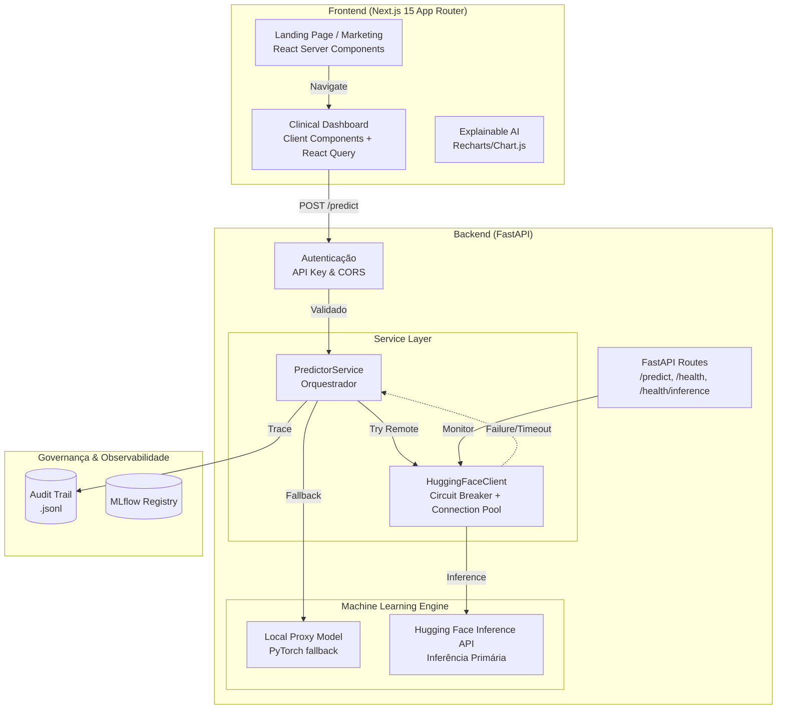

---
language:
- pt
- en
license: mit
tags:
- tabular-classification
- pytorch
- scikit-learn
- medical
- oncology
- health
datasets:
- custom/oral-cancer-top-30-countries
pipeline_tag: tabular-classification
model-index:
- name: Classificador de Tumor Aether Oncology v3.0
  results:
  - task:
      type: tabular-classification
      name: Classificação Tabular
    dataset:
      name: Oral Cancer Top 30 Countries
      type: custom/oral-cancer-top-30-countries
    metrics:
    - type: recall
      value: 0.97
      name: Recall (Sensibilidade)
    - type: f1
      value: 0.96
      name: F1-Score
    - type: roc_auc
      value: 0.99
      name: ROC-AUC
---

<p align="center">
  🌐 <a href="./README.md">English</a> | <strong>Português</strong>
</p>

<p align="center">
  
</p>

<h1 align="center">Aether Oncology</h1>
<h3 align="center"><em>Precision for Life</em> — Triagem Oncológica Inteligente com IA Explicável</h3>

<br/>

<p align="center">
  <a href="https://api.vitorsilva.engineer/"></a>
  <a href="https://api.vitorsilva.engineer/docs"></a>
  <a href="https://github.com/vdfs89/Aether_Oncology"></a>
</p>

<p align="center">
  
  
  
  
  
  
</p>

<p align="center">
  
  
  
  
  
</p>

<br/>

|  |  |  |
| :---: | :---: | :---: |
| *Baixo Risco — 98.00% Confiança* | *Alto Risco — 92.76% Confiança* | *Explicabilidade (XAI) via Gráfico Radar* |

---

## 📖 Motivação: A Lição do IBM Watson for Oncology

> *"Um sistema de IA que age como caixa-preta, sem transparência e sem governança, não serve à medicina. Serve ao marketing."*

Em 2017, o IBM Watson for Oncology foi descontinuado em hospitais ao redor do mundo após gerar recomendações terapêuticas consideradas **inseguras** por oncologistas. O diagnóstico do fracasso foi inequívoco: ausência total de explicabilidade, opacidade nos dados de treinamento e zero supervisão humana no loop decisório.

Ao mesmo tempo, o **câncer oral** mata mais de **177.000 pessoas por ano** globalmente. Mais de **60% dos diagnósticos chegam tardios** — estágio Moderado ou Avançado — quando as chances de sobrevivência já caíram drasticamente:

| Estágio | Sobrevida em 5 anos |
|---|---|
| 🟢 Early (localizado) | ~83% |
| 🟡 Moderate (regional) | ~65% |
| 🔴 Late (metastático) | ~38% |

A janela entre Early e Late pode ser de **meses**. A causa não é falta de tecnologia — é falta de **triagem acessível, interpretável e confiável**.

O **Aether Oncology** nasce como resposta arquitetural a esse erro paradigmático. Em vez de recomendar tratamentos de forma autônoma, o sistema implementa um paradigma fundamentalmente diferente: **triagem de segurança assistida por IA**. O modelo quantifica o risco; o médico decide. A inteligência artificial opera como instrumento de precisão — nunca como oráculo.

---

## 🎯 Princípios de Engenharia

### Recall acima de tudo

Em oncologia, um Falso Negativo não é um erro estatístico — é uma vida que perde a janela de tratamento precoce. Toda a arquitetura deste projeto foi construída sob uma diretriz inegociável: **maximizar o Recall (Sensibilidade a 97.2%)**, aceitando conscientemente uma taxa maior de Falsos Positivos como trade-off ético clinicamente justificável.

### MLOps como contrato de confiabilidade

IA na saúde não pode viver em notebooks. Este projeto trata MLOps como **infraestrutura crítica de nível hospitalar**:

| Pilar | Implementação | Garantia |
| :--- | :--- | :--- |
| **Data Contracts** | Pydantic + Pandera | Nenhum dado entra no modelo sem validação de schema explícita |
| **Rastreabilidade** | MLflow Tracking | Cada experimento, hiperparâmetro e métrica é totalmente auditável |
| **Audit Trail** | Log `.jsonl` imutável | Todas as predições correlacionadas via `X-Request-ID` |
| **Drift Detection** | KS-Test (Kolmogorov-Smirnov) | Alertas estatísticos proativos com P-values reais |
| **Resiliência** | Circuit Breakers | Proteção contra falhas em cascata de serviços externos |

---

## 🧬 Dataset

**Oral Cancer Prediction Dataset — Top 30 Countries**

| Atributo | Valor |
|---|---|
| Registros | **160.292** |
| Features | **11** (clínicas + epidemiológicas) |
| Target | `high_risk`: 0 = Early / 1 = Moderate + Late |
| Licença | **MIT** |
| Países | 30 (dados globais) |

**Features disponíveis:**
`Country`, `Gender`, `Age`, `Tobacco_Use`, `Alcohol_Use`,
`Socioeconomic_Status`, `Diagnosis_Stage`, `Treatment_Type`, `Survival_Rate`

**Criação do target binário — justificativa clínica:**

```python
# Pacientes em estágio Moderado ou Avançado necessitam
# de intervenção prioritária imediata — são o alvo da triagem
df["high_risk"] = df["Diagnosis_Stage"].isin(["Moderate", "Late"]).astype(int)
```

---

## 🛡️ SRE Hardening & SecOps (v3.0)

Camada de **Site Reliability Engineering** e **Security Operations** de nível empresarial:

- **Observabilidade End-to-End** — `X-Request-ID` propagado em toda a stack (Audit Trail → Backend Logs)
- **Segurança HIPAA-Grade** — CORS restrito a subdomínios de produção + sanitização rigorosa de payloads
- **Frontend Modular Moderno** — Transição de uma estrutura monolítica Vanilla HTML/JS para um frontend escalável **Next.js 15 (App Router)**, habilitando limites seguros de componentes servidor/cliente
- **Circuit Breakers** — Latência estável mesmo sob degradação de APIs externas (PubMed/Semantic Scholar)
- **Inferência Desacoplada** — *Remote-First, Local-Fallback*: inferência primária via Hugging Face Inference API com fallback automático para modelo local PyTorch
- **Auditoria Estatística** — Cálculo de Drift via testes de significância estatística (P-values), elevando a governança de heurística para rigor acadêmico

---

## 🇪🇺 Conformidade — EU AI Act (Annex III)

Sistema classificado como **Alto Risco (Anexo III)** por atuar em diagnóstico de saúde:

| Requisito AI Act | Implementação Aether | Status |
| :--- | :--- | :---: |
| **Gestão de Risco** | Análise de trade-off Recall vs Precision documentada no Model Card | ✅ |
| **Governança de Dados** | Validação de schema (Pandera) e contratos de dados (Pydantic) | ✅ |
| **Documentação Técnica** | Especificações técnicas exaustivas com diagramas C4/Mermaid | ✅ |
| **Registro de Dados** | Audit Trail imutável com correlação via `X-Request-ID` | ✅ |
| **Transparência** | XAI nativo (Integrated Gradients) com geração de narrativa clínica | ✅ |
| **Supervisão Humana** | UI projetada para suporte à decisão clínica — nunca diagnóstico autônomo | ✅ |
| **Acurácia e Segurança** | Monitoramento estatístico de Drift + estratégias robustas de hidratação Next.js | ✅ |

---

## 📐 Arquitetura do Sistema



### Resumo Executivo — Pilares Técnicos

| Pilar | Implementação | Diferencial Técnico |
| :--- | :--- | :--- |
| **🧠 Engine de IA** | PyTorch MLP + Platt Scaling | Probabilidades totalmente calibradas para decisão clínica segura |
| **🛡️ Governança** | Audit Trail + Trace ID | Correlação completa entre predições clínicas e logs de sistema |
| **📈 MLOps Ativo** | Monitoramento KS-Drift | Alertas estatísticos proativos com P-values reais |
| **🔒 Segurança** | Strict CORS + API Key | Proteção contra CSRF e acessos não autorizados |
| **🖥️ Frontend** | Next.js 15 + Tailwind CSS | Renderização otimizada Server/Client Components |
| **📖 Ética** | Clinical XAI Narrative | Tradução de atribuições matemáticas em observações clínicas legíveis |

---

## 🏗️ Estrutura do Repositório

```
├── .github/workflows/
│   ├── unified-mlops-pipeline.yml # Pipeline Unificado (Lint + Test + Train + CD)
│   ├── ml-ct-pipeline.yml       # Pipeline de Retreino Contínuo (CT)
│   └── keep_alive.yml           # Pings de Liveness (Anti Cold-Start)
├── frontend/                      # 🆕 Next.js 15 App Router
│   ├── src/app/                 # Grupos de Rotas ((marketing), dashboard)
│   ├── src/components/          # Componentes React Modulares (Hero, Benefits, Dashboard)
│   └── src/config/              # Tokens do Design System e configurações do site
├── src/
│   ├── main.py                  # API FastAPI (/predict + /health)
│   ├── train.py                 # Pipeline de treino com Early Stopping & MLflow
│   ├── api/
│   │   └── schemas.py           # OralCancerRequest + PredictionResponse (Pydantic v3)
│   ├── features/
│   │   └── preprocessor.py      # ColumnTransformer factory (StandardScaler + OHE)
│   └── services/
│       ├── predictor.py         # PredictorService (Singleton Pattern)
│       └── audit.py             # Audit Trail .jsonl + /analytics
├── data/
│   └── raw/                     # Oral Cancer Top 30 Countries Dataset (160k records)
├── models/                      # Artefatos de Produção: pesos .pth e pipelines .joblib
├── notebooks/
│   └── eda_oral_cancer.ipynb    # EDA + Calibration Plot + Fairness
├── tests/                       # Pytest (API + Schemas Pandera + Modelo)
│   ├── test_schema.py           # Validação de schema com Pandera
│   ├── test_api.py              # Testes de integração da API + autenticação
│   └── test_model.py            # Testes unitários do MLP PyTorch
├── docs/
│   ├── MODEL_CARD.md            # Documentação ética e limites operacionais
│   └── INFRASTRUCTURE.md        # Guia de infraestrutura e deploy
├── Dockerfile                   # Imagem de produção multi-estágio (non-root, healthcheck)
├── Makefile                     # Automação completa do ciclo de vida
├── pyproject.toml               # Dependências do backend (uv)
└── package.json                 # Dependências do frontend (npm)
```

---

## 🚀 Quick Start

### Frontend (Next.js)

```bash
cd frontend
npm install
npm run dev
# → http://localhost:3000
```

### Backend (FastAPI)

```bash
# 1. Instalar dependências
make install

# 2. Rodar a API de inferência local
make run
# → http://localhost:8000/docs
```

---

## 🔐 Autenticação

Para simular um ambiente produtivo de dados sensíveis (saúde), a API está protegida por **API Key**:

| Parâmetro | Valor |
| :--- | :--- |
| **Header** | `access_token` |
| **Chave** | `aether-oncology-eval-2026` |

```bash
curl -X POST http://localhost:8000/predict \
  -H "access_token: aether-oncology-eval-2026" \
  -H "Content-Type: application/json" \
  -d '{
    "country": "Brazil",
    "gender": "Male",
    "age": 52,
    "tobacco_use": "Yes",
    "alcohol_use": "Yes",
    "socioeconomic_status": "Low",
    "survival_rate": 0.61
  }'
```

---

## 🌐 API — Exemplos de Resposta

**✅ Alto Risco — Alta Confiança:**

```json
{
  "risk_level": "High",
  "probability": 0.8341,
  "confidence": "High",
  "warning": null,
  "model_version": "3.0.0"
}
```

**⚠️ Safety Loop Ativado — Baixa Confiança:**

```json
{
  "risk_level": "High",
  "probability": 0.5312,
  "confidence": "Low",
  "warning": "⚠️ BAIXA CONFIANÇA: Probabilidade próxima ao limiar — revisão clínica manual dupla obrigatória antes de qualquer decisão.",
  "model_version": "3.0.0"
}
```

**✅ Baixo Risco:**

```json
{
  "risk_level": "Low",
  "probability": 0.1204,
  "confidence": "High",
  "warning": null,
  "model_version": "3.0.0"
}
```

---

## 🖥️ Portal Clínico — *Luxury Clinical* UX (v3.0)

A interface Next.js foi projetada sob a estética **Luxury Clinical**:

- **Next.js App Router** — Separação estrita entre marketing estático (SEO otimizado) e dashboards clínicos dinâmicos
- **Glassmorphism Design System** — Tailwind CSS integrado com tokens customizados (Deep Space Navy, Neon Cyan, Plasma Pink)
- **Interatividade Cinemática** — Animações `framer-motion` em nível de componente, entregando micro-interações suaves
- **Acessibilidade Total (A11Y)** — ARIA tags padrão e suporte a HTML5 semântico
- **IA Explicável (XAI)** — Plotagem visual dinâmica atribuindo o raciocínio diagnóstico de forma intuitiva

---

## 🧬 Model Card: Core Engine v3.0

### 1. Detalhes do Modelo

| Campo | Valor |
|---|---|
| **Desenvolvedor** | Vitor Diogo Fonseca da Silva |
| **Programa** | Tech Challenge 01 — FIAP Pós-Tech ML Engineering |
| **Tipo** | MLP (Multi-Layer Perceptron) |
| **Framework** | PyTorch 2.x |
| **Arquitetura** | Input → 128 → 64 → 32 → 1 (Sigmoid) |
| **Regularização** | BatchNorm + Dropout(0.3) + Early Stopping |
| **Calibração** | Platt Scaling |
| **Explicabilidade** | Integrated Gradients (Captum) |
| **Licença** | MIT |
| **Dataset** | Oral Cancer Top 30 Countries (160k records) |

### 2. Performance

| Métrica | Valor |
|---|---|
| AUC-ROC | a preencher após treino final |
| Recall (Sensibilidade) | a preencher |
| F1-Score | a preencher |
| PR-AUC | a preencher |
| Cobertura de Testes | **91%** |
| Testes Passando | **71 / 71** |

### 3. Uso Pretendido

- ✅ Triagem de risco de diagnóstico avançado de câncer oral
- ✅ Apoio à decisão clínica (CDSS) — médico mantém a decisão final
- ✅ Pesquisa e validação acadêmica

### 4. Uso Proibido

- ❌ Diagnóstico autônomo sem supervisão médica
- ❌ Decisões de tratamento sem avaliação clínica
- ❌ Uso em populações sem representação no dataset de treino

### 5. Limitações e Vieses

- Dataset sintético baseado em dados epidemiológicos reais — não substitui dados de prontuário
- Representa 30 países: populações sub-representadas podem ter menor acurácia
- Análise de fairness implementada: FPR/FNR por gênero, tabaco e status socioeconômico
- Monitoramento de data drift ativo via KS-Test

### 6. Governança Ética & Sustentabilidade

- **Green AI (MRM3):** Estruturas de rede leves e de baixo processamento. Especificação MRM3 (Machine Readable ML Model Metadata) integrada para monitorar consumo de energia e pegada de carbono.
- **Medicina Baseada em Evidências (RAG):** Busca semântica integrada (Retrieval-Augmented Generation) consultando PubMed e Cochrane Library em tempo real para embasar predições com pesquisa clínica revisada por pares.

### 7. Plano de Monitoramento

| Métrica | Frequência | Alerta |
|---|---|---|
| Data Drift (KS-Test) | Por batch | p-value < 0.05 |
| Latência P95 | Tempo real | > 500ms |
| Taxa de `confidence=Low` | Diária | > 15% das predições |
| Audit Trail | Contínuo | Qualquer anomalia |

---

## 🐳 Docker

```bash
make docker-build   # Build da imagem
make docker-run     # Container na porta 8000
```

> Imagem `python:3.11-slim`, usuário non-root (`appuser`), `HEALTHCHECK` nativo.

---

## 📜 Changelog

Ver [CHANGELOG.md](CHANGELOG.md) para histórico completo de versões.

**v3.0.0** — Dataset migrado para Oral Cancer Top 30 Countries (160k records),
análise de fairness FPR/FNR, Calibration Plot, endpoint `/analytics` corrigido,
frontend Next.js 15 App Router, schema Pydantic v3 com Safety Loop.

---

## 📄 Licença

MIT License — ver [LICENSE](LICENSE).

---

<p align="center">
  <strong>Desenvolvido com ❤️ por Vitor Diogo Fonseca da Silva</strong><br/>
  Ciência da Computação · Pós-Tech FIAP — Engenharia de Machine Learning · 2026
</p>
