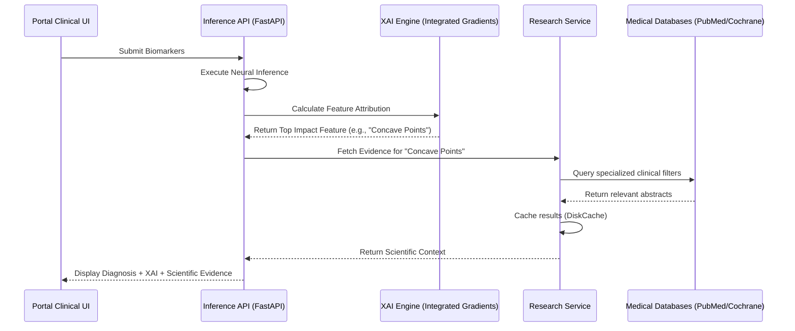

# 🔬 Scientific Integration & RAG Architecture

> **Aether Oncology** — Connecting machine learning predictions with the gold standard of clinical evidence.

---

## 1. Overview

The Aether Oncology platform implements an **Advanced RAG (Retrieval-Augmented Generation)** architecture designed specifically for the oncology domain. Instead of treating model predictions as "black-box" outputs, the system dynamically anchors every high-impact feature (XAI) to current medical literature from peer-reviewed sources.

## 2. Integrated Data Sources

The platform orchestrates a multi-source retrieval pipeline with cascading fallback and circuit breaker protection:

1.  **PubMed (Primary)**: Fetches primary research articles via the NCBI Entrez API. This provides the latest findings on specific biomarkers.
2.  **Cochrane Library (High-Evidence)**: Specifically filtered search for systematic reviews, which represent the highest level of clinical evidence in the hierarchy of medicine.
3.  **Semantic Scholar (Knowledge Graph)**: Used for automated TL;DR summaries and citation graph analysis to ensure relevance.

## 3. The RAG Workflow

When a clinician performs an inference on the terminal, the following sequence occurs:

## 4. Clinical Significance of Features

The model analyzes 30 features from the **Fine Needle Aspirate (FNA)** biopsy. The RAG system focuses on explaining why certain features trigger high-risk scores:

*   **Concave Points Mean**: Clinically related to the irregularity of the nuclear membrane, a hallmark of malignant transformations.
*   **Area Worst**: Correlates with cellular hypertrophy and uncontrolled growth.
*   **Radius Se**: Indicates high variance in nuclear size (anisonucleosis), often seen in aggressive carcinomas.

## 5. Compliance & Trust

By integrating live scientific evidence, Aether Oncology addresses the **transparency requirements** of:
- **LGPD/GDPR**: Right to an explanation for automated decisions.
- **AI Act (High-Risk Category)**: Mandatory transparency and human-oversight documentation.
- **HIMSS Stage 7**: Clinical decision support based on evidence-based medicine.

---
*Aether Oncology: Evidence-Based AI for Precision Medicine.*
